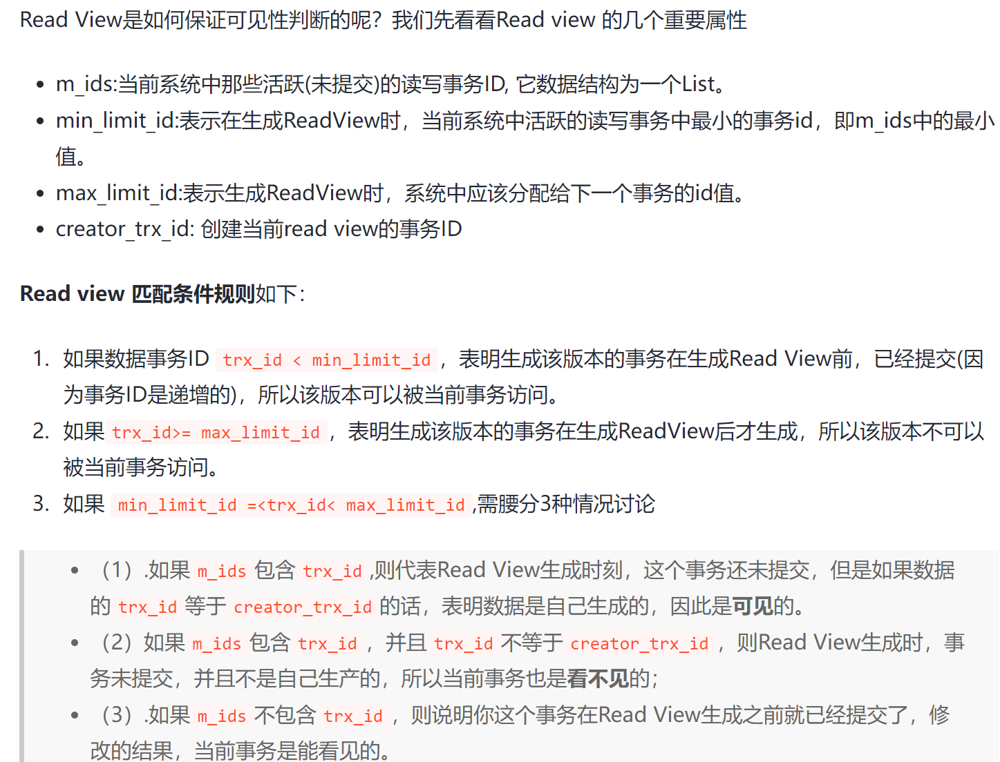
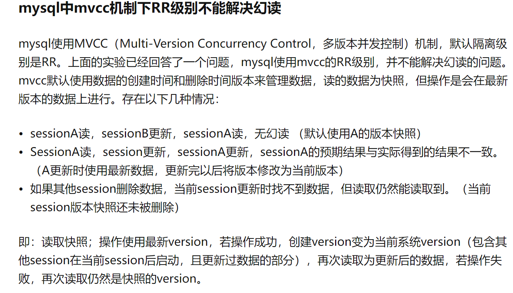

* `InnoDB`和`MyISAM`索引结构都是`B+Tree`

  但是`MyISAM`数种存储的是**实际数据的地址**，索引和数据是分开存储的，只是用索引指向实际数据，是**非聚集索引**。

  `InnoDB`是存的**实际数据**，是聚集索引，记录的物理顺序和索引存放顺序一致。提高主键查询效率，降低辅助索引效率，因为辅助索引需要额外访问一次主键索引。

## MVCC

* 解决读写冲突的无锁并发控制，最大优点是**读不加锁**，因此读写不冲突、并发性能好

* 原理主要是**版本链、undo log、Read View**来实现的

* 快照读：读取的是记录数据的可见版本（有旧版本）。不加锁，普通select都是快照读
* 当前读：读取的是记录的最新版本，**显式加锁的都是当前读**

Read View

MVCC实现流程：

1. 获取事务自身版本号，即事务ID
2. 获取Read View，查询到的数据要在Read View中查看是否符合可见性原则
3. 不符合Read View的可见性原则的，要从`Undo Log`中获取历史快照
4. 返回符合规则的数据

* MVCC在**读已提交**级别里面会有不可重复读问题，因为**同一个事务里面每次查询都会产生新的Read View副本**
* 在**可重复读**RR级别下，**一个事务只会获取一次Read View**，从而保证每次查询数据都一样
* RR级别解决幻读问题：next key lock（间隙锁+行锁）锁住范围间的记录和这个范围。

总结：MVCC就是一个用于避免读写冲突，**提高并发的技术。**它只能在读已提交和可重复读两个隔离级别下工作。普通select就是用快照读，读取数据可见版本。加锁的当前读读的是最新版本。可重复读依靠**一个事务只有一个Read View**来实现可重复读。每次都是从版本链里面最新的地方开始查，然后判断是否符合Read View要求，不符合就查下一个。旧版本都被存到undo log里面了，靠隐藏列的roll_pointer去链接。

> 解决幻读问题依靠的是MVCC吗？
>
> 依靠的是next key lock，MVCC只能保证A前后两次连续读取，中间没有当前读或者更改操作的时候才能避免幻读。只要中间有成功的修改，version就会更新成最新的version。
>
> [【MySQL】面试题之：MVCC能否解决幻读？](https://blog.csdn.net/qq_35590091/article/details/107734005)
>
> 

## 数据库的隔离级别

* 读未提交：极致并发，啥也阻止不了
* 读已提交：能解决脏读
* 可重复读：能解决不可重复读
* 串行化：极致串行，幻读都解决了

> * 脏读：读到的数据还没提交
> * 不可重复读：一个事务前后读到的数据不一样
> * 幻读：事务A中按条件查询两次数据库，两次查询结果条数不一样。
>
> 幻读是数据条数增减，不可重复读是数据的数值发生改变

* `InnoDB`默认隔离级别是**REPEATABLE READ**，但是使用**Next-Key Lock**算法避免了幻读产生

## 数据库的锁

死锁

* 解决死锁最简单的方式：**超时**，互相等待，某个事务等待时间超过阈值，进行回滚，另一个事务就能继续了
* **wait-for graph**：主动进行死锁检测，需要保存锁的信息链表和事务等待链表，利用二者构造图。存在回路则资源发生互相等待，`InnoDB`一般选择**回滚undo量最小的事务**

行级锁

* 给索引上的**索引项加锁**。**只有通过索引条件检索数据，`InnoDB`才使用行级锁，否则，`InnoDB`将使用表锁。**

间隙锁

* 锁定一个范围，但不包含记录本身、**阻止多个事务将记录插入到同一范围导致幻读**

next-key lock

* 上述两个锁的集合，解决幻读问题

## 数据库优化

优化原则：减少系统瓶颈，减少资源占用，加快系统反应速度。

优化方向：优化文件系统，提升**I/O读写速度**；优化**操作系统调度**策略，提升MySQL在高负荷下的负载能力；优化**表结构、索引、查询语句**等使得查询响应更快

> 使用带索引字段查询时索引不起作用的情况：
>
> 1. 使用LIKE关键字匹配符第一个是%时，索引不起作用
> 2. 使用多列索引，只有查询条件用了字段中的第一个时索引才会被使用，最左匹配
> 3. 使用OR的关键字查询，且OR前后条件中的列都是索引，才会用索引。

连接（join）代替子查询：连接查询不需要建立临时表，速度比子查询快，查询中如果用索引，性能会更好

如何提升插入数据的速度？

* **索引、唯一性校验、一次性插入记录条数**是主要影响因素

`MyISAM`：

* 禁用索引：在非空表大量插入数据，在插入前禁用索引，插入后再开。
* 禁用唯一性检查
* 使用批量插入
* 使用LOAD DATA INFILE批量导入

`InnoDB`：

* 禁用唯一性查询
* 禁用外键检查
* 禁用自动提交

以上操作都是先关闭了，插入完数据再开启的

> 表中包含几千万条数据怎么办？
>
> 按照如下顺序优化：
>
> 1. 优化**SQL和索引**
> 2. 增加**缓存**
> 3. **读写分离**
> 4. 使用MySQL自带的分区表
> 5. 做**垂直拆分**（拆列），根据模块耦合度，把大系统分割成小系统
> 6. 做**水平拆分**（拆行，先分库后分表），设置合理的**sharing key**，表结构和应用都要改变，结构加点冗余，sql尽量带sharing key，把数据定位到限定的表上查，而不是整张表扫描

慢查询优化：

1. 开启慢查询日志

2. 分析慢查询日志

3. 常见慢查询优化：

   * 索引没起作用：LIKE，多列索引，OR关键字
   * 优化数据库结构：抽离低频字段单独建表，常用联合查询表建立中间表

   * 分解关联查询：对每个表进行单表查询，结果在应用程序关联

   * 优化LIMIT分页：偏移量大代价高，用**索引覆盖扫描**，而非查询所有列，然后根据需要做一次关联操作返回所需列，偏移大的时候效率提升很大

     > 索引覆盖扫描：索引中的列包含**所有查询中要使用的列**，可以直接在索引中扫描出结果返回给客户端。不需要回表查询。
     >
     > 为啥？因为索引值里面就包含了所有你需要的数据，不需要查主键获取所有列了。

### explain的使用

主要关注：

* `type`：表示本次查询的类型

  type从差到好：

  * **ALL**：全表查
  * **index**：全索引扫描，如果是索引覆盖查询，则extra会显示`using index`，如果还要返回其他列，则需要回表
  * **range**：索引范围查询
  * index_subquery：子查询用到索引
  * unique_subquery：子查询用到唯一索引
  * index_merge：用到多个索引
  * ref_or_null：表连接类型是ref，但进行扫描的索引列可能包含null
  * fulltext：全文检索
  * **ref**：非唯一性索引扫描，基于索引的等值查询，或表间等值连接
  * **eq_ref**：唯一性索引扫描
  * const：基于主键或者唯一索引**唯一值查询**
  * system：查询对象表就一行数据

* `key`：最终选择的索引

* `key_len`：用于结果过滤的索引的实际长度

* `rows`：预计需要扫描的行数

* `Extra`：额外附加信息，主要确认是否出现`Using filesort, Using temporary`

  * `Using filesort`：用外部排序而非索引顺序排列结果，数据少内存排序，数据多磁盘排序

  * `Using temporary`：创建临时表存结果，出现于对没索引的列`Group By`或者`Order by`里面的列都不在索引
  * `Using index`：覆盖索引扫描
  * `Using where`：全表/索引 扫描后用`WHERE`完成结果过滤。

## 数据库设计三大范式

* 第一范式：每一个数据都是原子项，**只要是关系型数据库一定满足第一范式**

* 第二范式：数据表中不存在非关键字对候选关键字段的**部分函数依赖**，非主属性完全依赖于码

  第二范式要求数据库中**每个实例都能被唯一区分**。

  > 什么是函数依赖？
  >
  > 如果⼀个表中某⼀个字段B的值是由另外⼀个字段或⼀组字段A的值来确定的，就称为B函数依赖于A

* 第三范式：在第⼆范式的基础上，数据表不存在非关键字段对任⼀候选关键字段的**传递函数依赖**

  第三范式要求**一个关系中不包含在其他关系中已包含的非主关键字信息**

## 数据库存储引擎

### `InnoDB`

* 事务性数据库首选，支持**事务安全**表（ACID），支持**行锁**和**外键**，`InnoDB`作为默认引擎特性如下：
  1. `InnoDB`是为**处理巨大数据量的最大性能设计**。它的CPU效率可能是任何其他基于磁盘的关系数据库引擎所不能匹敌的
  2. 提供了具有**提交、回滚和崩溃恢复能力**的事务安全（**ACID兼容**）存储引擎
  3. `InnoDB`是聚簇索引，数据和索引紧密结合，辅助索引查询需要回表。
  4. 支持**外键完整性约束**

### `MyISAM`

* `MyISAM`不支持事务，用的表级锁，非聚簇索引。处理少量数据效果比`InnoDB`好，存储元数据信息比`InnoDB`少，耗费的表空间也少
* 拥有较高的插入、查询速度

## 秒杀系统

### 缓存穿透

* 查询记录的id在缓存和数据库都没有，这些请求每次都能穿透缓存直接访问数据库。

* 处理手段：**布隆过滤器**，首先查该id是否存在，存在再去缓存中查询，不存在直接返回失败。

  布隆过滤器存在问题，需要和缓存中的数据保持一致，一般用于**缓存数据更新少**的场景

  > 如果缓存数据更新频繁，如何处理？
  >
  > * 把不存在的商品id都缓存起来，但是要设置一个比较短的过期时间

### 库存问题

* 加锁影响性能，需要原子性操作防止库存超卖。比如redis配合lua脚本。lua脚本具有原子性，然后用其执行redis操作。

### 分布式锁

* 一次只有一个客户能获取到锁。但是容易导致均匀分布的秒杀（每一万人中一个成功的），所以可以利用**自旋锁**，规定时间内不断尝试加锁，失败就休眠一段时间再来，直至超出规定时间还没抢到，直接返回失败。

### mq异步处理

* 秒杀、下单、支付是三大流程，真正并发量大的是秒杀，所以可以把支付和下单拆出来。
* 下单要做成mq异步处理的，支付功能例如支付宝是业务场景本身保证异步。

### 

使用mq会产生以下几个问题：

1. 往mq服务端**发送消息丢失**：添加**消息发送表**，失败了就使用**job**，增加**重试机制**

   

2. **重复消费消息**问题：消费者消费消息的时候ack应答丢失了或者消息发送者重试机制，导致消费者重复消费消息概率增大

   处理手段：加一张**消息处理表**，记得**和下单放在一个事务里面保证原子操作**

   

3. 垃圾消息问题：由于某些原因，消息消费者下单一直失败，一直不能回调状态变更接口，这样job会不停的重试发消息。最后，会产生大量的垃圾消息。

   处理手段：job重试的时候查看消息发送表该消息是否达到最大限制，达到直接返回。这样只会产生少量的垃圾消息。

   

4. 延迟消费问题：秒杀成功，下单后十五分钟没支付，订单自动取消退回库存

   处理手段：

   1. job每隔一段时间处理一次，缺点是**实时性不太好**

   2. 更好方案：**延迟队列**，rocketmq自带延迟队列

      

### 限流

常用方式：

1. 基于nginx限流
2. 基于redis限流

* 对同一用户限流
* 对同一IP限流：容易误杀，因为同一公司网吧啥的公网ip是一样的
* 对接口限流：非法请求太多影响正常用户访问，得不偿失
* **加验证码**：
  * 普通验证码：数字或者图案，生成速度快，但是可能被破解，有安全隐患
  * **移动滑块**：生成速度慢，但是安全的一比
* 提高业务门槛：参与秒杀要冲会员😋

## 索引

- 按「数据结构」分类：**B+tree索引、Hash索引、Full-text索引**。
- 按「物理存储」分类：**聚簇索引（主键索引）、二级索引（辅助索引）**。
- 按「字段特性」分类：**主键索引、唯一索引、普通索引、前缀索引**。
- 按「字段个数」分类：**单列索引、联合索引**。