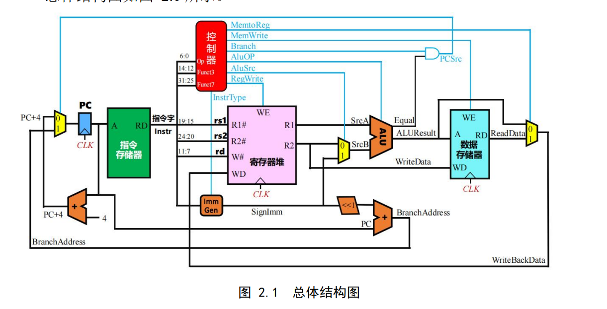

## 五段流水线

### 单周期CPU

* 单周期CPU的设计采用的是**硬布线控制器控制，使用指令和数据存储分开的哈佛结构**

* 控制器的设计依靠分析每条指令的输出控制信号，形成表达式导入自动生成逻辑电路，每个信号的指令对应的控制信号都要去RISCV手册里面查一查。

### 中断机制

* 均为**外部中断**，对中断源信号进行采样，然后根据不同的中断号选择不同的中断地址作为下一条指令的地址，同 时将当前指令保存到 mEPC 寄存器，然后关中断，进入中断服务程序，完成程序后根据 URET 指令清除中断产生的信号，开中断，同时返回中断之前指令的 PC 地址。
* 多级中断就是加上优先级判断是否能打断当前中断服务程序，利用堆栈保存多个中断，多个`mEPC`保存不同层中断的返回地址
* 中断服务程序的入口地址用`RARS`仿真器工具查看。（把汇编程序通过汇编转换成机器语言，查看指令的入口地址）
* **优先编码器**实现高优先级中断先执行

### 流水线CPU

* **取指IF、译码ID、执行EXE、访存MEM、写回WB**

* 流水接口部件用寄存器实现相应信号量的锁存和传递

* 气泡流水线**：延迟后续指令进入ex阶段**来保证不会发生数据冲突，分支冲突同理，分支指令到EX了，则清空IF和ID的指令，使得分支跳转的下一条指令就是跳转后的指令

* 重定向流水线：不考虑ID段取得的操作数是否正确，**实际EXE使用的时候再考虑正确性**。即前面的指令会把MEM段ALU的原酸结果和WB段的写回数据传回EX，用重定向逻辑判断前后指令是否存在数据相关，从而选择正确的操作数进入ALU运算。

  如果相邻指令存在数据冲突，且**前一条是访存指令**，则只能在LoadUse信号产生的时候暂停IF、ID，**往EX插入一个气泡**。如果用重定向功能上可以实现，但是后果是 EX 段的**关键路径延迟变成了 MEM 段访 存延迟加 EX 段运算器运算延迟**，而流水线频率取决于流水线中最慢的功能段，这会使得 流水线频率大大降低。

### 动态分支预测

* 加快经常性事件原理，减少分支指令引起的分支延迟损失
* 用BTB表根据每次分支指令的跳转不停调整BTB表数据，提升准确率

## 字节青训营项目

### Redis

* 拿redis作为缓存，缓存点赞、评论和关注的计数。

* Redis基于内存操作，性能高，读写速度快，支持高并发，支持持久化操作。这里利用持久化特性，异步方式将数据写入数据库中。

* 用hash进行存储，key划分为三段：model name、field name、model ID

  model name说明是哪一个表的

  field name说明是具体这个表里面哪个相关的count字段

  model ID说明是哪一行的
  
* 增加了jwt用户鉴权校验，防止缓存穿透

### Kafka

* 用作消息队列，实现热点数据的异步更新，快速返回请求。

### Cronjob

* 定时去扫描redis的缓存里面有没有新的数据，刷入数据库。

### Docker

* 方便，不同成员开发的时候一个配置文件就解决了环境问题，移植性高。
* 可扩展，需要什么新的中间件直接docker上拉个镜像下来用。

## 网络技术挑战赛

* 往嵌入式的Linux内核上添加TSN模块，用的OpenWrt这个嵌入式的Linux系统
* 真实环境测试，部署固件到多个设备
* TSN模块主要是基于时间同步，实现流量整形
* TSN协议族在链路层
* **保障高优先级事务的低时延传输**

### TAS整型

* 根据优先级划分的时间片
* 使用门控算法保障每个时间片能接收的流量优先级

* 想法是根据优先级判断能够发送字节数目，防止饥饿
* 加权轮询时间片，权重随着发送字节增多而减少。每个优先级都有一个初始权重，和优先级相关（可替换）
* 所有权重减为0就重新初始化。

主要做了三个模块：发送模块、接收模块、转发模块

* 转发模块有bug，根据MAC地址表匹配转发端口

* 接收要能区别TSN帧和普通帧，普通帧直接入0队列
