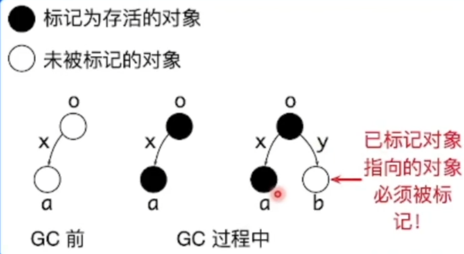
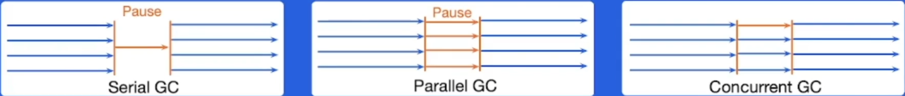
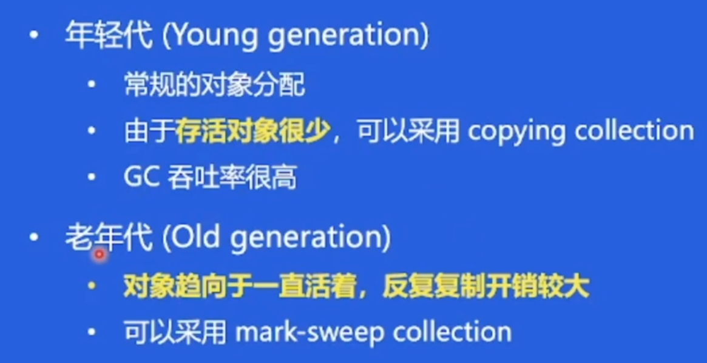
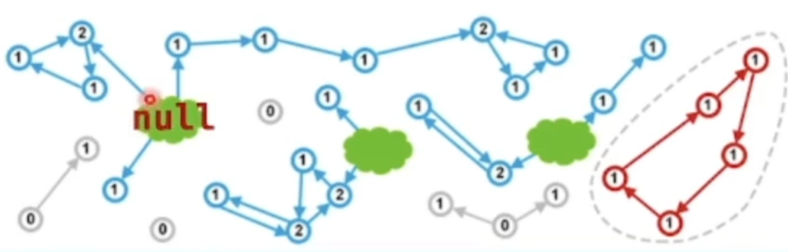
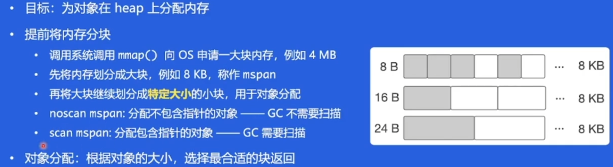
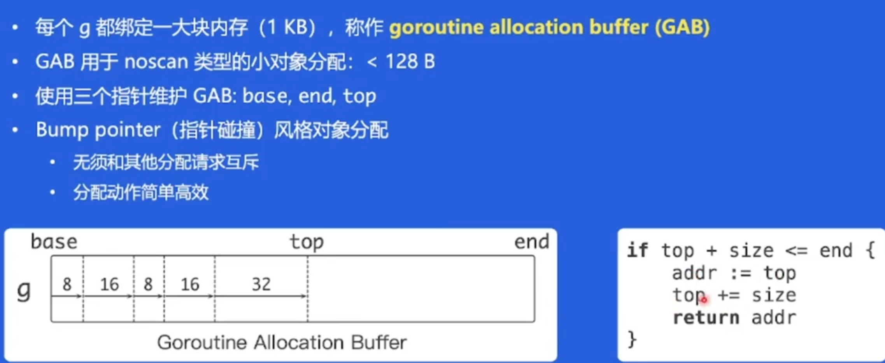
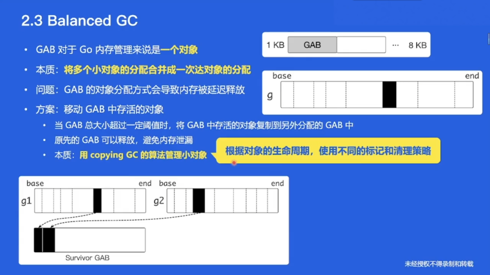
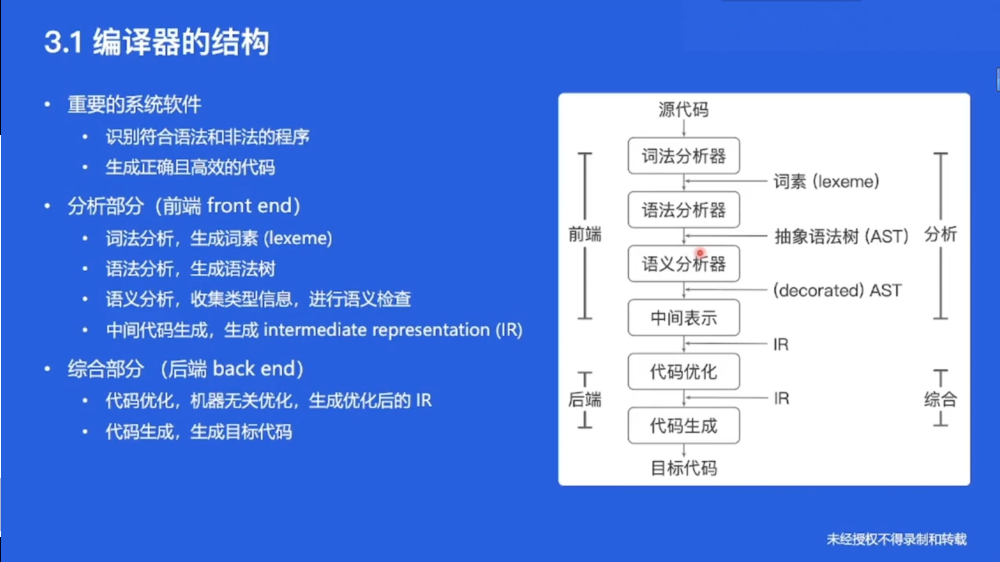
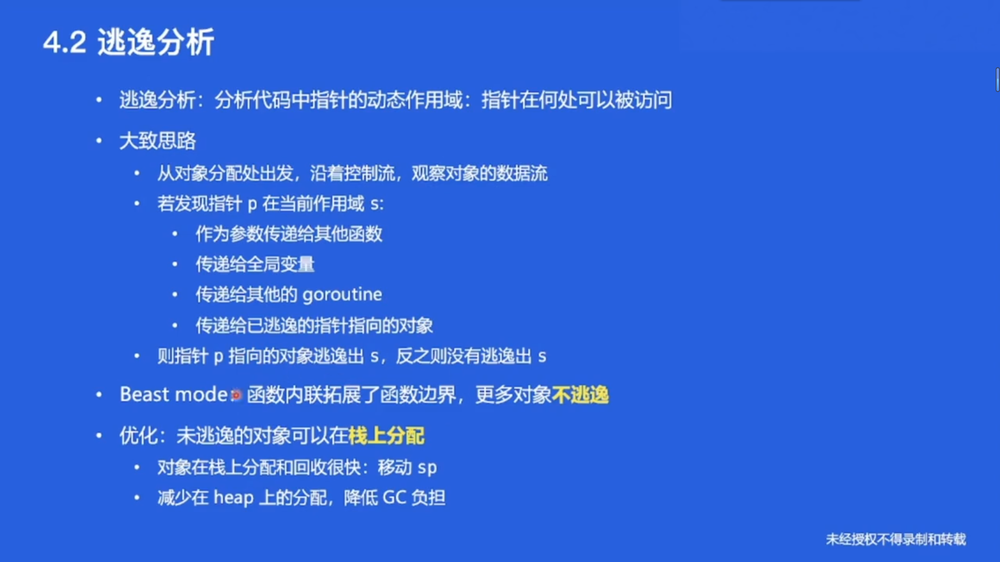

# 性能优化

* 软件基本结构
  * 业务代码
  * SDK
  * 基础库
  * 语言运行时
  * OS

## 性能优化的层面

* 业务层优化
  * 针对特定场景，具体问题，具体分析
  * 容易获得较大性能收益
* 语言运行时优化
  * 考虑通用的性能问题
  * 考虑更多场景
* 数据驱动
  * 自动化性能分析工具---pprof
  * 依靠数据而非猜测
  * 首先优化最大瓶颈

## 性能优化与软件质量

* 保证接口稳定的前提下改进具体实现
* 测试用例：覆盖尽可能多场景，方便回归
* 文档：做了什么，没做什么，能达到什么效果
* 隔离：通过选项控制是否开启优化
* 可观测：必要的日志输出

# 自动内存管理

* 动态内存：程序在运行时根据需求动态分配的内存
* 自动内存管理：程序语言运行时系统管理动态内存

## 相关概念

> Mutator：业务线程，分配新对象，修改对象指向的关系
>
> Collector：GC线程，找到存活对象，回收死亡对象的内存空间
>
> Serial GC：只有一个collector
>
> Parallel GC：支持多个collectors同时回收的GC算法
>
> Concurrent GC：mutators 和collectors可以同时执行
>
> * Concurrent难点：必须感知对象指向对象关系的改变
>
>   
>
> 

* 评价GC算法
  * 安全性：不难回收存活的对象
  * 吞吐率
  * 暂停时间：业务是否感知（时间短就感知不到）
  * 内存开销：GC元数据开销
* 追踪垃圾回收
* 引用计数

## 追踪垃圾回收

* 对象被回收条件：指针指向关系不可达的对象
* 标记根对象
* 找到可达对象进行标记
* 清理所有不可达对象
  * Copying GC：存活对象复制到另外内存空间
  * Mark-sweep GC：死亡对象内存标记为”可分配“
  * Mark-compact GC：移动并整理存活对象

## 分代 GC(Generational GC)

* Intuition：很多对象分配出来后很快不再使用

* 每个对象年龄：经过的GC次数

* 目的：针对不同年龄，指定不同GC策略，降低整体内存管理开销

  

## 引用计数

* 对象存活条件：当且仅当引用数大于0

* 缺点：

  * 开销大：**原子操作**保证引用计数的原子性和可见性
  * 无法回收环形数据结构------weak reference（红色圈圈）
  * 内存开销
  * 回收内存依然可能引发暂停（null指向的所有）

  

# Go 内存管理及优化

## Go 内存分配

### 分块

### 缓存

### 字节的优化方案------Balanced GC

* 本质：**把多个小对象的分配合并成一个大对象的分配**

# 编译器和静态分析

## 编译器的结构

## 静态分析

* **不执行程序代码**，推导程序的行为，分析程序性质
* 控制流：程序执行流程
* 数据流：数据在控制流上的传输

## 过程内和过程间分析

* 过程内分析：仅在函数内部分析
* 过程间分析：考虑过程调用时参数传递和返回值的数据流和控制流

# Go 编译器优化

## 函数内联(inline)

* 把被调用的函数的函数体的副本直接替换到调用位置上，同时重写代码以反映参数的绑定
* 优点：
  * 消除调用开销，如传参，保存寄存器等
  * **把过程间分析转化为过程内分析**，帮助其他优化，如**逃逸分析**
* 缺点：
  * 函数体变大，instruction cache不友好
  * 编译生成的Go镜像也会变大

## 逃逸分析

## 字节的优化方案-------Beast mode

