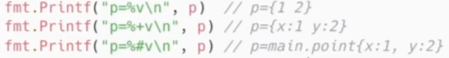
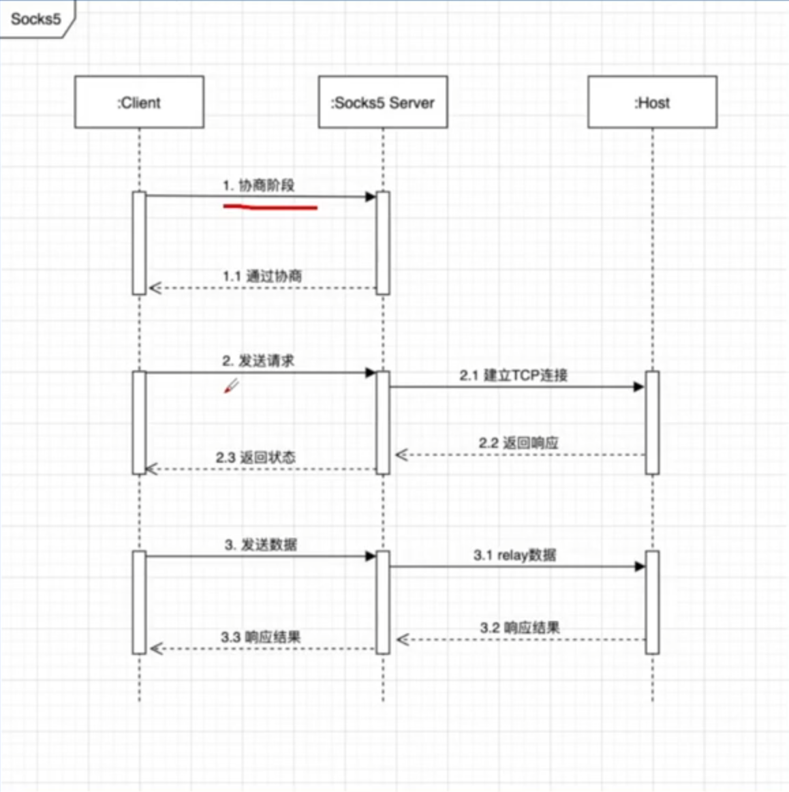

* package main: 代表文件属于main包的一部分
* import 导入 fmt 用于输入输出字符串
* go里面switch和if都不加括号，go里面switch不用加break，跑完一个case不会跑其他分支，c++则会

* map和切片的创建

  ```go
  m := make(map[string]int)//delete删除kv对
  s := make([]string, 3)//可以append，要赋值回去
  ```

* range遍历，对数组会返回两个值

* go里面printf可以用%v打印所有类型变量，%+v可以得到更加详细的结构，%#v更加详细

  

## SOCKES5 代理

原理

