# 语言进阶

## 并发编程

* Go可以充分发挥多核优势，高效运行

### Goroutine

* 线程：内核态，线程跑多个协程，栈MB级别
* 协程：用户态，轻量级线程，栈KB级别

### CSP(Communicating Sequential Processes)

* 提倡通过**通信共享内存**而不是通过共享内存而实现通信

  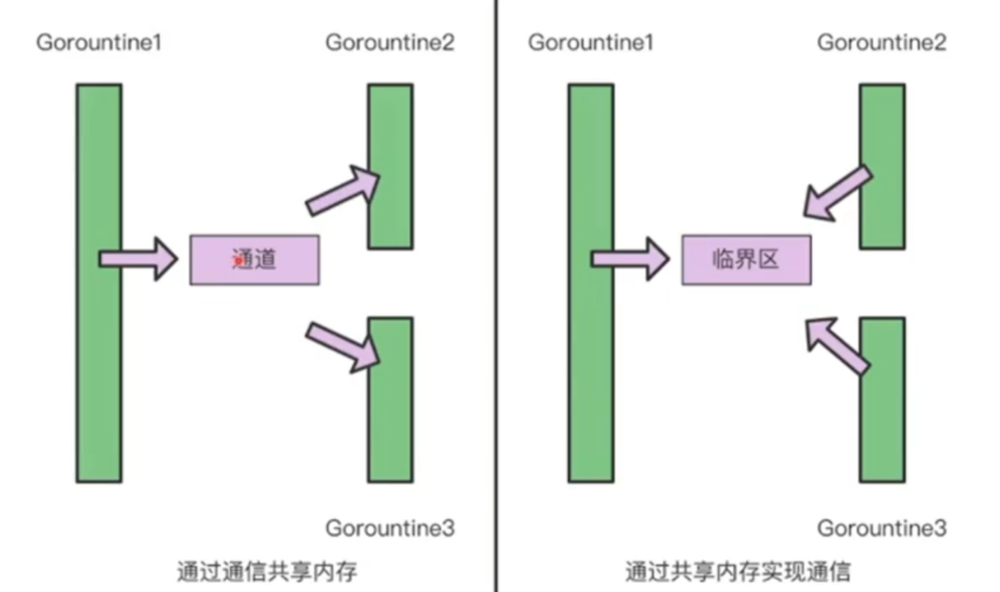

### Channel

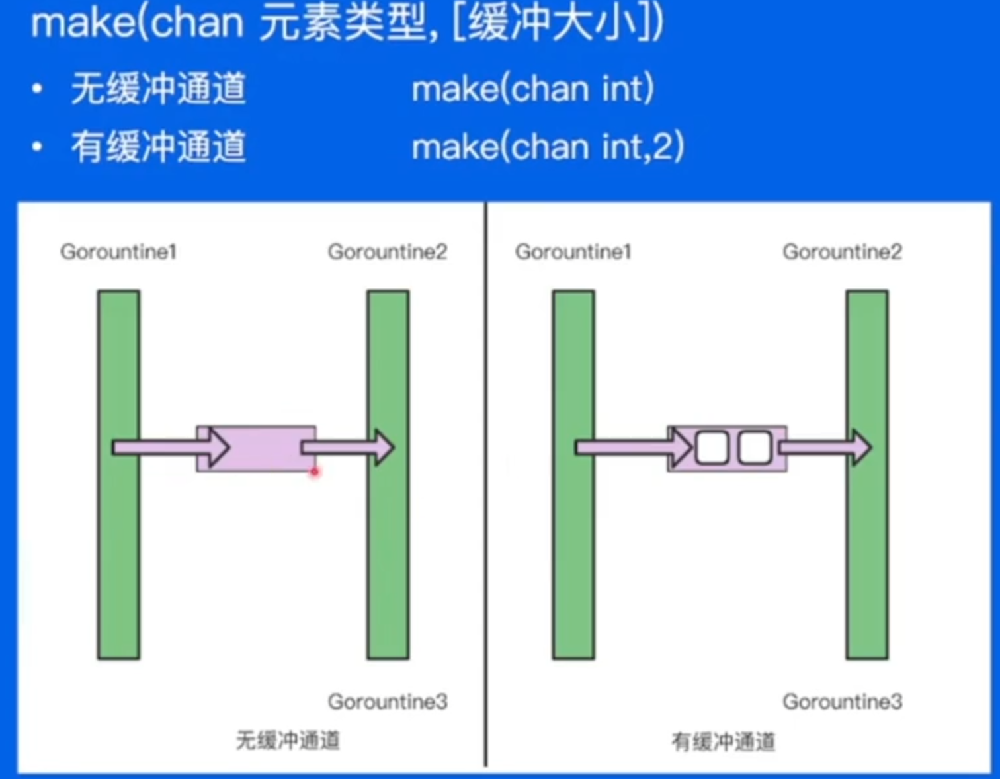

### 并发安全 Lock

### WaitGroup

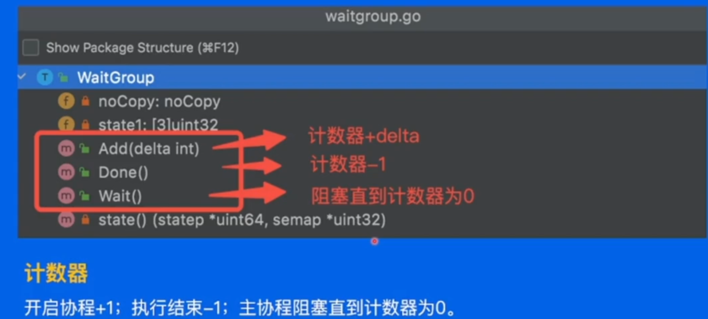

# 依赖管理

## 背景

Go 依赖管理演进

* GOPATH --> GO Vendor --> Go  Module

  迭代目的：

  * 不同环境(项目)依赖的版本不同
  * 控制依赖库的版本

### Go依赖管理

#### GOPATH

**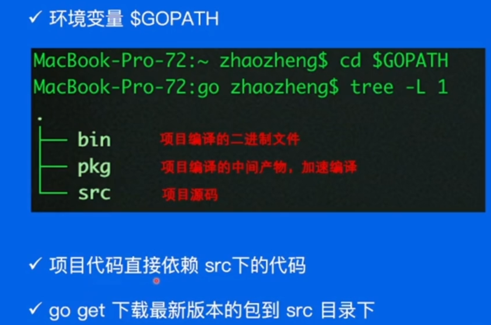**

弊端：无法实现package多版本控制

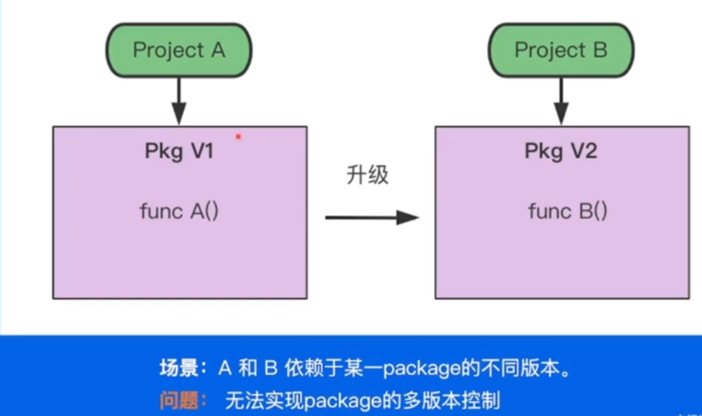

#### Go Vendor

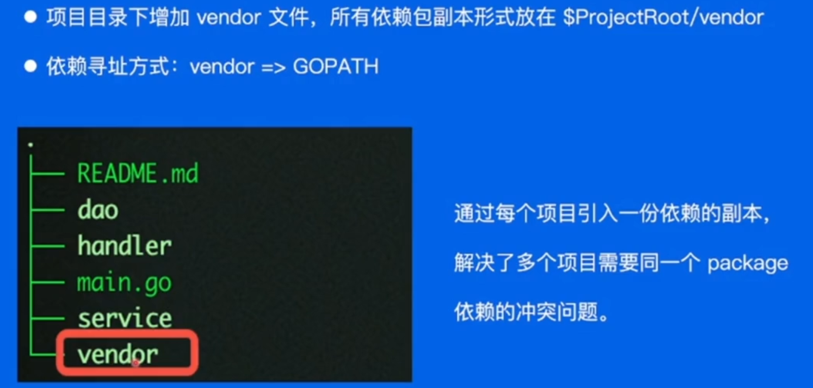

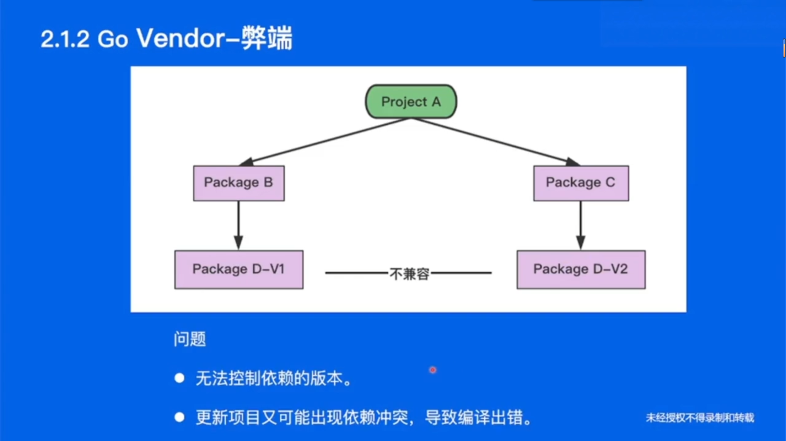

#### Go Module

* 通过**go.mod**文件管理依赖包版本
* 通过**go get/go mod**指令工具管理依赖包

### 依赖管理三要素

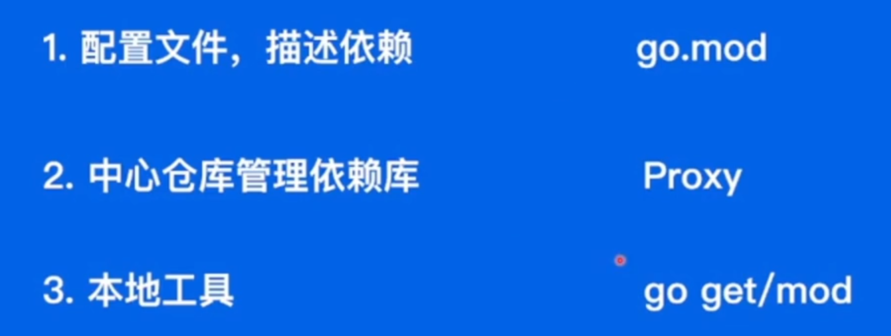

# 测试

## 单元测试

* 输入-->测试单元-->输出（与期望进行校对）

  > 测试单元：函数、模块......

* 测试规则：

  * 测试文件以_test.go结尾
  * func TestXxx( *testing.T)
  * 初始化逻辑放到TestMain方法中

## Mock测试

* 为函数/方法打桩
* 不再依赖本地文件

## 基准测试

* 优化代码，对当前代码进行分析
* 内置的测试框架提供了基准测试的能力
* 以BenchmarkXxx作为方法名称，参数是 ***testing.B**

# 项目实战

## 需求分析

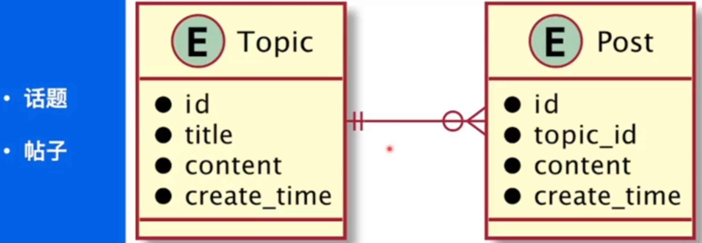

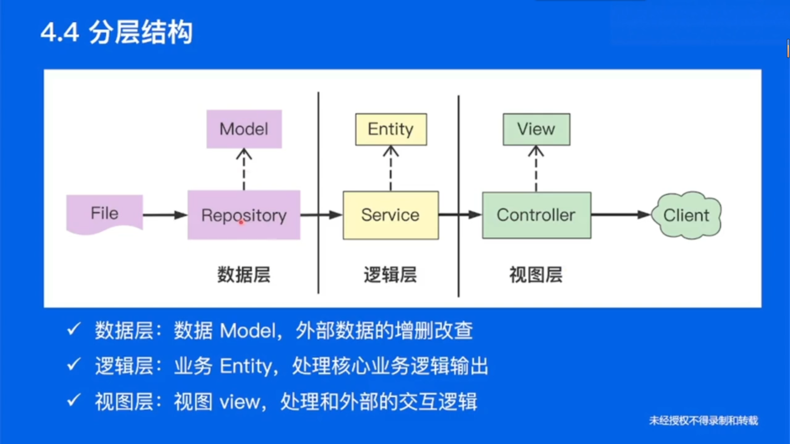

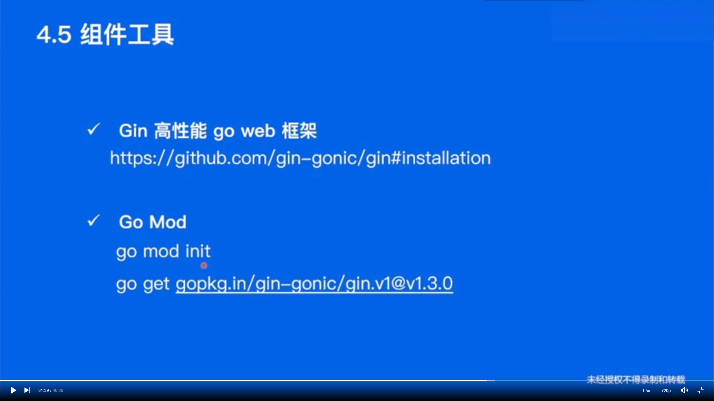

