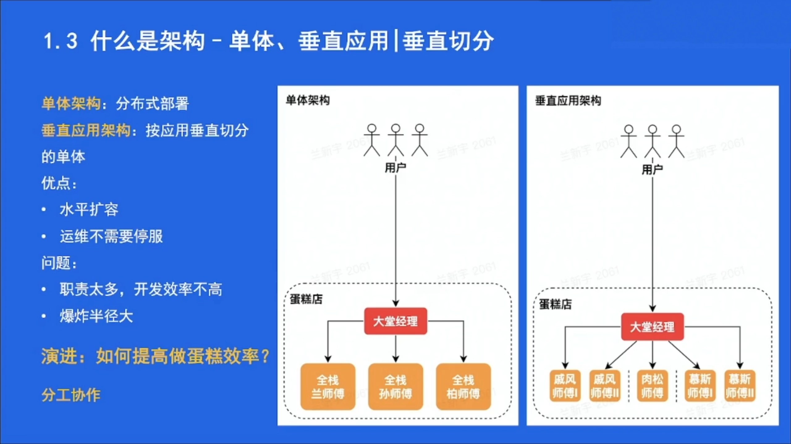
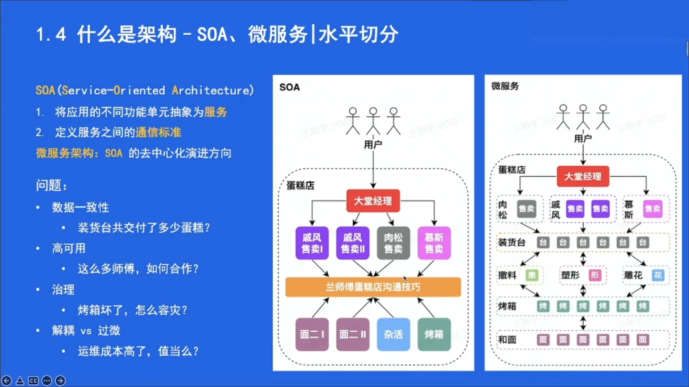
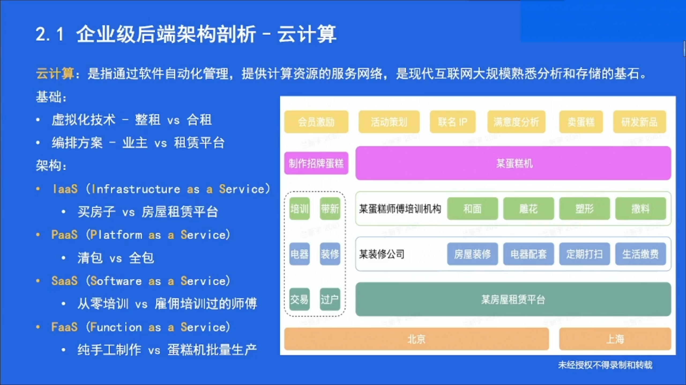
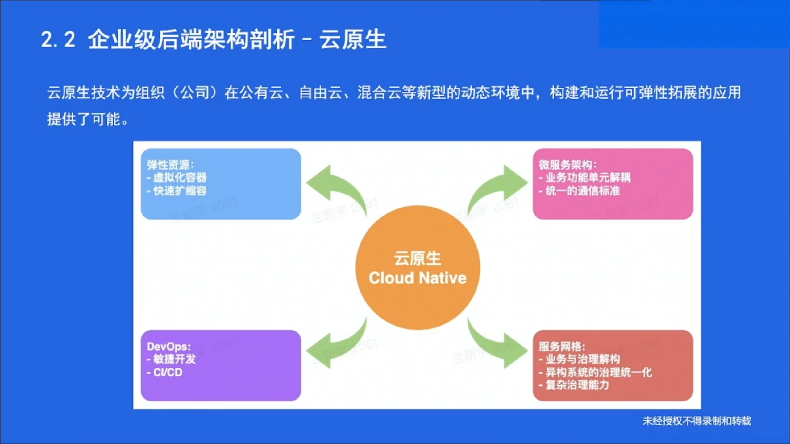
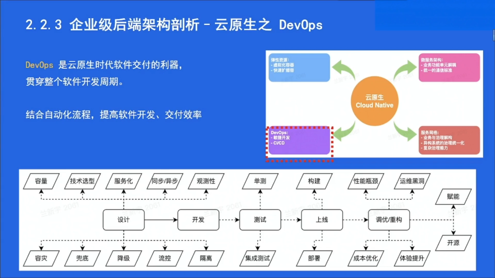

# 常见软件架构

## 单体架构

优点简单，缺点C10K问题，运维需要停服

### 简单单体架构

* 代码层面没有拆分，所有业务逻辑**都在一个项目里**面打包成一个二进制的编译后文件，根据这个文件进行部署，提供业务能力
* 优点：**简单**，团队任何一个人都可以随时修改代码，然后开发、调试、测试整个系统，编译打包系统创建一个二进制版本。对于初创团队**迅速从0到1**占领市场非常有意义。
* 缺点：
  * 不利于系统长期稳定发展，简单单体模式存在**严重耦合**问题，代码即使按package划分成不同模块也可以直接相互引用，**系统内的对象间依赖关系混乱**，修改一处代码，可能会影响一大片的功能无法正常使用。
  * 系统变化对部署影响大，任何业务逻辑调整都会导致系统重新打包，部署，停机再重启，导师系统停机发布时间长
  * 影响开发效率，编译一个单体项目时间长
  * 打包后的部署结构太大，导致系统启动很慢
  * 扩展性受限

### MVC模式

* 模型层：代表**业务数据实体**部分
* 视图层：代表**前端展示**部分
* 控制器层：代表**请求分发，处理调度**部分

优点：简单，直观，利于分配开发工作，不同模块和分层结构本身就可以作为一个开发层面的子项目拆分结构

缺点：对于简单业务场景可能拆解过于细致导致复杂度增加，基于单体模式导致其仍然解决不了可用性和扩展性的影响

### 前后端分离模式

* 前后端团队分别独立开发系统，两个团队一起制定前后端系统的数据接口

## 分布式架构

### 服务与SOA

面向服务架构（SOA）是一种建设企业 IT 生态系统的架构指导思想。SOA 的关注点是服务。服务最基本的业务功能单元，由平台中立性的接口契约来定义。

* 从宏观的视角来看，不同于以往的孤立业务系统，SOA 强调整个企业 IT **生态环境是一个大的整体**。整个 IT 生态中的所有**业务服务**构成了企业的**核心 IT 资源**
* 从研发的视角来看，**系统的复用**可以从以前代码级的粒度，**扩展到业务服务的粒度**；能够**快速应对业务需求和集成需求的变更**

* 从管理的角度来看，SOA 从更高的层次对整个企业 IT 生态进行统一的设计与管理，对消息处理与服务调用进行监控，优化资源配置，降低系统复杂度和综合成本，为业务流程梳理和优化提供技术支撑。

### 微服务架构

**微服务架构是SOA的去中心化演进方向**

微服务架构的优势在于：

- 更加彻底的组件化，系统内部各个组件之间**解耦的比较干脆**，单个系统的规模小很多；
- 可以组建每个服务独立的维护团队，利于各自团队独立的开发和维护；
- 每个**微服务独立部署**，只要服务间的接口稳定，各系统可以相互之间互不干扰的独立发展；
- 微服务架构使得每个服务本身可以**独立的扩展**，性能出现瓶颈，优化或增加这个服务的配置即可。

# 企业级后端架构剖析

## 云计算

## 云原生

