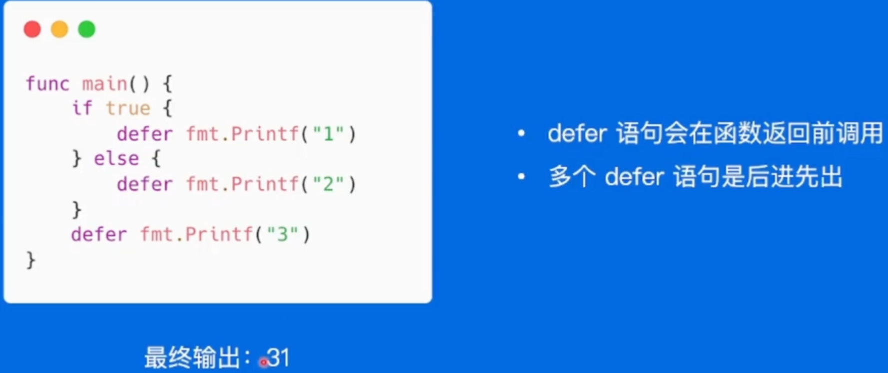

# 高质量编程

什么是高质量

* 边界条件是否考虑完备
* 异常情况处理，稳定性保证
* 易读易维护

## 编程原则

* 简单性
* 可读性
* 生产力

## 编码规范

### 注释

* 公共符号始终要注释，例外是不需要注释实现接口的代码

### 代码格式

* gofmt自动格式化代码

### 命名规范

* 缩略词全大写，位于变量开头且不需要导出，用全小写
* 函数名不携带包名的上下文信息，因为包名和函数名总是成对出现的
* package
  * 只由小写字母组成
  * 简短并且包含一定的上下文信息

**Good name is a good joke. If you have to explain it, it's not funny** 

### 控制流程

* 避免嵌套
* **尽量保持正常代码路径为最小缩进**
  * 优先处理错误/特殊情况，尽早返回或者继续循环来减少嵌套

### 错误和异常处理

* 简单错误：仅出现一次的错误，在其他地方不需要捕获该错误

  优先使用`errors.New`来创建匿名变量直接表示简单错误，若有格式化需求，使用`fmt.Errorf`

* 错误的wrap和unwrap

  * 在`fmt.Errorf`中使用：`%w`关键字来将一个错误关联至错误链中

* 错误判定

  * 判定一个错误是否为特定错误，使用`errors.ls`，该方法可以判定错误链上所有错误是否含有特定错误
  * 在错误链上获取特定种类的错误，使用`errors.As`

* panic

  * 不建议在业务代码中用panic
  * 问题能被屏蔽和解决，建议使用error代替panic
  * 但是程序启动阶段发生不可逆转的错误，可以在init和main函数中使用panic

* recover

  * 只能在被defer的函数中使用

  * 只在当前goroutine生效

  * defer执行顺序**后进先出**

    

  * 如果需要更多上下文，可以recover后在log中记录当前的调用栈

## 性能优化建议

* slice预分配内

  > 大内存未释放
  >
  > 在已有切片基础上创建切片，不会创建新的底层数组
  >
  > 场景
  >
  > * 原切片较大，代码在原切片基础上新建小切片
  > * **原底层数组在内存中有引用得不到释放**
  >
  > 处理方法：可以用`copy`代替`re-silce`

* map预分配内存

* 使用`string.Builder`进行字符串处理，比`bytes.Buffer`和 `+` 都快一点，加号拼接字符串最慢

* 使用空结构体节省内存

  eg:用map代替实现set

* 使用atomic包，性能比加锁好

  锁应该用于保护一段逻辑，保护一个变量可以用atomic包

# 性能调优实战

## 性能调优原则

* 要依靠数据而非猜测
* 定位最大瓶颈而不是细枝末节
* 不要过早优化
* 不要过度优化

## 性能分析工具pprof

