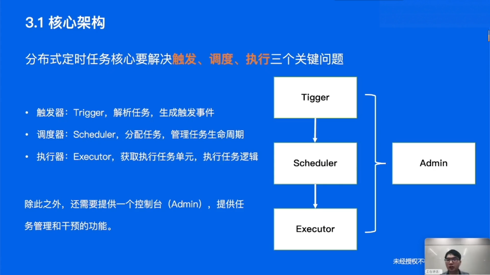

自动化+定时执行+海量数据+高效稳定=**分布式定时任务**

## 发展历程

### Windows批处理

* 定时自动关机

### Windows任务计划程序

* 每日定时疫情打卡

### Linux命令-CronJob

* 每天定时清理机器日志

* Linux系统命令，使用简单，稳定可靠，但是只能控制单台机器且无法适用于其他操作系统

### 单机定时任务-Timer、Ticker

### 单机定时任务-ScheduledExcutorService

* 复用线程
* 仍是单机可用

### 任务调度-Quartz

### 分布式定时任务

特点：

* 平台化管理
* 分布式部署
* 支持海量数据

## 实现原理

### 核心架构

### 控制台

### 触发器

* 给定一系列任务，解析触发规则，在规定时间点触发任务调度

设计约束

* 需要支持大量任务
* 支持秒级调度
* 周期任务需要多次执行
* 需要保证秒级扫描的高性能，并避免资源浪费

#### 方案一 定时扫描+延时消息 

#### 方案二 时间轮

#### 高可用

> 如何实现触发器的高可用？
>
> * 储存上，不同国别、业务做资源隔离
> * 运行时，不同国别、业务分开执行
> * 部署时，采用多机房集群化部署，避免单点故障，通过数据库锁或者分布式锁保证任务只能被触发一次

* 数据库行锁模式：触发调度之前，更新数据库中JobInstance状态，成功抢锁的才会触发调度。

  缺点：堕胎及其频繁竞争数据库锁，节点越多性能越低

* 分布式锁模式：触发调度之前，尝试抢占分布式锁，可用Redis锁或者Zookeeper锁

  性能较高，多家公司使用此方案

### 调度器

#### 资源来源

* 业务系统提供机器资源
* 定时任务平台提供机器资源

#### 节点选择

### 执行器

## 业务应用

* 所有需要**定时、延时、周期性执行任务**的业务场景，都可以考虑使用分布式定时任务