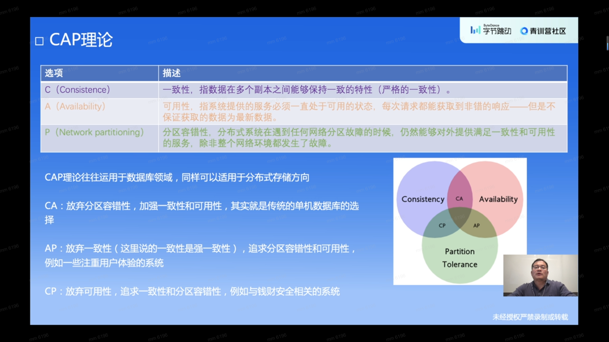
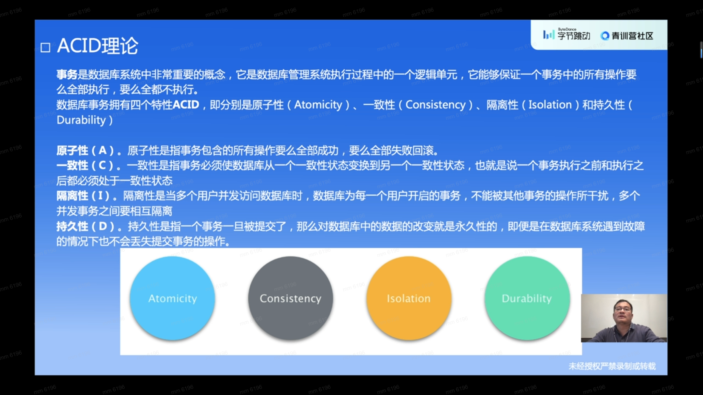
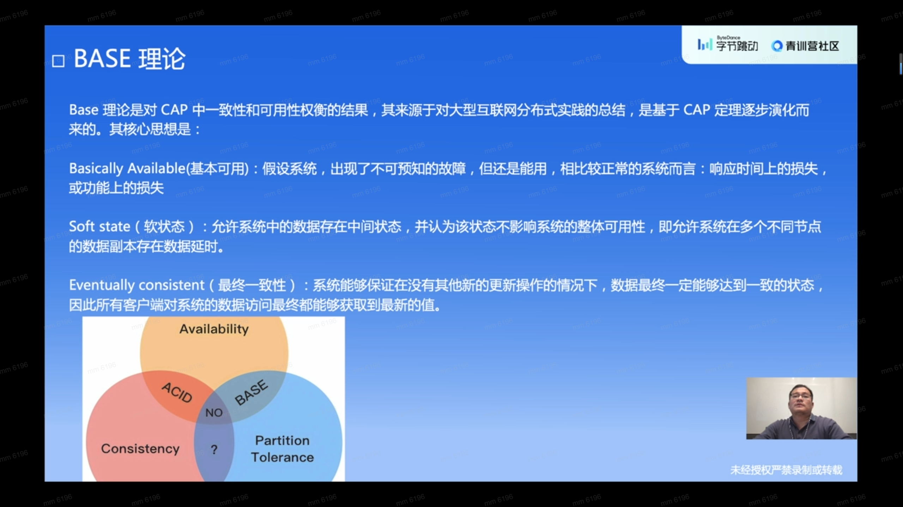
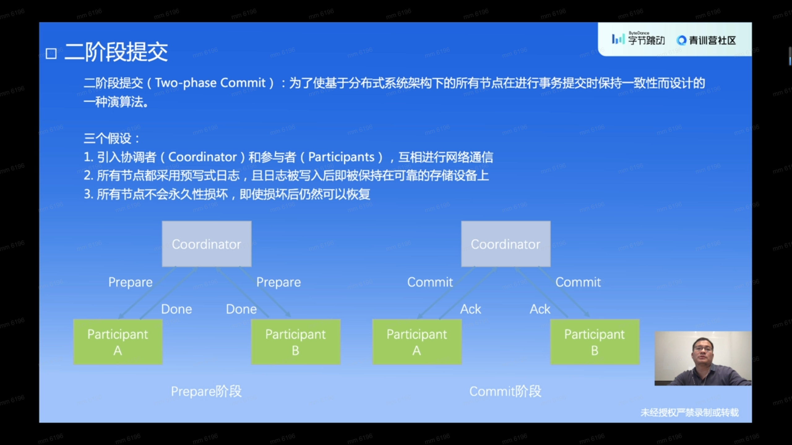
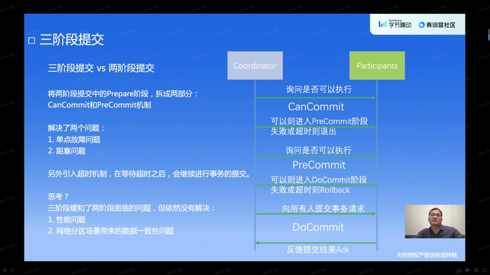
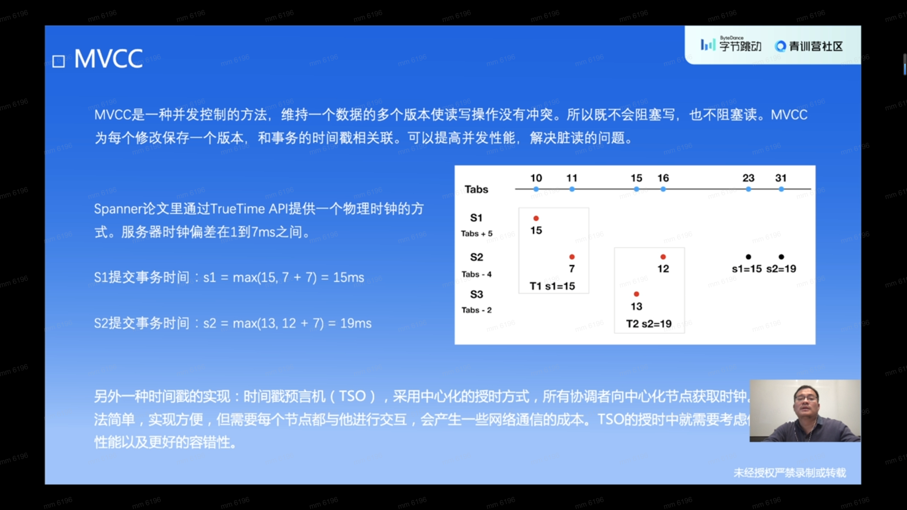
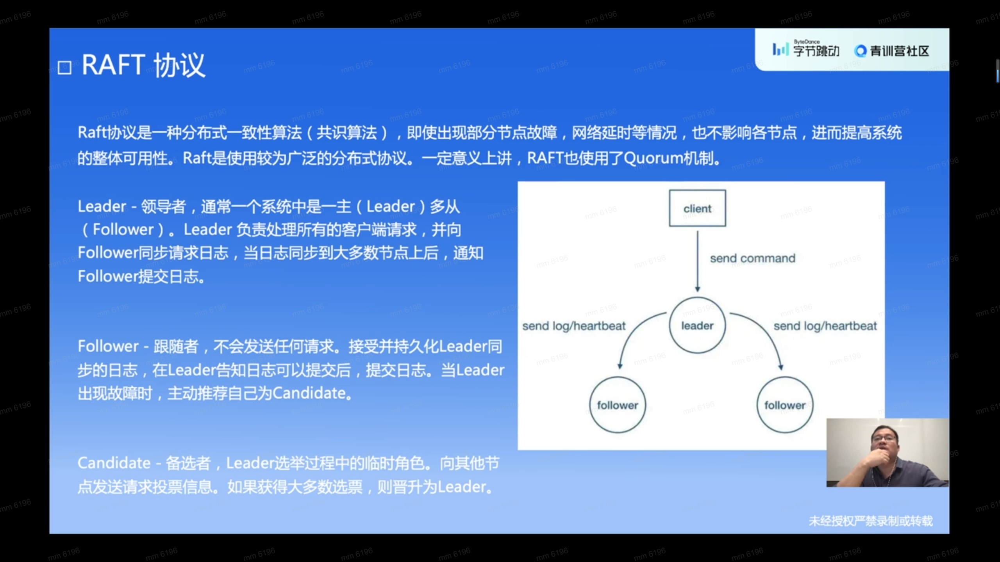
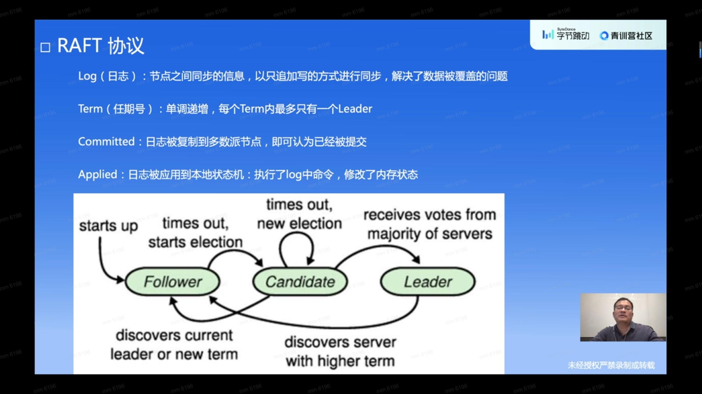
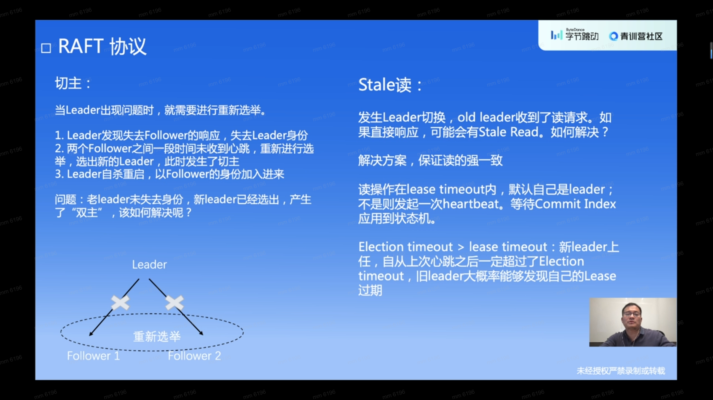
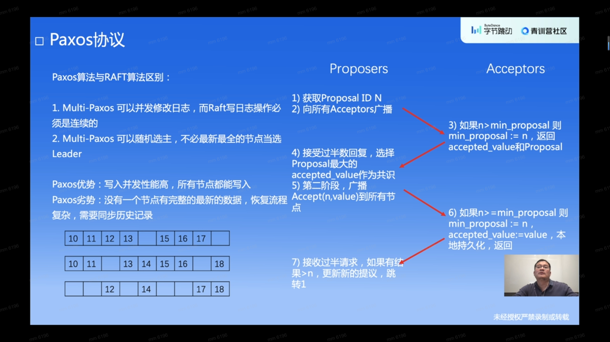

# 分布式理论基础

## CAP理论

## ACID理论

## BASE理论

# 分布式事务

## 二阶段提交

## 三阶段提交

## MVCC

* 悲观锁：操作数据的时候**直接把数据锁住**，直到操作完成才释放锁；上锁期间别人不能操作数据
* 乐观锁：**不会上锁**，只是在执行更新的时候判断别人是否修改数据，只有冲突的时候才放弃操作

## 共识协议

### Raft协议

### Paxos协议

## MapReduce

# 分布式KV

