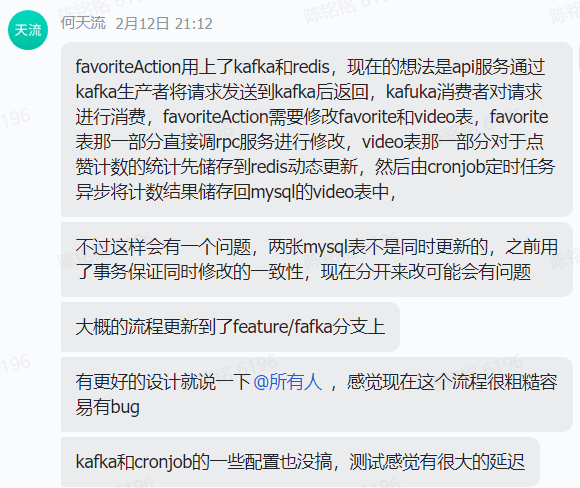

*  首先得在`cmd`目录下对应的服务中编写`handler.go`文件，完成代码核心业务逻辑
* 在`handler`中涉及数据库操作的，要调用`dal`下`db`中定义的数据库操作函数，这部分也要根据自己的需要进行相应设计
* `kitex`框架生成代码会自动进行服务注册(?)，我们要做的是在`rpc`目录下进行服务发现和客户端的初始化，**初始化函数要添加在`init`文件中**

* `rpc`中调用实际接口，随后去`api_service`中调用`rpc`提供的接口，其中主要操作是将请求从`api`格式转换成对应服务格式作为`rpc`调用的参数，再把`rpc`返回的response转换成`api`服务下的response
* 如果在`api_service`下的操作有需要用到`middleware`进行鉴权操作什么的，需要在`router`下的`mdiddle.go`中进行注册。

调用逻辑：客户端 --(`api idl`)-> http服务(`api`) --(`services idl`)->`rpc`服务(feed user publish favorite comment relation message) -> `db`

* `api`中返回方式是把得到的response转换为`api`格式下的response然后进行序列化为`json`格式用于http传输，客户端得到后反序列化得到相应的信息？

## 项目亮点

* 在注册的时候通过redis加锁保证了同一时刻只能对一个名字进行注册操作。
* 根据时间倒序获取feed video

## Kafka、redis和cronjob的使用

* Kafka建立了对点赞数量、评论数量和关注数量的consumer
* consumer的业务逻辑：
  1. 建立一个新的consumer，然后订阅指定topic
  2. 无限循环，等待生产者产生message，读取message，反序列化回request的类型
  3. 利用request中的`ActionType`确定是增还是删操作
  4. 获取存储在`redis`中的`hashKey`和`FieldName`，看是否在`redis`中
  5. 不在`redis`中有缓存就去数据库获取，不然就更新`redis`中的缓存值。
  6. 如此开三个goroutine去作为点赞、评论、关注数目的Consumer
  7. 然后开一个Cronjob定时任务，定期扫描发生改变的`redis`中的缓存值，异步写回数据库

# 项目学习与总结

## 代码规范

* 箭头代码：使用很多if语句。这是一种不好的编程风格，会增加程序的循环复杂度，降低代码可维护性和可读性。

  改进手段：用`swtich case`来

## 安全性

* **HTTPS协议的使用**

* 事务、SQL注入
* 对入参的校验
* 对登陆密码的复杂性校验：对登录密码进行复杂性校验的一种方法是使用正则表达式来检查密码是否符合一定的规则，比如长度、字符种类等。

## 测试

## 其他项目可改进之处

* 由于对点赞评论计数操作仅仅对一个数据进行操作，所以redis锁足以保障一致性和原子性，不需要事务锁了。

  > redis锁和事务锁的区别？
  >
  > redis锁是分布式锁，主要用于不同客户端对某一数据获取的控制。
  >
  > 事务锁主要用于保障

* user_name字段使用了BTREE索引，其实用哈希索引更好（是不可排序的字符串类型，不适合用BTREE，而且等值查询适合用哈希）
* 可以集群部署，网关请求分流
* 密码的复杂度校验，入参的校验
* 防止SQL注入

## 遇到的问题

* 刚开始的时候IDL中post请求缺少斜杠导致无法接收到客户端发送的请求

* 客户端查询消息记录是轮询的，新数据获取之后追加在旧数据之后

  处理方法：用消息队列，只允许消费一次？

* 在写comment的时候没关注到vedio中的comment_count也得变

* 配置问题，mac和win的问题

