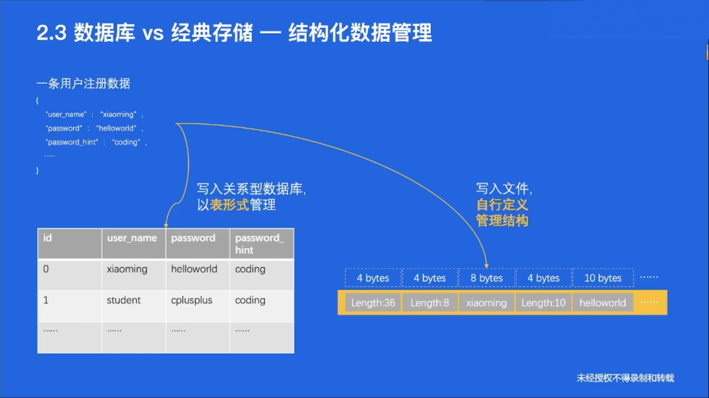

# 经典案例

# 存储 & 数据库简介

存储系统：一个提供了读写、控制类接口，能够安全有效地把数据持久化的软件

## 存储系统

### 系统特点

* **性能敏感**
* 存储系统软件架构，**容易受硬件影响**
* 存储系统代码，**既简单又复杂（异常分支的处理）**

### 存储器层级结构

### RAID技术

## 数据库

> 数据库和存储系统一样吗？

### 关系型数据库特点

**关系型数据库是存储系统**，但在存储之外，发展出**其他能力**

* 数据化结构友好
* 支持事务
* 支持复杂查询语言SQL

### 非关系型数据库特点

**非关系型数据库也是存储系统**，但是**一般不要求严格的结构化**

* 半结构化数据友好
* 可能支持事务（ACID）
* 可能支持复杂查询语言

## 数据库 vs 经典存储

# 主流产品剖析

## 单机存储

单个计算机上的存储软件系统，一般不涉及网络交互

eg：单机kv存储系统，本地文件系统

## 分布式存储

在单机存储基础上实现了**分布式协议**，涉及大量网络交互

## 单机关系型数据库

单个计算机节点上的数据库系统，事务在单机内执行，也可能通过网络交互实现分布式事务

## 单机非关系型数据库

* 和RDBMS相比，ES天然能做模糊搜索，还能自动算出关联程度

## 分布式数据库

# 新技术演进

