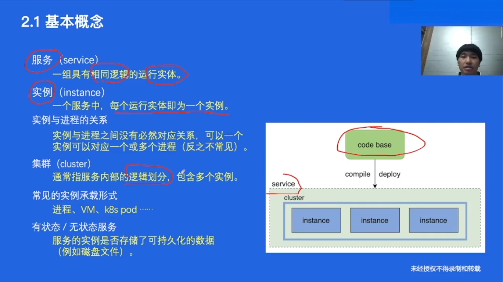
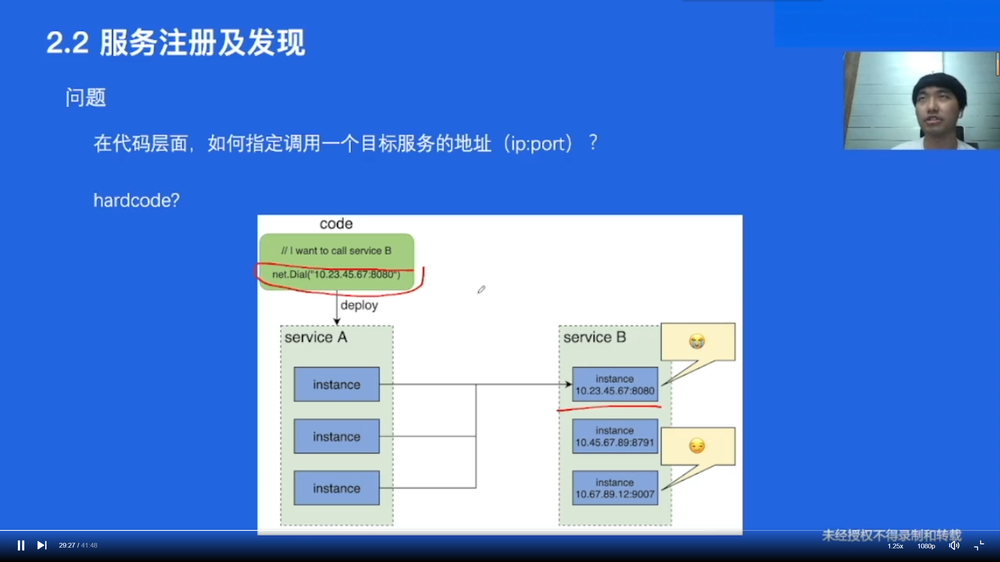
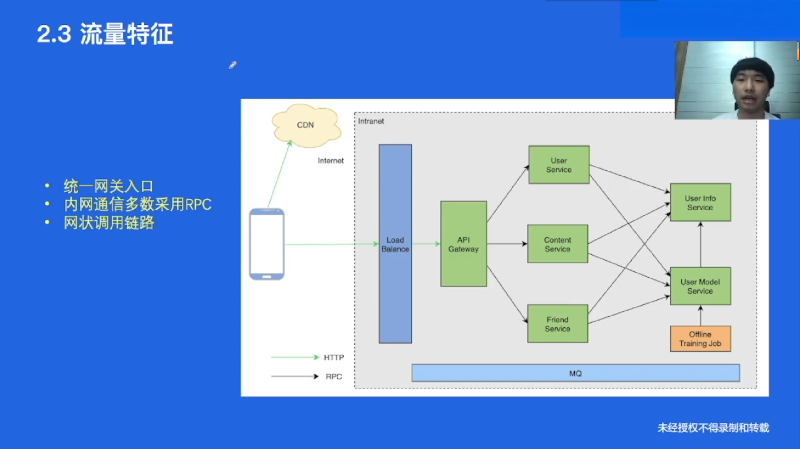
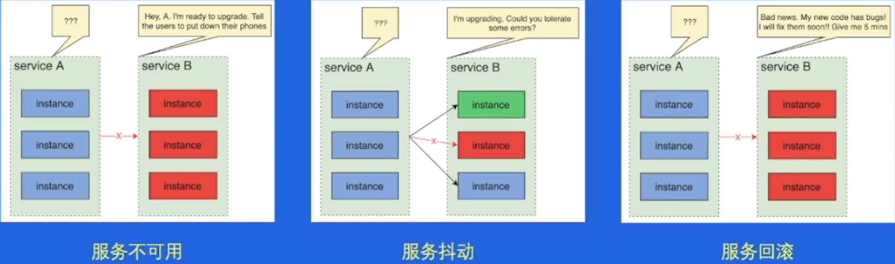
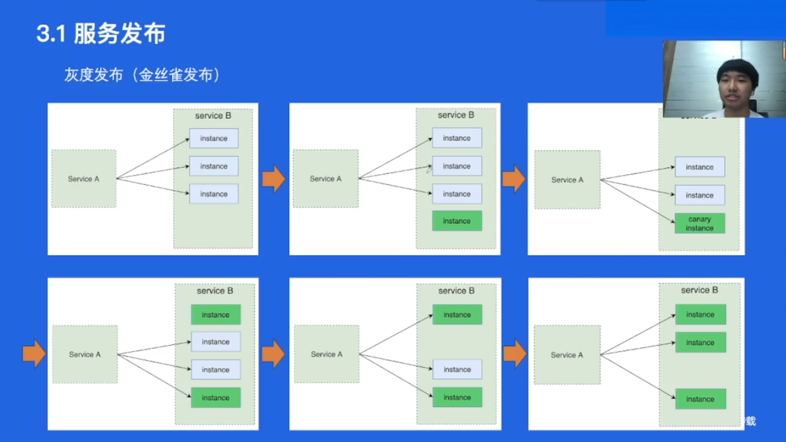
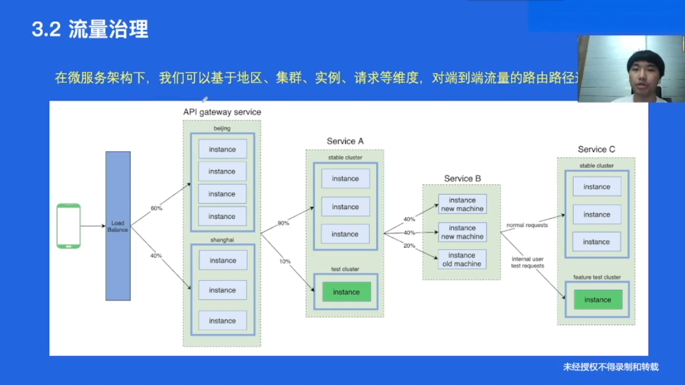
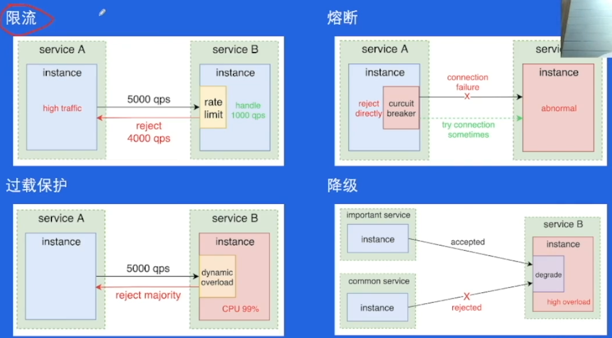
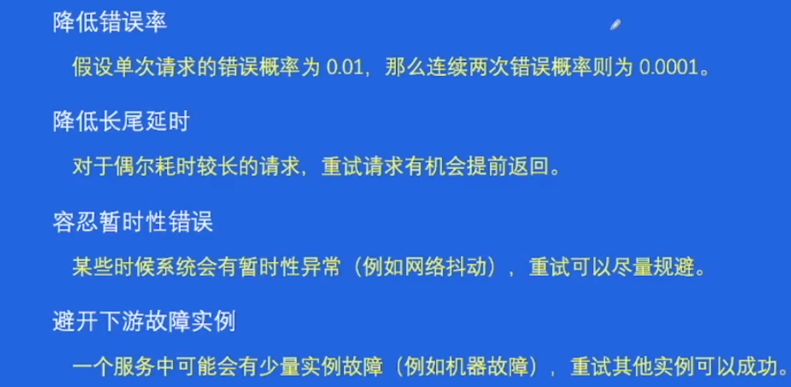
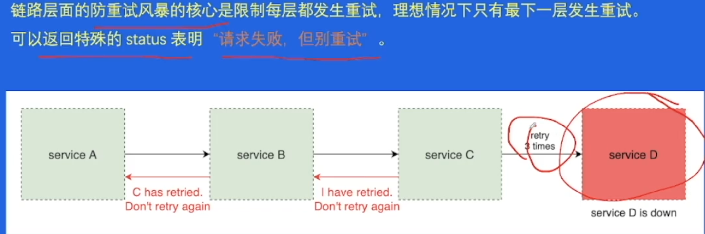
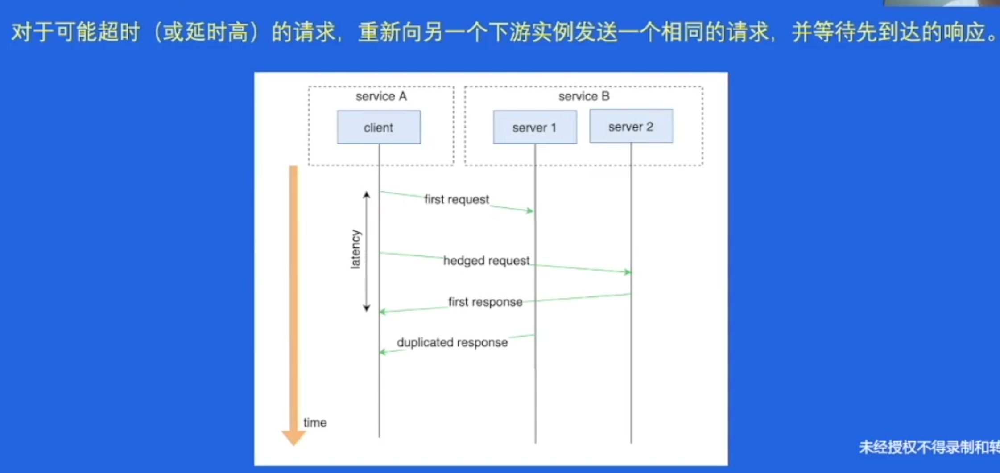

# 微服务架构原理与特征

## 微服务架构核心要素

* 服务治理
* 可观测性
* 安全

## 基本概念

* 一个实例可能包含一或多个进程，反之一般不成立
* 相同逻辑即指运行同一份代码的一堆实例称为一个服务

### 服务间通信

* 单体服务中不同模块的通信是简单的函数调用
* 微服务中，服务间通信意味着**网络传输**，常见的协议有`HTTP, Thrift, gRPC`等

## 服务注册与发现

* 不能直接hardcode，因为服务有不同实例且动态变化
* 不能DNS，因为：
  * 本地DNS存在缓存，导致延时（修改DNS到缓存里面旧地址改变需要时间？）
  * 无法处理负载均衡问题
  * 不支持服务实例的探活检测
  * 域名无法配置端口
* 解决思路：新增一个统一的**服务注册中心**，用于存储服务名到服务映射的实例

### 服务实例上线及下线过程

下线服务过程：

1. 去服务中心注销要删除的实例地址
2. 下线实例

上线服务过程：

1. 先把实例添加好，并进行`health check`
2. 把实例注册到服务中心

## 流量特征

* 进网关之前都是HTTP，内网里面用RPC

  > 为什么？
  >
  > HTTP是文本协议，效率比较低，性能差。
  >
  > gRPC等RPC协议是二进制协议，效率更高

# 核心服务治理功能

## 服务发布

* 指让一个服务升级运行新代码的过程

服务发布的难点：

* 服务不可用
* 服务抖动
* 服务回滚

可行操作

* 蓝绿部署（两个集群轮着发布，一个更新一个顶着）

  简单，稳定，但需要两倍资源。适合在流量低峰进行更新

* 灰度发布（金丝雀发布）

  先上线一个新的服务实例，观察是否能运行正常。正常的话下掉一个老的实例，上新实例。依此类推不断替换掉旧实例。

  

  难点：难以回滚（需要强大基础设施提供精细化回滚操作），需要进行流量切分

## 流量治理

## 负载均衡(Load Balance)

常见的LB策略

* Round Robin
* Random
* Ring Hash
* Least Request

## 稳定性治理

### 典型稳定性治理功能

* 限流
* 熔断（reject的是上游请求，等过一会儿再尝试连接下游服务）
* 过载保护
* 降级

# 字节跳动服务治理时间

## 重试的意义

远程调用有重试意义，本地没啥意义，因为远程才有各种网络熔断等情况，可以重试

* 重试可以避免掉偶发的错误，提高SLA(Service-Level Agreement)

## 重试的难点

* 幂等性

* 重试风暴

  微服务调用链路很深，可能几十层。要是都无脑重试会导致重试请求指数增长

* 超时设置

## 重试策略

1. 限制重试比例

   设定一个重试比例阈值，重试次数占所有请求比例不超过阈值的才重试。即大部分都成功的情况下才会重试

2. 防止链路重试

   

3. Hedged requests 对冲请求

   

## 重试效果验证

