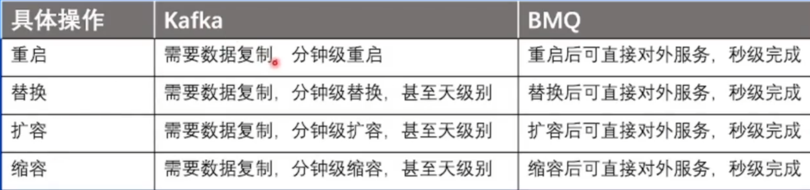

## 消息队列-Kafka

* 不同partition可以并发处理，提高吞吐量

* 每个partition有不同副本，存储在不同集群，用于容灾，分为leader和follower，和leader差距太多的follower会被从ISR踢出

* borker写入磁盘采用顺序写，避免寻道时间，提升写入效 率

### Kafka缺点

#### 数据复制时间成本问题

* 为什么要回切？

  保证负载均衡，否则可能所有的leader最后都到了一个borker

* 为什么只能一台台重启

  避免所有partition都被重启，导致对应topic都不可用了

#### 负载不均衡

## 消息队列-BMQ

## 消息队列-RocketMQ

