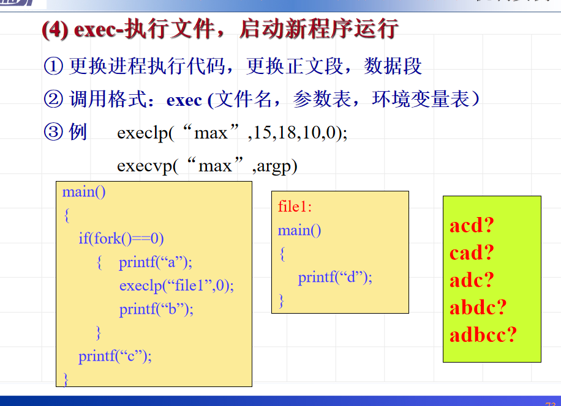
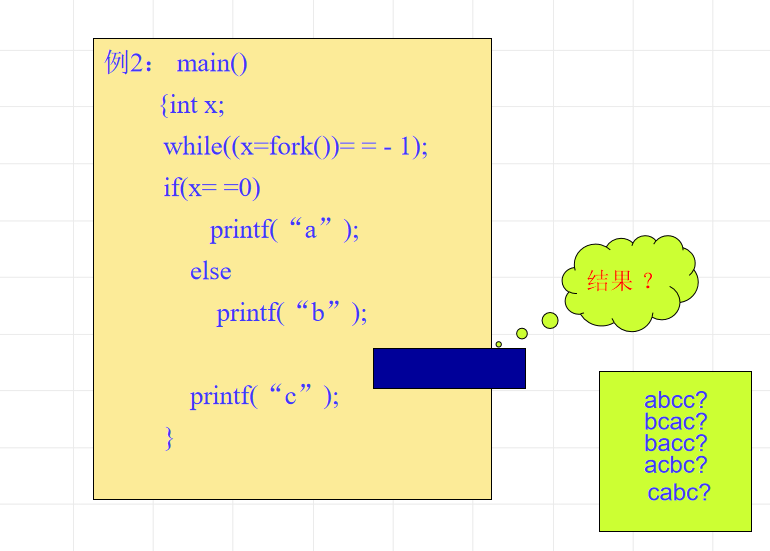
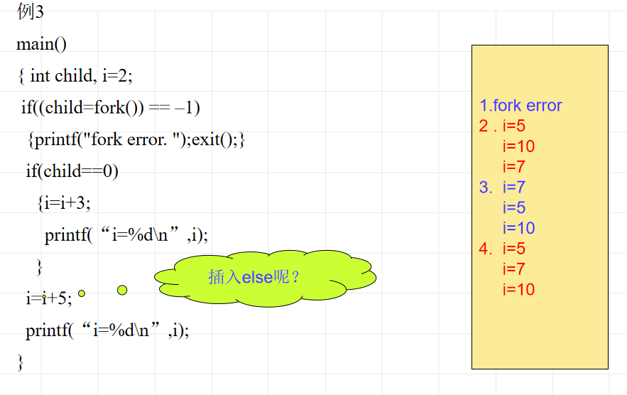

	

* 操作系统管理着系统资源，这些资源包括：处理机（CPU）、主存、文件（信息）、设备。

  处理机管理负责**作业调度**和**进程调度**。一个作业可以有多个进程。负责计算资源的最大化利用。

  主存管理负责**地址映射、主存分配、主存扩充、存储保护**，主要负责快速存取设备资源的最大化利用。
  
  设备管理负责**对设备进行分配和控制以及缓冲技术**，方便用户使用，提升外部设备利用率
  
  信息管理负责**对文件进行组织**，方便存取，尽可能减少I/O，提升性能