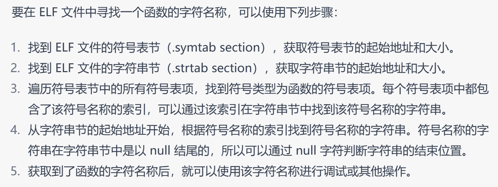

lab1_1: kernel/strap.c  line 29

```
tf->regs.a0 = do_syscall(tf->regs.a0,tf->regs.a1,tf->regs.a2,tf->regs.a3,tf->regs.a4,tf->regs.a5,tf->regs.a6,tf->regs.a7);
```


lab1_2:machine/mtrap.c line47

```
handle_illegal_instruction();
```


lab1_3:kernel/strap.c line41

```
g_ticks++;
write_csr(sip,0);
```


lab2_1:kernel/vmm.c line162:

```
uint64 pa = lookup_pa(page_dir,(uint64)va) + ((uint64)va & ((1<<PGSHIFT) - 1));
  return (void *)pa;
```


lab2_2: kernel/vmm.c line188:

```
pte_t *PTE = page_walk(page_dir,va,0);
  uint64 pa = lookup_pa(page_dir,va);
  if(free != 0)
  free_page((void *)pa);
  (uint64)*PTE & (uint64)(0xfffffffffffffffe);
```


lab2_3:kernel/strap.c lin62:

```
if(stval < 0x7ffff000 && stval > 0x7ffff000 - PGSIZE*20)
      {
        uint64 pa = (uint64)alloc_page();
        user_vm_map((pagetable_t)current->pagetable, ROUNDDOWN(stval, PGSIZE), PGSIZE, pa, prot_to_type(PROT_WRITE | PROT_READ, 1));
      }
```

question: 为什么这里需要特别判断？不特别判断本地能过，educoder过不了

为什么需要ROUNDDOWN，map函数里面不是内置了吗？

lab2_1 challenge: kernel/strap.c line 62

```
if(stval < 0x7ffff000 && stval > 0x7ffff000 - PGSIZE*20)
      {
        uint64 pa = (uint64)alloc_page();
        user_vm_map((pagetable_t)current->pagetable, ROUNDDOWN(stval, PGSIZE), PGSIZE, pa, prot_to_type(PROT_WRITE | PROT_READ, 1));
      }
      else{
        panic("this address is not available!");
      }
```


lab3_1:kernel/process.c line196:

```
map_pages(child->pagetable,parent->mapped_info[i].va,PGSIZE,lookup_pa(parent->pagetable,parent->mapped_info[i].va),prot_to_type(PROT_READ | PROT_EXEC , 1));
```

 lab3_2:kernel/syscall.c line79:

```
current->status = READY;
insert_to_ready_queue(current);
schedule();
```

lab3_3:kernel/strap.c line84:

```
if(current->tick_count + 1 >= TIME_SLICE_LEN)
  {
    current->tick_count = 0;
    insert_to_ready_queue(current);
    schedule();
  }
  else{
    current->tick_count++;
    return;
  }
```


lab1_challenge1 print backtrace

### 利用用户态栈获取函数的返回地址

* 函数的返回地址和函数的入口地址？为什么函数返回地址能获取到函数名？

### 函数返回地址转换为源程序符号

* 如何定位到符号表节（.symtab）和字符串节（.strtab）的位置？

  > 每个section header的name是`uint32`类型，是string table的索引，里面存着对应section的名字，用C语言的字符串比较函数能读取到想要的section内容
  >
  > 同理，每个`.symtab`中的name也是`uint32`，是`.strtab`的索引，里面存了想要的符号的字符串名称

* 从符号节表中找到需要的函数的符号表项，里面存储着该符号名称在**字符串节**的索引
* 获取字符串节的首地址，加上索引找到函数字符串名称



# Questions


