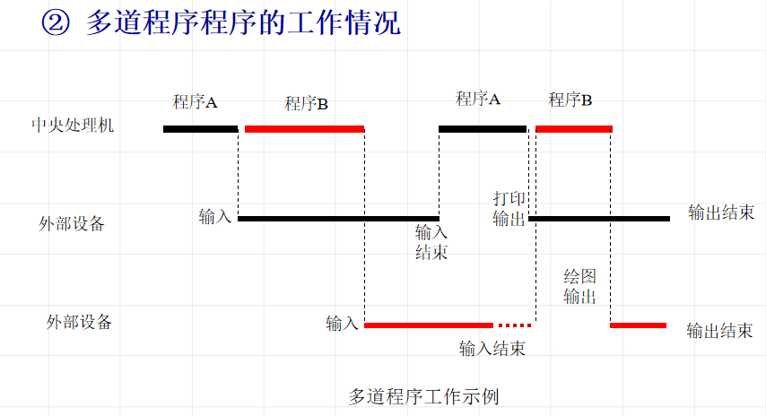

## 操作系统形成与发展

**多道程序设计技术**：主存同时放几道相互独立的程序，在monitor的控制之下穿插运行，当某道程序不能继续运行（如等待外部设备传输数据），管理程序monitor九八另一道程序投入运行

多道运行的特征：

* 多道
* 宏观上并行
* 微观上串行

**分时技术**：把处理机时间划分成时间片分配个各个程序轮流使用

**操作系统**

特征：

* 并发
* 共享
* 不确定性

## 操作系统的资源管理功能

### 处理机管理

1. 提出进程调度策略
2. 进程调度算法
3. 处理机分派

### 存储器管理

1. 存储分配和存储无关性
2. 存储保护
3. 存储扩充：系统提供虚拟存储技术，扩大逻辑内存

### 设备管理

1. 设备无关性
2. 设备分配
3. 设备的传输控制

### 信息管理（文件系统）

## 操作系统基本类型

1. 批量操作系统：吞吐率高，作业周转时间长，使用不便
2. 分时操作系统：用时间片轮转，具有**并行性，独占性，交互性**
3. 实时操作系统（嵌入式）：
   * 软实时：系统中止期限错过只会性能下降
   * 硬实时：错过截止期限会导致灾难性后果 