# 主存管理功能

* **实现逻辑地址到主存地址的映射**
* 主存分配
* 存储保护
* 主存扩充

## 地址映射

地址映射：将程序空间中用的**逻辑地址**变成主存中的**物理地址**的过程

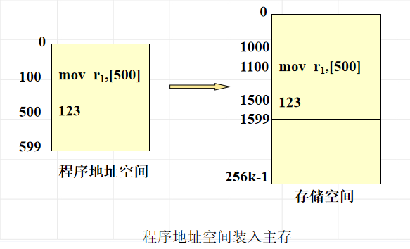

地址映射的时机和类别：

1. **编程或编译**时确定地址映射关系

   程序编写/编译时候确定实虚地址对应关系，结果是一个不能浮动的程序模块

2. 在**程序装入**时确定地址映射关系

   在程序装入过程中随即进行的地址变换方式称为**静态地址映射**

3. 在**程序运行**的时候确定地址映射

   在程序执行期间，随着每条指令和数据的访问自动地连续地进行地址映射，这种地址变换方式称为**动态地址映射**。

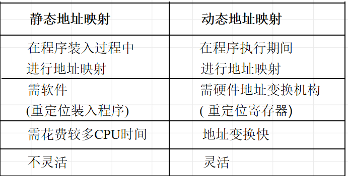

## 主存分配

* 构造分配用的数据结构

* 指定策略：

  * 分配策略：选择请求

  * 放置策略：选择空闲区

  * 调入策略：决定信息装入主机时机

    预调策略：预先将信息调入主存

    请调策略：要信息了再调入主存

  * 淘汰策略：淘汰已占用的内存区

## 主存扩充

目的：**用户编程无需考虑内存容量限制**

可行性：程序局部性原理

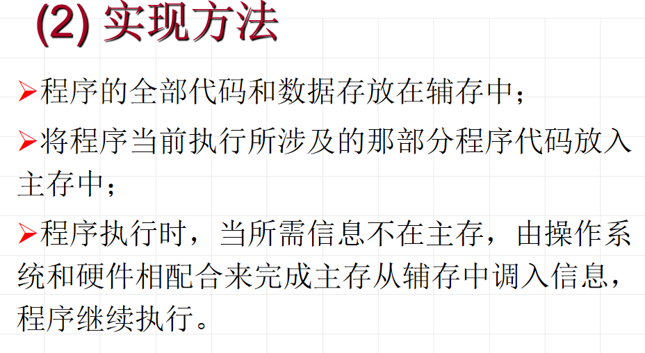

## 存储保护

* 界地址保护

  上下界防护

  基地址，限长防护

* 存储键保护

# 分区存储管理

## 动态分区分配

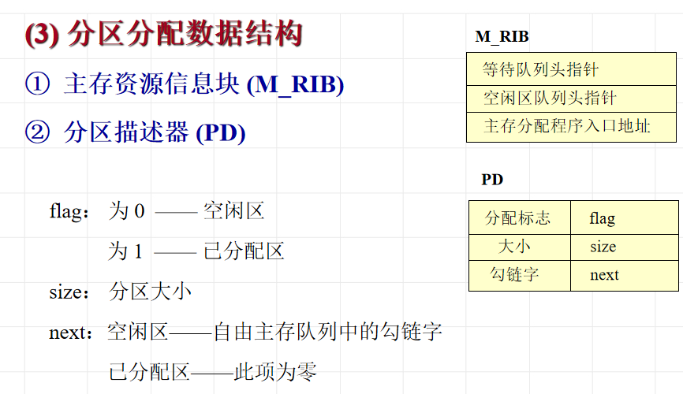

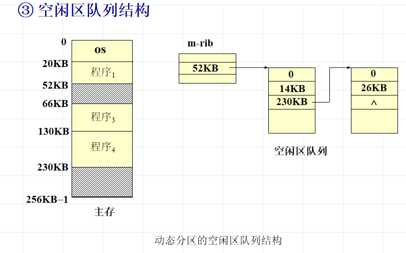

## 分区的分配与回收

分配思路：找空闲块，正好大小的直接从空闲队列摘除，大的话分割一下

回收思路：若是上下邻接空闲区则合并为连续空闲区，若不相邻建立一个新的空闲区加入到空闲区队列

## 放置策略

* 首次匹配：将输入的程序放置到主存里第一个足够装入它的地址最低的空闲区中

  空闲区地址由低到高排序，**尽可能使用存储器中低地址空闲区，保留高地址**

* 最佳匹配：输入程序放置到主存中与它**所需大小最接近**的空闲区中

  空闲区队列由小到大排序	

* 最坏匹配：输入程序放置到主存中与它**所需大小差距最大**的空闲区中

  空闲区队列由大到小排序

**一般空闲区从地址高端开始分割**

## 碎片问题及拼接技术

缺点：

* 移动分区**花费CPU时间**
* 拼接时**停止所有工作**，影响性能
* 需要**重新定义内存中的作业**

# 页式存储管理

打破分区存储需要分配**较大的连续内存区域**的问题

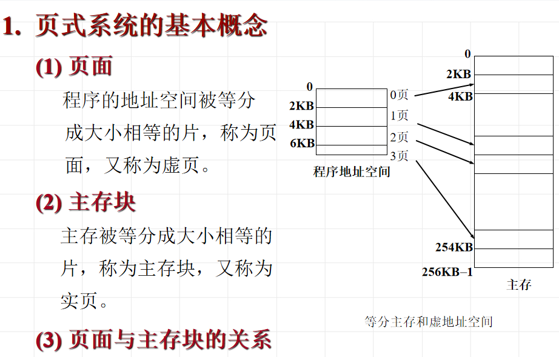

## 页式地址变换

页表：记录页和块之间对应关系的**地址变换的机构**

页表组成：

* 高速缓冲寄存器：地址变换速度快，成本高
* 主存：地址变换速度比硬件慢，成本低

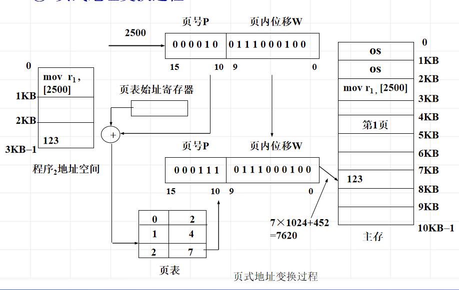

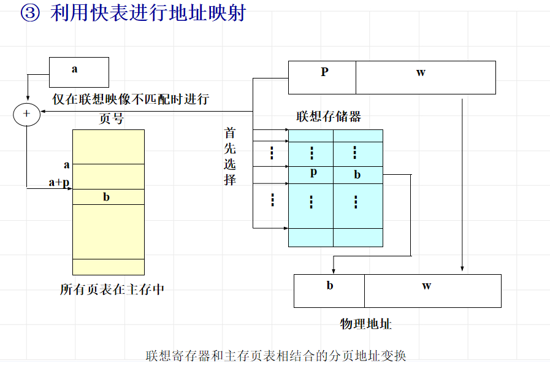

* 页表储存在内存中，如果不用快表，地址变换要**访问两次内存**，一次访问页表，一次访问最终主存物理地址

## 两种页式系统

* 简单页式系统

  将程序的逻辑地址空间和物理内存划分为固定大小的页或页面(page or page frame)，程序加载时，分配其所需的**所有页**，这些页不必连续。

  优点：没有外碎片，程序不必连续存放，程序占用空间大小可变

  缺点：程序必须全部装入内存

* 请求页式系统

  只装入一个作业的**部分页面**即可投入运行，一个作业事先分配固定数目的主存块

  在程序执行过程中，如果需执行的指令或访问的数据尚未在内存（称为**缺页**），则由处理器通知操作系统将相应的页或段调入到内存，然后继续执行程序。

* 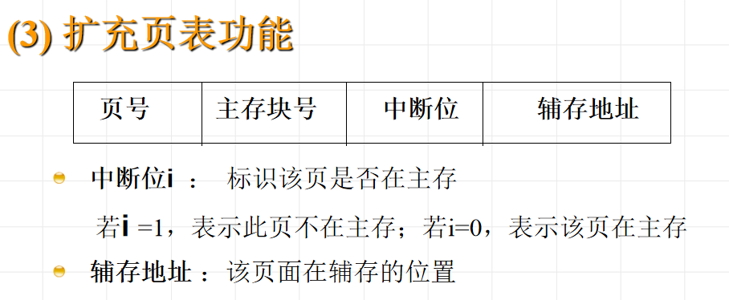

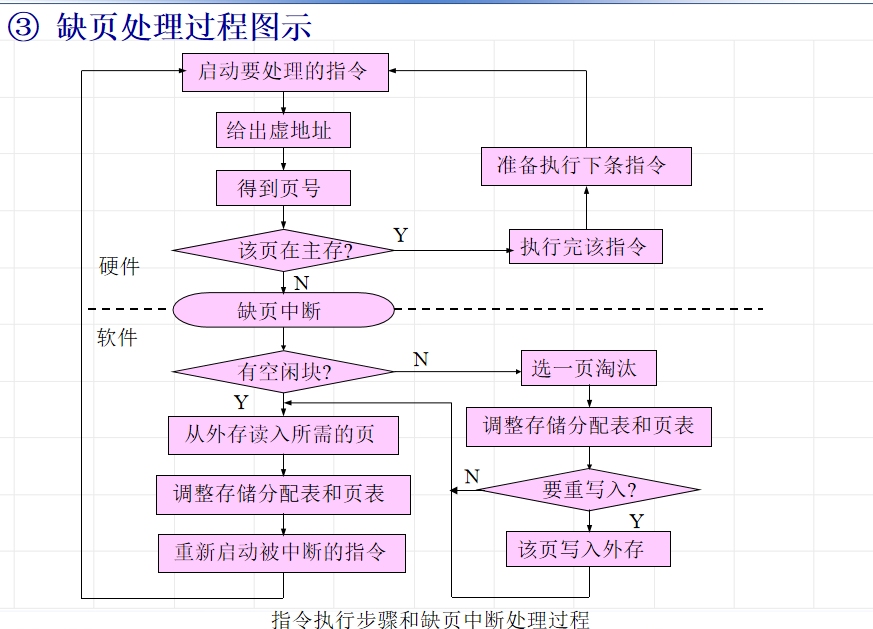

## 淘汰机制与策略

扩充页表功能：**引用位（标识该页最近是否被访问），改变位**

> 为了实现请求页式系统，需要扩充的页表功能？
>
> 中断位（是否在主存）、辅存地址

抖动/颠簸：主存和辅存之间频繁置换页面

常用置换算法：

* 最佳算法（OPT算法）

  淘汰的页应该是**以后不要再用的**，或者是在**最长时间之后才会用到的那页**

* 先进先出FIFO

  选择在**主存中居留时间最长的**一页淘汰

* 最久未使用LRU

  硬件方法：计数器

  软件方法：**页号栈**

  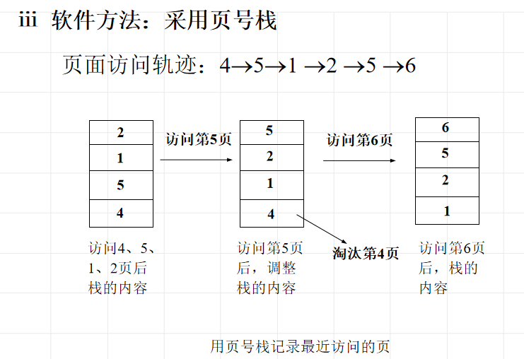

* LRU近似淘汰算法

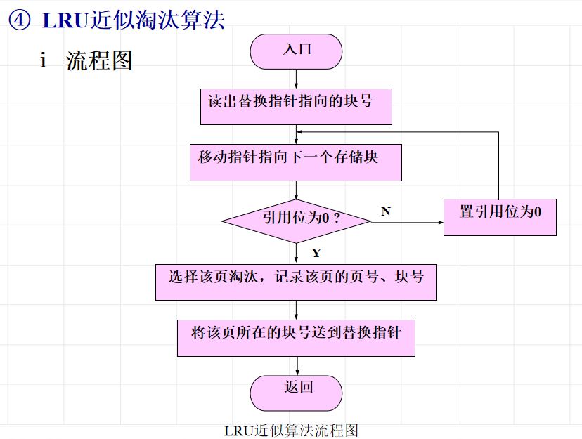

# 段页式存储管理

* 段：分段是程序中自然划分的一组**逻辑意义完整**的信息集合，如代码分段，数据分段，栈段页
* 程序地址空间：由**若干个逻辑分段**组成，每个分段有自己的名字，对于一个分段而言，它是一个连续的地址区

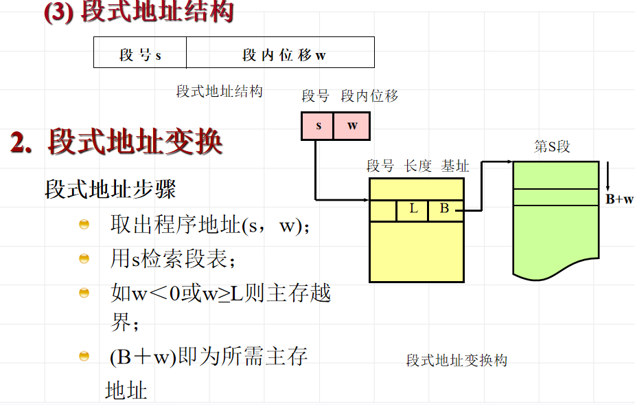

> 段和页的区别？
>
> 

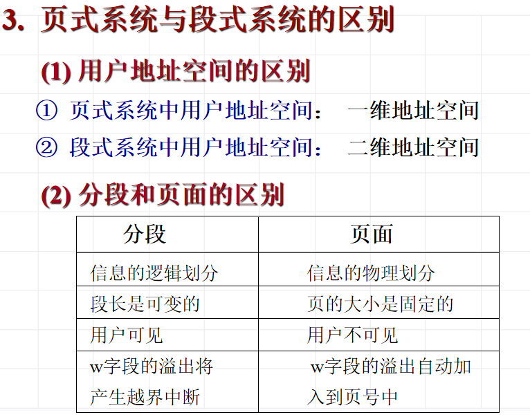

## 段页式系统

在**段式存储管理中结合分页存储**管理技术，在一个**分段内划分页面**，就形成了段页式存储管理。
