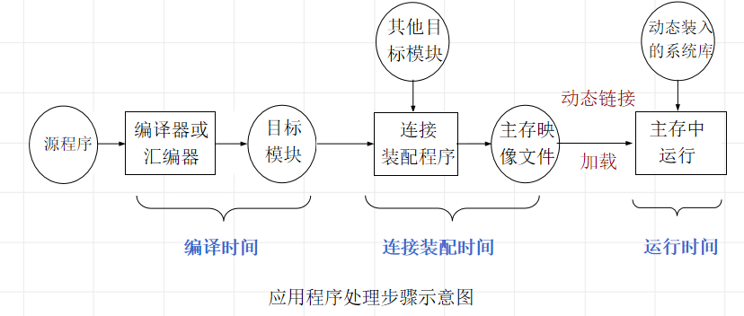
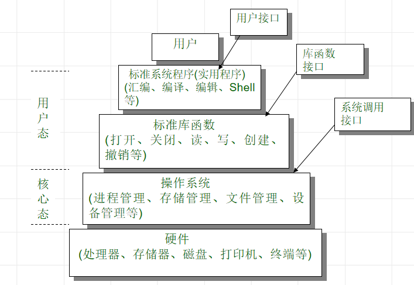
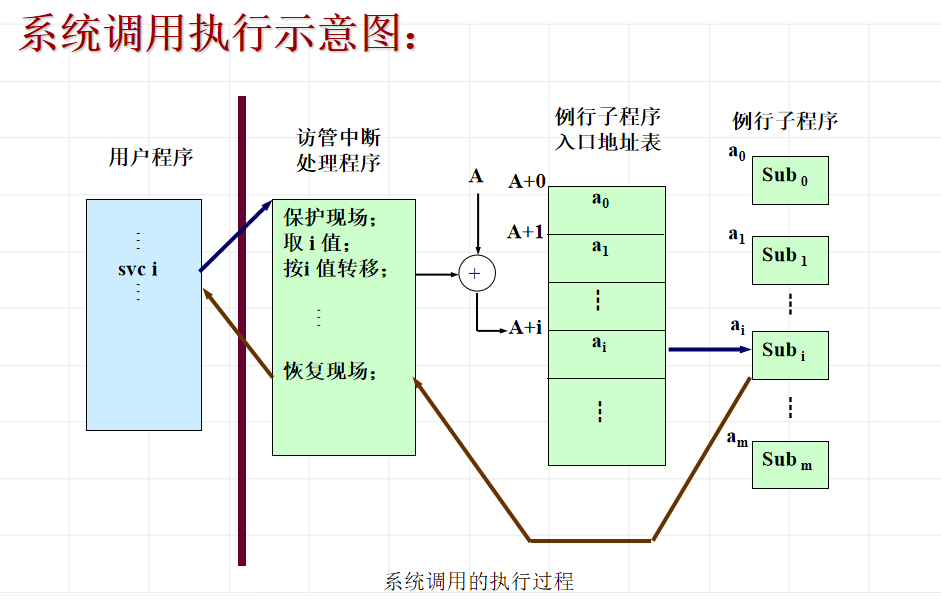

## 应用程序的处理

编辑、编译、连接、运行

应用程序处理步骤：

* 静态连接：一个源程序经编译后，生成一个可重定位的目标模块，并产生内部符号表和外部符号表，供连接程序 (Link)使用。静态连接将所需的外部函数链接到目标文件中形成为一个可执行文件。
* 动态链接：动态连接不需要将外部函数链接到目标文件中。而是在应用程序中需要调用外部函数的地方作记录，并说明要使用的外部函数名和引用入口号。形成函数调用链表。

## 用户接口

操作系统提供的用户界面

1. 操作界面（命令接口）
   * 作业控制语言（批处理操作系统）
   * 键盘命令（分时/PC 操作系统）
   * 图形界面（分时/PC 操作系统）
2. 系统功能服务界面（程序接口）

## 系统功能调用

操作系统通过提供实现各种功能的例行子程序来为用户提供服务

* 调用操作服务功能：

  采用的统一的进管方式---系统提供**访管指令**，**访管中断**，处理机执行到访管指令时发生中断。

* 什么是系统调用？

  系统功能调用是用户在程序一级请求操作系统服务的一种手段，它是带有一定功能号的“访管指令”。其功能是由操作系统中的程序完成的，即由**软件方法实现**的。 

* **系统调用和库函数的区别**

  * **系统调用代码属于OS**（驻留在内存），库函数由开发程序提供，由**编译工具链入用户程序**
  * 系统调用代码的执行引起CPU**状态变化**：用户态-->核心态，库函数的执行不会引起CPU状态变化：用户态
  * 系统调用减少了用户程序的大小

  

* 系统调用执行过程

  