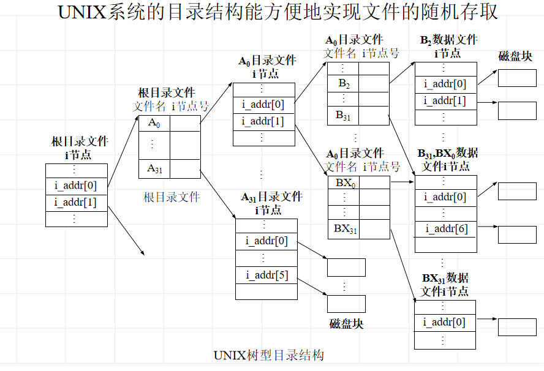

# 文件存储空间的管理

常用空闲块管理策略

* 空闲文件目录：记录空闲块的**起始块号，空闲块个数**

* 空闲块链：把所有空闲块链成一个链，每个空闲块中有指向下一个空闲块的指针，所有空闲块构成一个链表
* 位示图

# 文件的逻辑结构

* 流式文件：无结构的，相关的**有序字符的集合**，按信息的个数或以特殊字符为界进行存取的

* 记录式文件：有结构的，逻辑上看作一组**连续顺序的记录的集合**

  定长记录

  变长记录

## 文件存取方法

* 顺序存取
* 随机存取

# 文件的物理结构

* 逻辑记录：文件中按信息在**逻辑上的独立含义**来划分的信息单位，逻辑记录是**对文件进行存取操作的基本单位**。
* 物理记录：在存储介质上，由**连续信息所组成的一个区域**称为块，也叫物理记录
* 逻辑记录最终要存放到物理记录上

## 物理结构分类

### 连续文件

连续文件结构是由一组分配在磁盘连续区域的物理块组成的

特点：

* 连续存取速度快（eg：Linux内核文件需要快速读取且很大）
* 文件长度一经固定不易改变
* 文件增生和扩充不易

### 串联文件

特点：

* 更好利用辅存空间（只要有空闲块就能链接，无需物理连续）
* 易于对文件增生和扩充
* 连续存取时速度较快，随机存取性能差

### 串联文件改进----文件映照

把链接文件中的链接字集中在一结构中，这样既保持了链接文件的优点，也克服了其缺点

> FAT表比串联优势在哪？
>
> 可以较好支撑随机存取，虽然仍是从前向后找，但是每次存取是读FAT数组（FAT在系统磁盘读到内存，以数组形式存储）

### 索引文件

系统为**每个文件**建立**逻辑块号与物理块号**的对照表。这张表称为该文件的索引表。文件由**数据文件**和**索引表**构成。这种文件称为索引文件

特点:

* 易于文件增删
* 直接读写任意记录

### 索引表的组织

* 直接索引：把索引表直接放在文件目录

  

* 一级间接索引：

  

* 二级间接索引

  

# 文件目录及其结构

**操作系统提供的系统调用接口是所有软件获取资源的最底层实现**

* 文件目录（目录文件）：文件目录是记录文件的名字、存放地址及其他有关文件的说明信息和控制信息的数据结构

* 文件目录项内容：

  1. 文件名
  2. 文件逻辑结构：记录是否定长，记录长度，记录个数等
  3. 文件物理结构：连续（第一块物理地址，文件占用块数），串联（第一块物理地址），索引（索引表地址）
  4. 存取控制信息
  5. 管理信息
  6. 文件类型：数据文件、目录文件、块存储设备文件、字符设备文件

  

## 一级文件目录

* 把系统中所有文件目录项放在一张表中

## 树型文件目录结构

**记住根目录是一个/，后面的/是分隔符，计算目录不要忘记根目录**

# 文件共享与安全

* 文件安全：

  如何进行文件保护：进行存取权限验证

  存取权限验证方法：访问控制矩阵，存取控制表，用户控制表，口令，密码

* 链接文件

# 文件操作与文件备份

## 文件操作

1. 打开和关闭文件

   

   

## 文件备份

1. 周期性转储
2. 增量性转储

# UNIX文件系统的主要结构及实现技术

## UNIX文件系统特点

* 树型文件目录结构
* 可安装拆卸的文件系统
* 文件是无结构字符流式文件
* 将外部设备与文件一样对待

UNIX文件类型

1. 普通文件
2. 目录文件
3. 特别文件

## UNIX系统的索引文件结构

1. 文件索引节点

   UNIX系统把文件目录项中**除了名字以外的信息**全部存放到一个磁盘的数据块上，这种数据块就是文件索引节点 (indexnode)，简称i节点，又称为磁盘索引节点。在**目录项中只有文件的名字和对应i节点的编号**。

   

2. 文件索引结构

   

3. UNIX文件目录结构

   目录项与目录文件

   

   每个文件系统都有一个**根目录文件**，它的辅存i节点是相应文件存储设备上**辅存索引区中的第一个**。

   

   文件目录结构中的勾链：用户可以用不同文件路径名共享一个文件，**一个文件由多个目录项指向**

   

   * 基于索引节点共享方式（硬链接）

     

     

   * 利用符号链接实现文件共享(windows里面的快捷方式)

     

## UNIX系统的打开文件机构

打开文件机构由**活动i节点表**、**打开文件表**和**用户文件描述符**表组成

每个open操作建立一个打开文件表

0标准输入，1标准输出，2出错，所以最低文件描述符从3开始

父子进程文件共享：

* 父进程和子进程共享文件表项，父进程和子进程增加“文件打开计数”。共用inode偏移。
* dup增加文件描述符
* 父子进程独立运行后（fork后）再打开的文件不共享file对象。

## 文件存储器空闲块的管理

空闲磁盘块的管理

每一组的最后一块作为索引表，用来登记下一组100块的物理块号和块数，**利用空闲块管理空闲块**

