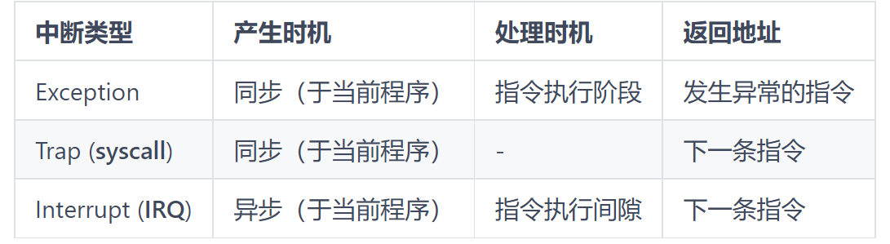

## 操作系统虚拟机

* **在裸机上配置了操作系统程序后就构成了操作系统虚拟机**

操作系统虚拟机的指令

* 裸机：机器指令
* 操作系统虚拟机的指令系统：
  1. 操作命令（**命令接口**）
     * 键盘命令
     * 作业控制语言
     * GUI
  2. 系统功能调用（**程序接口**）

## 操作系统结构

* 单体结构

  操作系统无结构，代码执行效率高，规模扩大时难以维护：Unix/Linux

* 模块化结构

* 微内核结构

  操作系统以C/S形式为用户程序服务，内核发消息给服务器，服务器接受用户请求，内核用消息把结果返回用户

  > 此处的服务器就是运行内核外服务进程的那些服务器，简单理解成外包

  微内核：最基本的核心功能，进程/线程管理，低级存储器管理，中断和陷入处理

  服务进程（核外）：文件服务，存储管理服务......

  优点：正确性，灵活性，可维护性，便于扩展性

* 层次结构的操作系统

## 处理机的特权级

处理机状态分类：

* 管态：处理机特权级，可以用全部指令和系统资源
* 用户态：禁用特权指令，不能直接取用资源与改变机器状态，只允许用户进程访问自己的存储区域

PSW：程序状态字，区别不同处理器工作状态

> 处理机状态的特权指令集：
>
> * 涉及外部设备输入/输出指令
> * 修改特殊寄存器的指令
> * 改变机器状态的指令
>
> 用户态转到核态：
>
> * 用户程序访问系统资源
> * 中断
> * 系统异常
>
> 核态转到用户态：
>
> * 执行用户程序

## 中断及其处理

1. 中断响应
2. 保护现场
3. 中断服务
4. 恢复现场

中断响应是当中央处理机发现已有中断请求时，中止现行程序执行，并自动引出中断处理程序的过程

中断响应实质：**交换指令地址及处理机的状态信息**

> 现场：
>
> * 后续指令在内存中的单元号
> * 程序运行所处状态
> * 指令执行情况
> * 程序执行的中间结果

向量中断：当中断发生时，由**中断源自己引导处理机进入中断服务程序**的中断过程称为**向量中断**

**每类中断类型都有自己的中断向量**，包含：**中断服务例行程序的入口地址**和**处理器状态字**。

## Linux系统的特权级与中断处理

### 特权级

* 特权级0-----核态（内核模式）
* 特权级3-----用户态（用户模式）

### Linux系统中断处理的上半部和下半部

> 为什么分上下半部？
>
> 不然中断处理时间太长，影响工作效率

* 上半部：中断响应后必须立即处理的工作即刻执行

* 下半部：更多的处理工作向后推迟执行

  实现机制：

  * tasklet：通过软中断实现

  * 工作队列

    **如果下半部工作需要睡眠则选择工作队列，否则可选tasklet，tasklet中任务不可阻塞**

