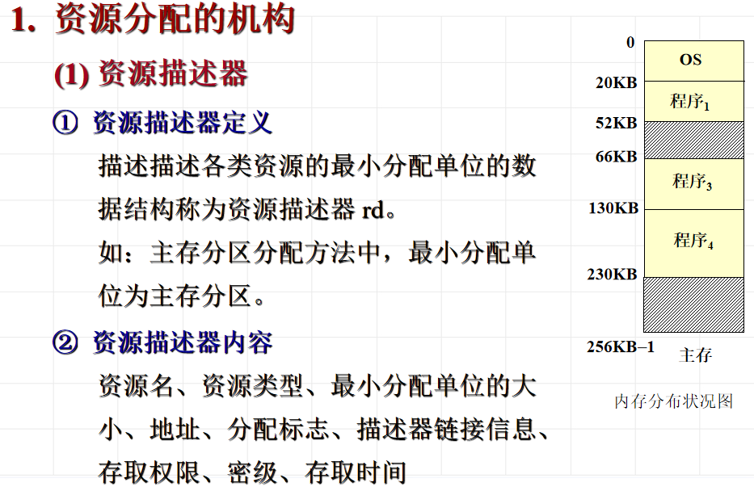
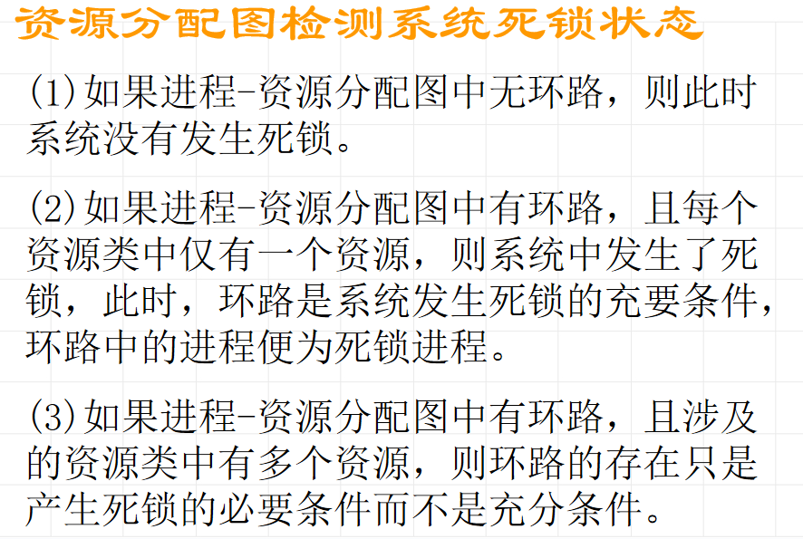

# 资源分配机构和策略

## 资源分配机构

## 资源分配策略

常用的资源分配策略：

1. 先进先出：每产生一个新请求放入队尾	
2. 优先调度：定义每个进程优先级，按优先级高低插入到相应位置

# 死锁

死锁产生原因：

* 系统资源不足
* 程序推进顺序非法

死锁必要条件：

* 互斥条件
* 不剥夺条件
* 部分分配
* 环路条件

解决策略：打破必要条件

* 静态资源分配---预防死锁

* 有控资源分配---避免死锁

  有序资源分配法：给所有资源**指定唯一编号**，所有分配请求必须以上升的次序进行，打破环路条件

* 死锁检测与解除

* 忽略死锁

死锁的检测和解除：

