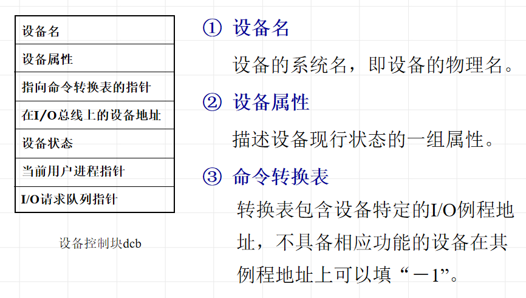
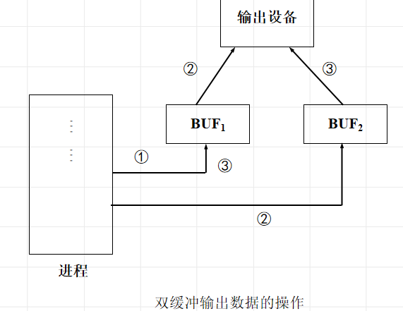
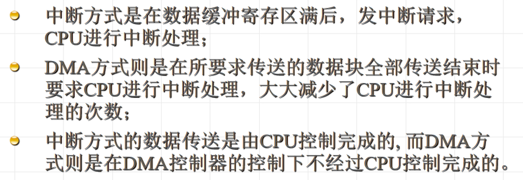

# 设备管理概述

## 设备分类

* 存储设备：磁盘，磁鼓
* 输入输出设备：键盘，显示器，打印机
* 通信设备：调制调解器，网卡等

## 设备管理目标

1. 提高设备利用率

   * 合理分配设备
   * 提高设备和CPU，各种外部设备之间的并行性

2. 方便用户使用

   提供使用方便且独立于设备的界面

   * 统一：对不同设备提供一致界面
   * 独立于设备：用户使用的设备与物理设备无关

## 设备管理功能

* 状态跟踪

* 设备分配与回收

  1. 静态分配------应用程序级
  2. 动态分配------进程级

* 设备控制

  实施设备驱动和中断处理的工作

## 设备独立性

用户在程序中使用的设备与实际使用的设备无关，也就是在用户程序中仅使用逻辑设备名

### 设备控制块DCB

# 缓冲技术

缓冲是两种不同速度的设备之间传输信息时平滑传输过程的常用手段

## 常用缓冲技术

* 双缓冲

  

* 环形缓冲

* 缓冲池

# 设备分配

* 独享分配

* 共享分配

* 虚拟分配

## 设备分配算法

先来先服务

优先级高者优先

特定设备分配算法------磁盘调度算法

* 先来先服务

* 最短寻道时间优先

* 扫描算法

  从磁盘一端扫描到另一端，沿途反映请求，到另一端了反向移动（电梯算法）

  特点：寻道性能较好，但是不利于远离磁头一端的访问请求

* 循环扫描移动

  **规定磁头单向移动**

  特点：消除了对两端磁道请求的不公平

# 设备控制

## 输入输出控制方式

* 循环测试I/O方式

* I/O中断方式

* DMA方式

  设备与主存之间使用总线进行数据交换

  >DMA vs 中断
  >
  >

* 通道方式

  通道是独立于CPU的专门负责数据输入/输出传输工作的处理机，对外部设备实现统一管理，代替CPU对输入/输出操作进行控制，从而使输入，输出操作可与CPU并行操作（可以理解成专门用于I/O处理的小CPU）

  目的：使CPU从I/O事务中解脱出来，提高CPU与设备，设备与设备的并行工作能力

## I/O子系统功能

1. I/O子系统的接口
   * 在应用层为用户提供 I/O应用接口
   * 每个通用设备类型都通过一组标准函数 (及接口)来访问
2.  I/O控制的功能
   * 解释用户的I/O系统调用 
   * 设备驱动
   * 中断处理
3. 设备处理程序
4. 控制I/O核心模块的方式