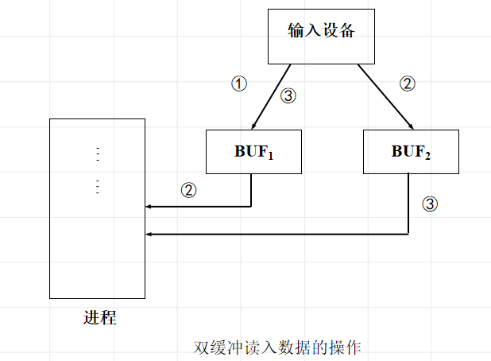

# 设备管理概述

* 计算机中除**CPU**和**内存储**外的所有设备和装置称为计算机外部设备

## 设备分类

* 存储设备：磁盘，磁鼓
* 输入输出设备：键盘，显示器，打印机
* 通信设备：调制调解器，网卡等

## 设备管理目标

1. 提高设备利用率

   * 合理分配设备
   * 提高设备和CPU之间，各种外部设备之间的并行性

2. 方便用户使用

   提供使用方便且独立于设备的界面

   * 统一：对不同设备提供一致界面
   * 独立于设备：用户使用的设备与物理设备无关

## 设备管理功能

* 状态跟踪

* 设备分配与回收

  1. 静态分配------应用程序级

     程序进⼊系统的时候就进⾏分配,退出系统的时候回收全部资源

  2. 动态分配------进程级

     进程提出设备申请的时候分配,使⽤完毕⽴即收回

* 设备控制

  实施设备驱动和中断处理的工作

## 设备独立性

用户在程序中使用的设备与实际使用的设备无关，也就是在用户程序中仅使用逻辑设备名

优点：

* 方便用户
* 改善设备利用率
* 提高系统的可扩展性和可适应性

### 设备控制块DCB

# 缓冲技术

缓冲是两种**不同速度**的设备之间传输信息时**平滑传输过程**的常用手段

> 为什么要缓冲？
>
> * 处理数据流生产者和消费者的速度差异
>
> * 协调传输数据大小不一致的设备
>
>   如：在计算机网络中用来处理消息的分段和重组。
>
> * 应用程序的拷贝语义

## 常用缓冲技术

* 双缓冲

  

* 环形缓冲

* 缓冲池

## Unix系统的缓冲区管理

缓冲读：**预先缓存**

缓冲写：**延迟发送**

* 缓冲区组成：缓冲数组、缓冲首部

* 缓冲区队列结构：

  1. 设备缓冲区队列**b链**：与**某类设备有关**的所有缓冲区组成的队列
  2. 空闲缓冲区队列**av链**：**可供重新分配使用**的缓冲区组成的队列

  b链永远都在，区别是av链的摘取使用和空闲放回

# 设备分配

* 独享分配：让一个作业在整个运行期间**独占使用**的设备

* 共享分配：由**多个作业、进程共同使用**的设备称为共享设备

* 虚拟分配：当进程需要与独占型设备交换信息时，系统将**分配磁盘空间，并建立相应的数据结构**，这种分配方法称为设备的虚拟分配

  虚拟技术：在一类物理设备上模拟另一类物理设备的技术，是将**独占设备转化为共享设备**的技术

  通常把用来代替独占型设备的那部分外存空间 (包括有关的控制表格)称为虚拟设备

Spooling系统

* SPOOLING系统提供**外围设备同时联机操作**的功能
* 预输入
* 缓输出
* 系统优点：
  * 提供虚拟设备
  * 外围设备同时联机操作
  * 加快作业处理速度

## 设备分配算法

先来先服务

优先级高者优先

特定设备分配算法------磁盘调度算法

* 先来先服务FCFS

* 最短寻道时间优先

  性能比FCFS好，但不保证时间最优，且**可能导致饥饿**

* 扫描算法

  从磁盘一端扫描到另一端，沿途反映请求，到另一端了反向移动（电梯算法）

  特点：寻道性能较好，但是**不利于远离磁头一端的访问请求**

* 循环扫描移动

  **规定磁头单向移动**

  特点：消除了对两端磁道请求的不公平

# 设备控制

## 输入输出控制方式

* 循环测试I/O方式

* I/O中断方式

  方式的优点是大大地**提高了CPU的利用效率**，缺点是**每次I/O都要CPU的干预**，如果系统中配备了多台（套）设备时，CPU的利用率也会降低

* DMA方式

  **设备与主存之间使用总线进行数据交换**

  >DMA vs 中断
  >
  >
  >
  >

* 通道方式

  通道是独立于CPU的专门负责数据输入/输出传输工作的处理机，对外部设备实现统一管理，代替CPU对输入/输出操作进行控制，从而使输入，输出操作可与CPU并行操作（可以理解成专门用于I/O处理的小CPU），当通道传输完成最后一条指令时，向CPU发I/O中断，并且通道停止工作

  目的：使CPU从I/O事务中解脱出来，提高CPU与设备，设备与设备的并行工作能力

## I/O子系统功能

1. I/O子系统的接口
   * 在应用层为用户提供 I/O应用接口
   * 每个通用设备类型都通过一组标准函数 (及接口)来访问

2. I/O控制的功能
   * 解释用户的I/O系统调用 

     I/O接口程序的作用：

     * 负责解释用户的I/O系统调用，将其转换成I/O控制模块认识的命令形式后，将I/O请求发给对应的设备处理进程

   * 设备驱动

   * 中断处理

3. 设备处理程序

4. 控制I/O核心模块的方式

   * 以设备处理进程的方式：每类设备一个进程，要用唤醒
   * 把设备和文件一样对待：使用**文件系统的系统调用**命令进行设备的读、写

