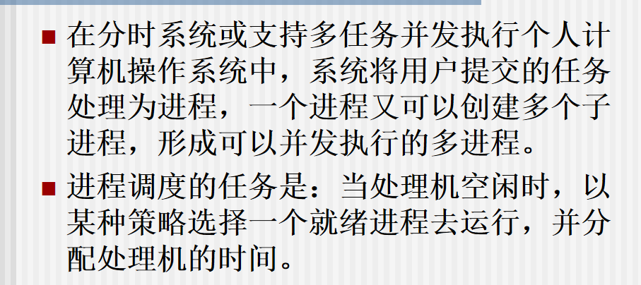
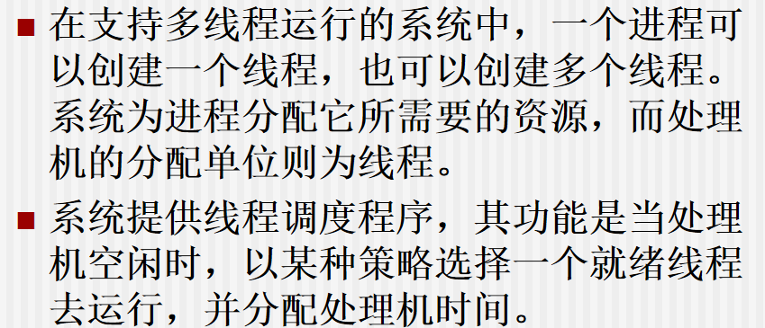
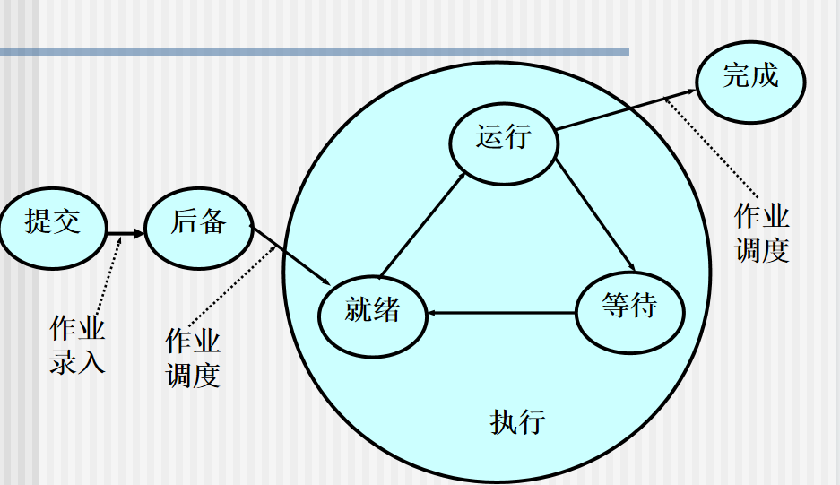
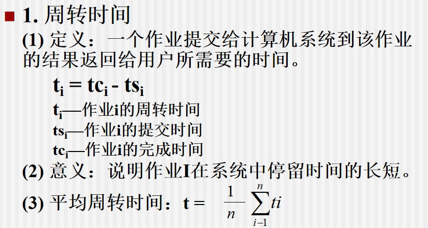
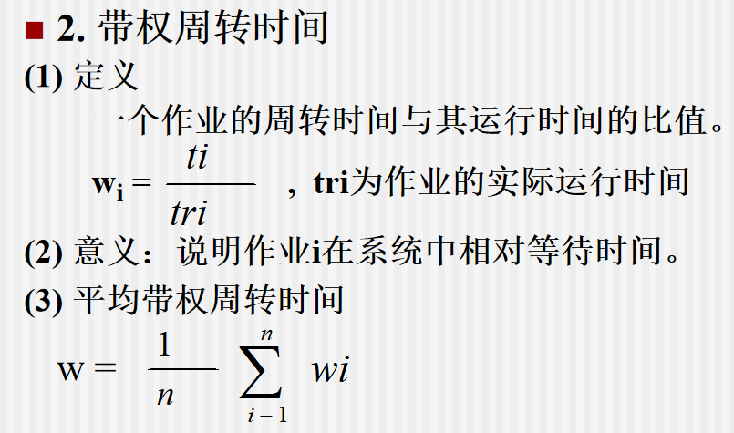

# 处理机的多级调度

## 批处理系统中的处理机调度

* 作业调度
* 进程调度

## 多任务操作系统中的处理机调度

## 多线程操作系统中的处理机调度

# 作业调度

作业状态：

* 提交状态
* 后备状态
* 执行状态
* 完成状态

## 作业调度算法

* 先来先服务
* 短作业优先
* 响应比高优先：响应比=响应时间/运行时间

# 进程调度

## CPU调度时机

* 运行态-->等待态
* 运行态-->就绪态（与调度策略有关）
* 等待态-->就绪态（与调度策略有关）
* 进程中止

## 进程调度方式

* 非剥夺方式：等当前进程执行完成或者进入阻塞态，才把处理机分配给“重要且紧迫”进程
* 剥夺方式：当“重要且紧迫”进程到来，马上暂停当前执行进程，把处理机分配给优先级更高的进程

## 进程调度算法

* 进程优先数调度算法
  * 静态优先数
  
  * 动态优先数
  
    占用CPU一段时间，降低优先级
  
    等待一定时间，提高优先级
  
    IO操作后，提高优先级
  
* 循环轮转调度算法
  * 简单循环
  * 可变时间片循环
  * 多重时间片循环

# 死锁问题

