## 程序的顺序与并发执行

* 顺序不但指一个程序内部，也指两个模块之间

* 并发：宏观上程序在同一时间段运行，微观上任一时刻仅有一个程序在处理器上运行

  * 失去程序的封闭性与可再现性

  * 程序与计算不再一一对应

  * 程序并发执行的相互制约：

    1. 间接相互制约---资源共享

    2. 直接相互制约---公共变量

## 进程概念

* 所谓进程，就是一个程序在给定活动空间和初始环境下，在一个处理机上的执行过程

> 进程与程序区别：
>
> * 程序是静态概念，进程动态
> * 进程是竞争系统资源的基本单位
> * 一个程序可以对应多个进程，一个进程至少有一个程序

* 进程状态：
  1. 运行状态（running）：进程已经获得运行所需资源，程序在处理机上执行
  2. 等待状态（wait）：进程等待某一事件发生而暂停执行，获取CPU控制权也无法执行
  3. 就绪状态（ready）：获得除了CPU之外运行所必需资源，一旦得到CPU控制权，立即可以运行

## 进程基本控制

* 进程控制块PCB：描述进程与其他进程，系统资源的关系以及进程在不同时期所处的状态的数据结构，描述进程的动态特征

  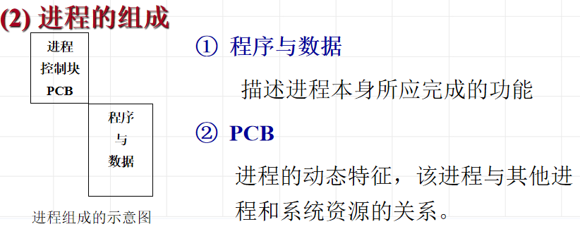

## 进程的相互制约关系

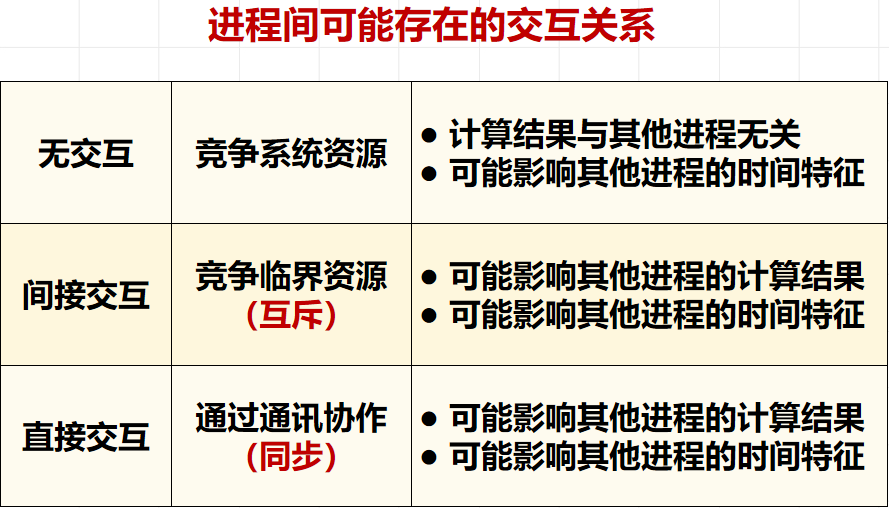

* 临界资源：在某个时刻只能允许一个进程占用的资源
* 临界区：  临界区是进程中对公共变量 (或存储区)进行审查与修改的程序段，称为相对于该公共变量的临界区。
* **同一临界资源的临界区才需要互斥进入**  

临界区访问规则：

* 空闲则入
* 忙则等待
* 有限等待：临界区代码不要出现死循环，睡眠挂起等操作，越短越好
* 让权等待（optional）：不能进入临界区的进程释放CPU

进程同步：并发进程在一些关键点上可能需要互相等待与互通消息，这种相互制约的等待与互通消息称为进程同步

## 进程互斥与同步机制

* 锁（只支持互斥）

* 信号灯和P，V操作（支持互斥和同步）**p减v加**

  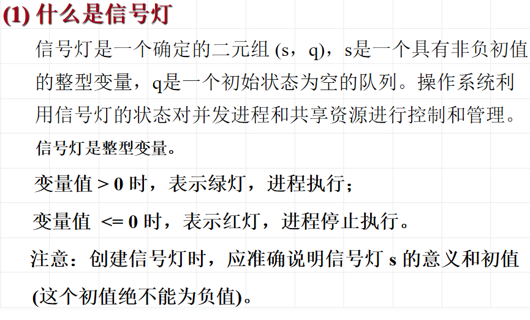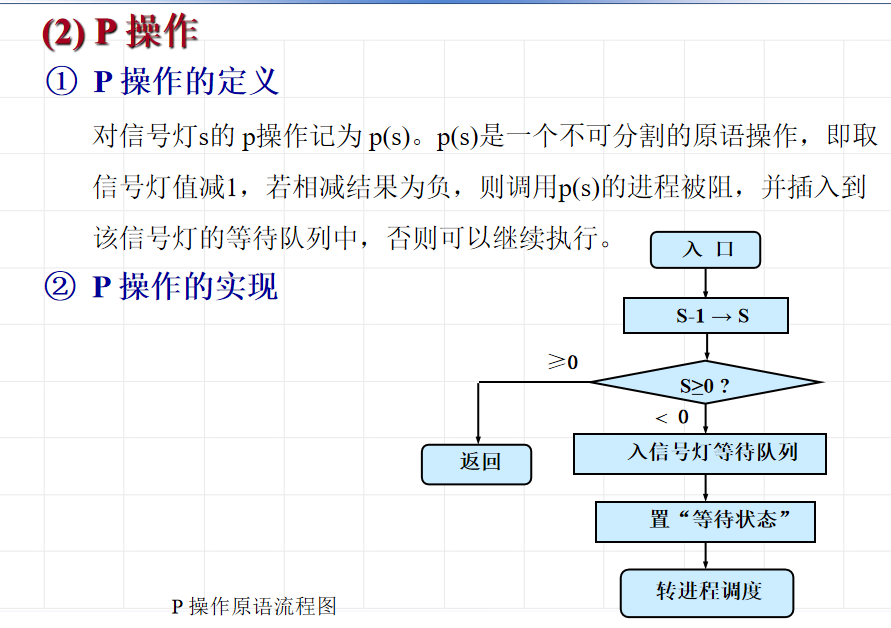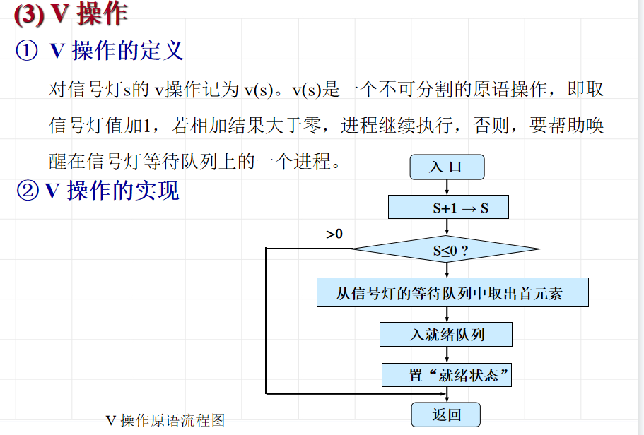

  

## 进程互斥同步的实现

两类同步问题的解法：

* 合作进程的执行次序

  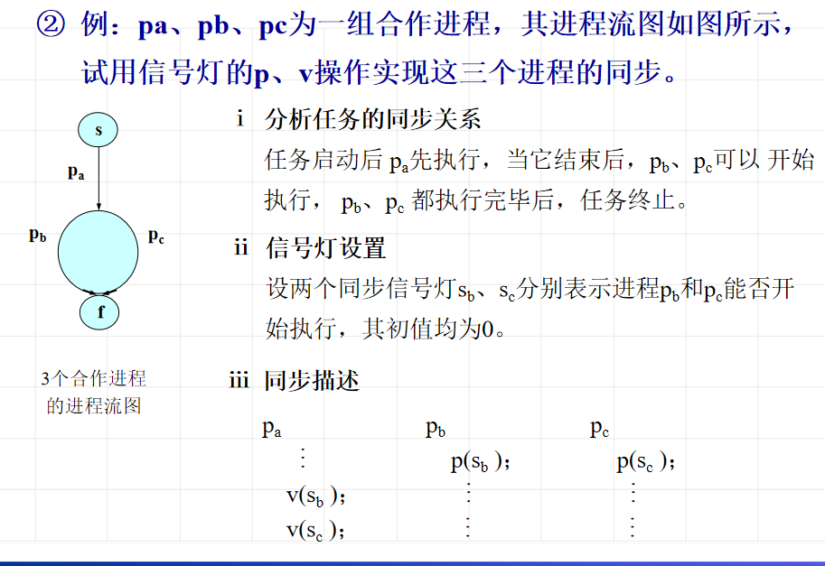

* 共享缓冲区的合作进程的同步解法

  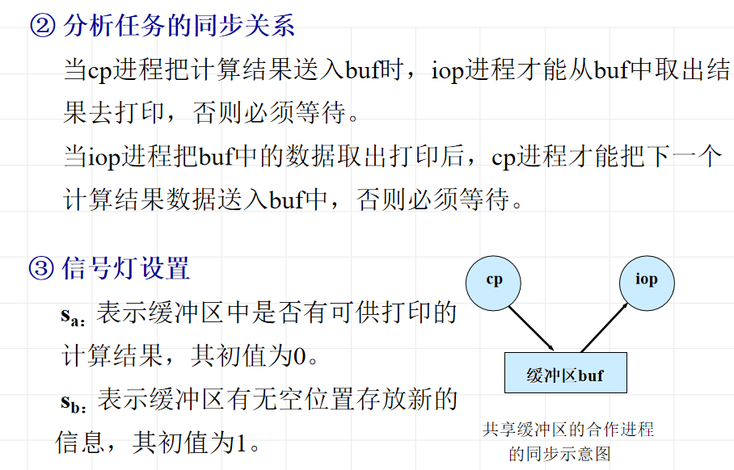

  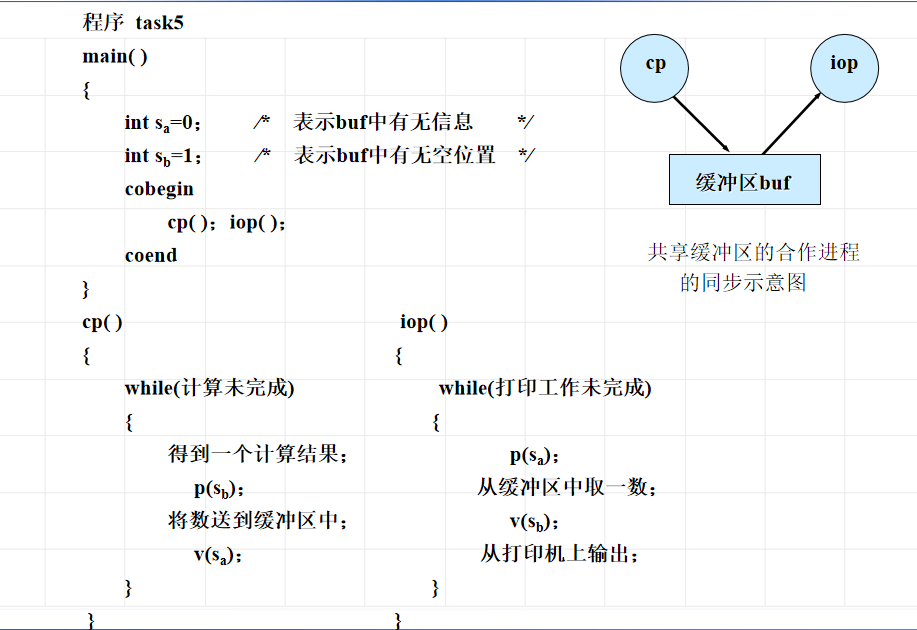

> 互斥就是交替运行吗？
>
> 不是，互斥只满足**排他性控制**，未必满足交替。
>
> 交替是互斥的充分不必要条件。

### 生产者-消费者问题

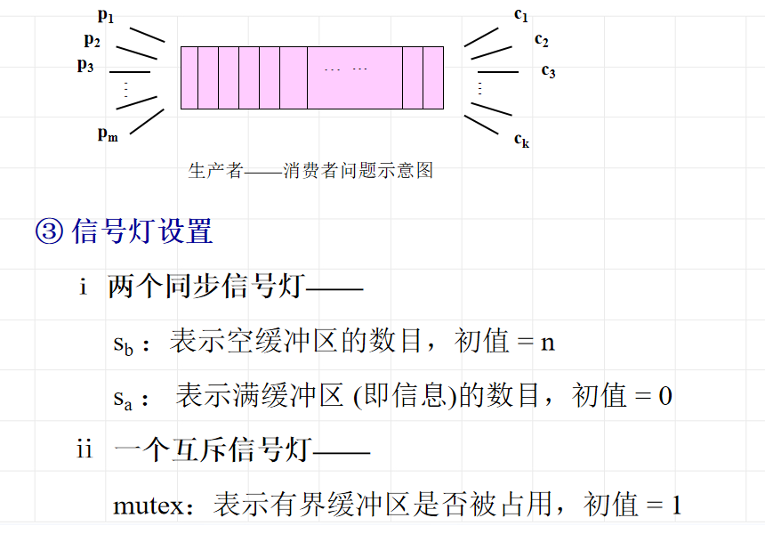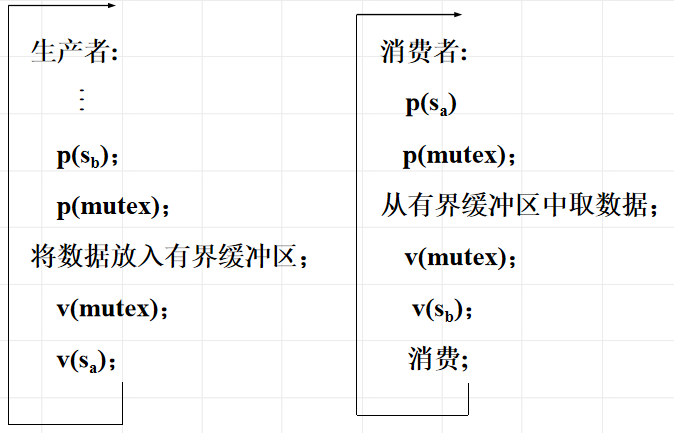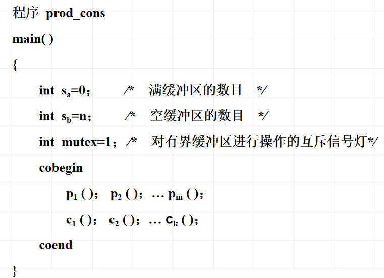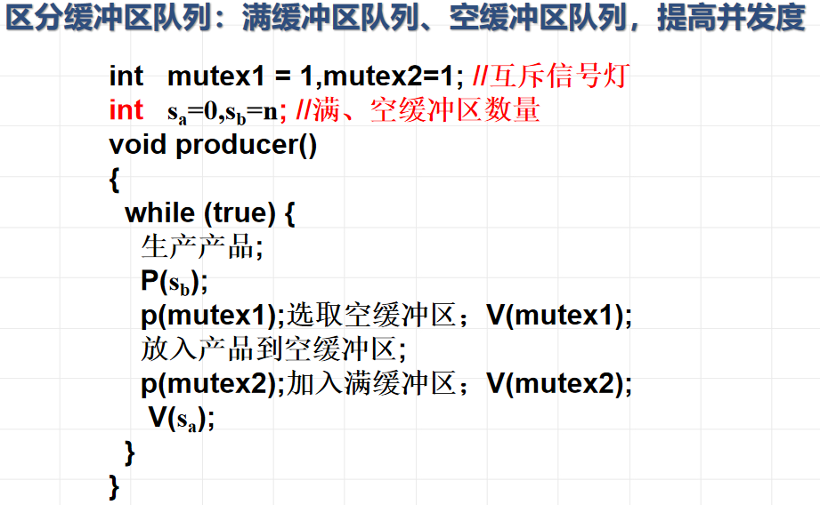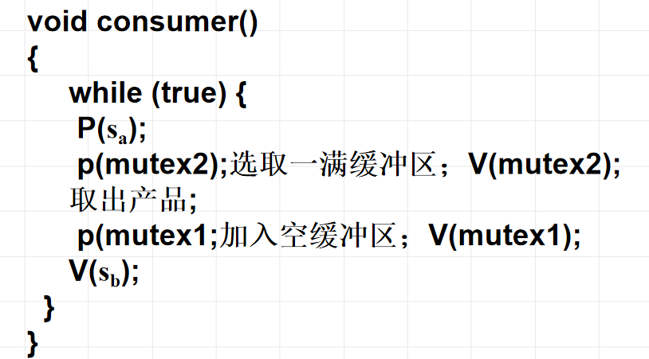

## 进程间通信机制

进程通信方式：

1. 消息缓存通信

   在内存中开设缓冲区，发送进程将消息送入缓冲区，接收进程接收传递来的缓冲区。

2. 信箱通信-----实现非实时通信

   信箱通信中，所使用的信箱可以位于用户空间中，是接收进程地址空间的一部分；也可以放置在操作系统的空间中。

3. 共享内存

   向内核中申请一块允许两个或者更多进程访问的内存空间

## 线程概念

* 把进程的两项功能－－“独立分配资源”与“被调度分派执行”分离开来

* 进程作为系统资源分配和保护的独立单位，无需频繁切换
* 线程作为系统调度和分派的基本单位，能轻装运行，会被频繁地调度和切换

**线程定义：**比进程更小的活动单位，进程中的一个执行路径

* 有自己私有的堆栈和处理机执行环境

*  它与父进程共享分配给父进程的主存
* **一个进程创建的多个线程可以共享地址区域和数据**

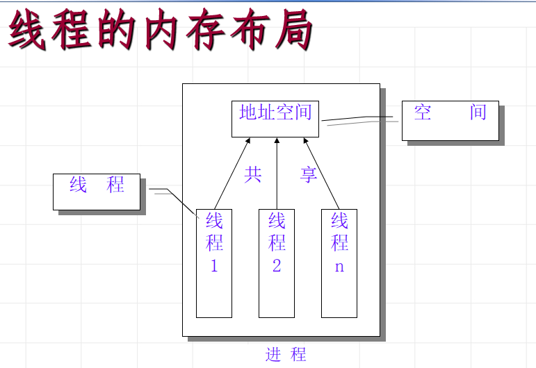

* wait仅用于父子进程，join用于父进程和子线程