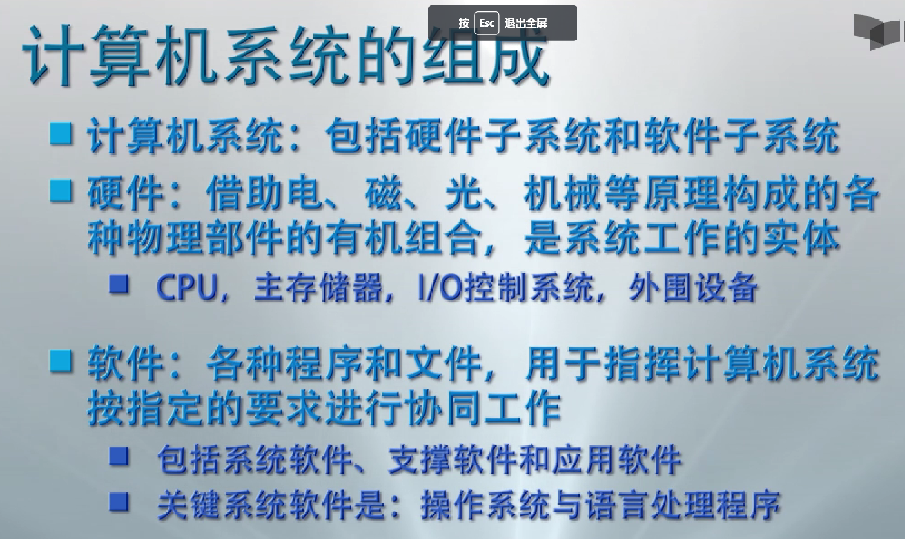
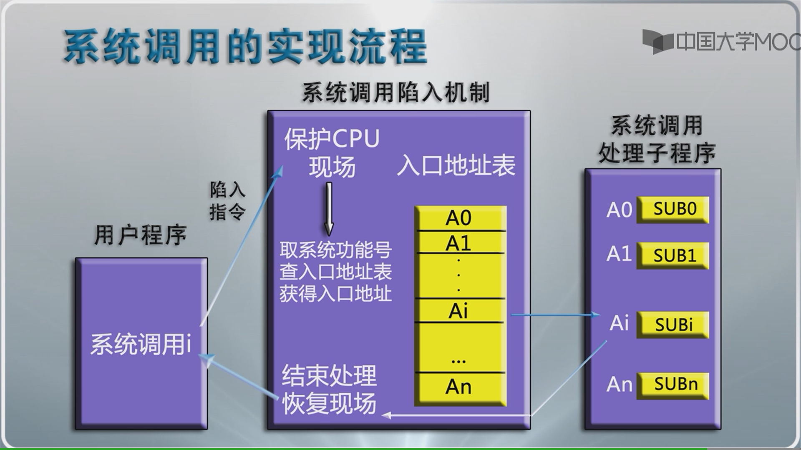
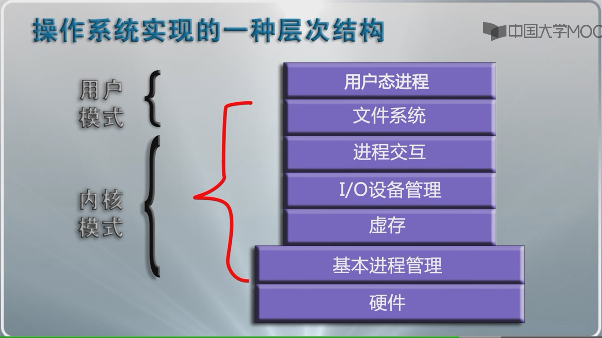

# 操作系统概述

## 资源管理角度

* 驱动程序：**屏蔽资源使用的底层细节**，最底层的，直接控制和监视各类硬件（或文件）资源的部分

## 操作系统控制计算机角度

* 脱机作业控制
* 联机作业控制

## 人机交互角度

* WIMP界面：窗口，图标，菜单，指示装置

## 程序接口角度

* 操作系统的程序接口------系统调用

  系统调用是操作系统实现的完成某种特定功能的过程

  为所有运行程序提供访问操作系统的接口

* 系统调用的实现机制

  * 陷入处理机制
  * 陷入指令

* 系统调用处理流程

  

## 系统结构的角度

操作系统实现的一种层次结构

