# 处理器与寄存器

* 处理器部件

  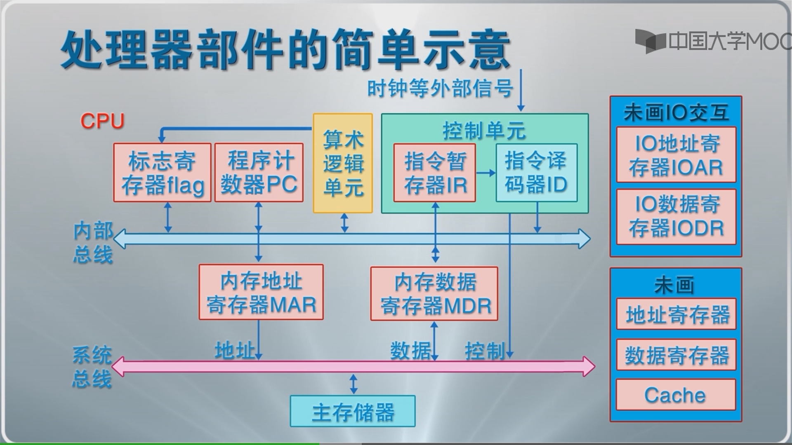

指令执行周期：取指---解码----执行

* 特权指令与非特权指令

* 处理器模式

  0：操作系统内核

  1：系统调用

  2：共享库程序

  3：用户程序

  一般只用0和3对应内核模式和用户模式

# 中断

* 操作系统是“**中断驱动**”的，中断是激活操作系统的唯一方式

## 中断，异常与系统异常

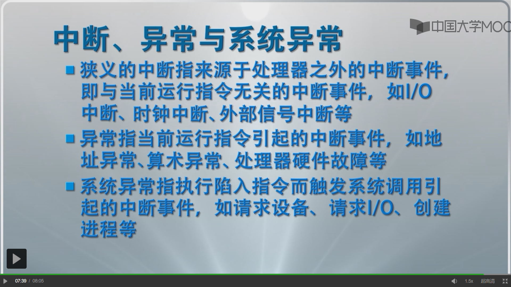

# 中断源

* 处理器硬件故障中断异常

  **处理器，内存储器，，总线**等硬件出错

* 程序性中断事件

  处理器执行机器指令引起的（eg：除以0，非法指令，终止进程指令，虚拟地址异常：调整内存后重新执行）

* 自愿性中断

  处理器执行陷入指令请求OS服务引起的

* I/O中断

  外围设备报告I/O状态的中断事件（打印机打一半缺纸）

* 外部中断

  外围设备发出信号引起（eg：时钟中断，设备报到与结束，键鼠信号中断，关机/重启中断）

# 中断系统

* 中断只能发生在一条指令执行完后

## 中断装置

计算机系统中发现并响应中断/异常的硬件装置

1. 处理器外的中断：**中断控制器**发现和响应
2. 处理器内异常：指令的控制逻辑和实现线路发现和响应，相应机制为**陷阱**
3. 请求OS服务的系统异常：处理器执行**陷入指令**时直接触发，相应机制称为**系统陷阱**

## 中断响应过程

* 发现中断源，提出中断请求
* 中断当前程序的执行，记录中断点
* 转向操作系统的中断处理程序

## 中断的处理

* 中断处理程序

* 恢复正常操作：

  case1：直接返回刚刚被中断的进程

  case2（eg: I/O中断）：中断当前进程运行，调整进程队列，启动进程调度，选择下一个执行的进程并恢复其执行

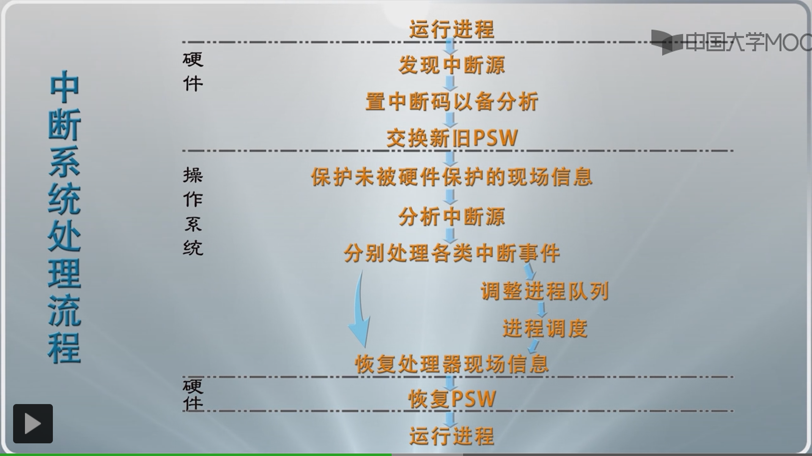

## 多中断的响应与处理

### 中断屏蔽

有选择的响应中断

### 中断优先级

有优先度的响应中断

### 中断的嵌套处理

中断嵌套处理改变中断处理次序，先响应的有可能后处理

考虑到系统效率和实现代价，嵌套限制在一定层数内，如三层 

# 进程及其状态

进程：一个具有一定独立功能的程序关于某个数据集的一次运行活动

* 进程是操作系统进行资源分配和调度的一个独立单位

  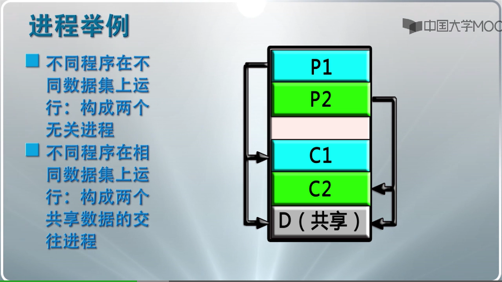

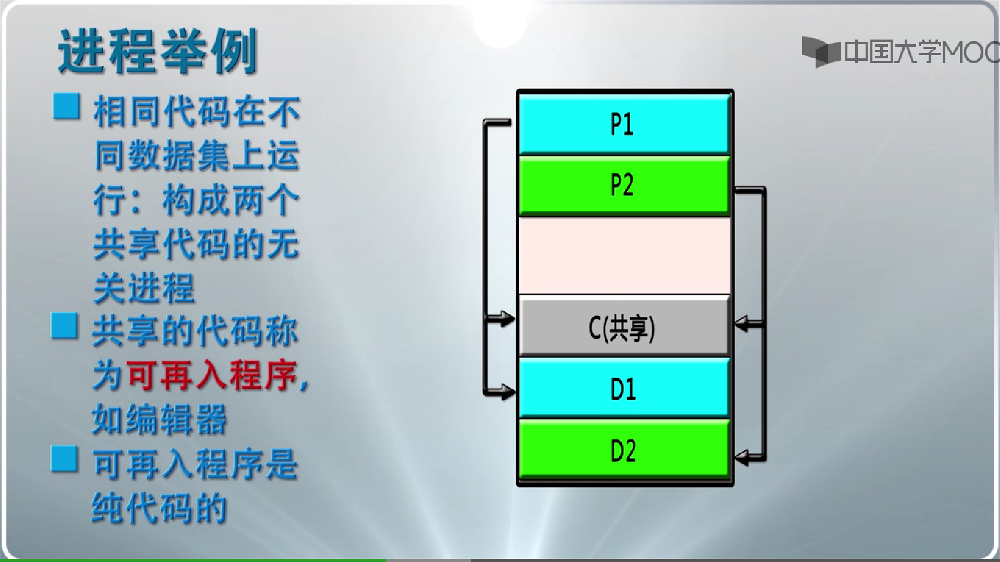

C:代码 D：数据集

## 概念级的进程状态

* 运行态
* 等待态
* 就绪态

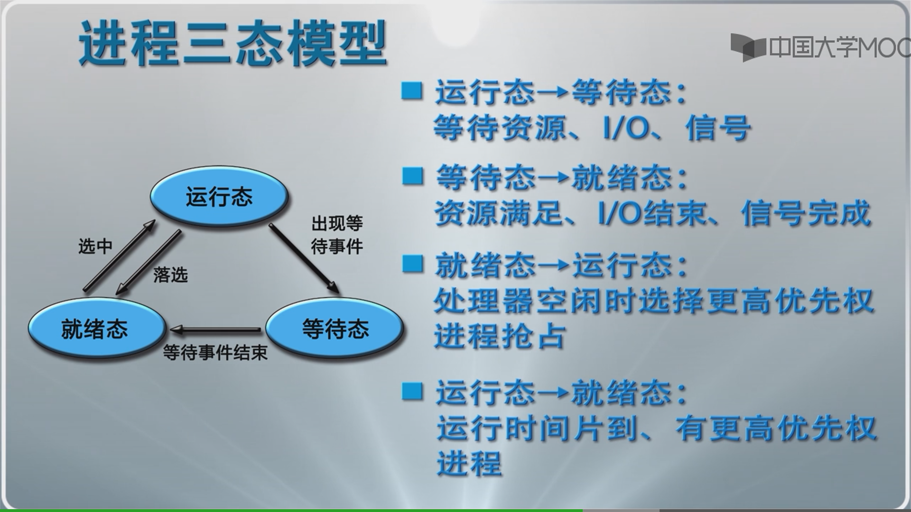

## 进程挂起概念

* 挂起态和等待态有本质区别，后者占有已申请到的资源处于等待，前者没有任何资源
* 进程挂起：剥夺某些进程的内存和其他资源，调入OS管理的对换区，不参加进程调度 ，等待适当时候再调入内存，恢复资源，参与运行

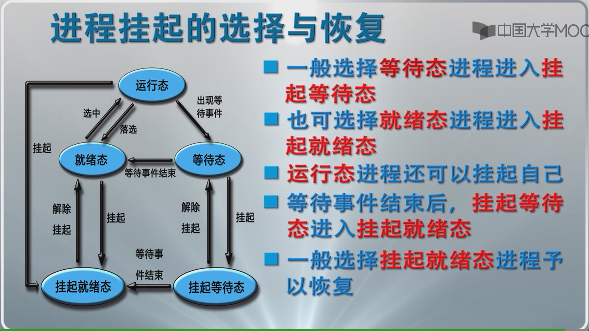

# 进程的数据描述

## 进程控制块

* 标识信息：存放唯一标志该进程的信息
* 现场信息：存放该进程运行时的处理器现场信息
* 控制信息：存放与管理，调度进程相关的信息

## 进程映像

某一时刻进程的内容及其执行状态集合

进程映像是内存级的物理实体，又被称为进程的内存映像

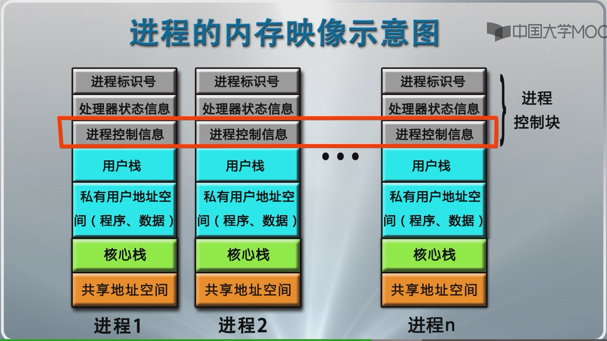

## 进程上下文

进程的执行需要环境支持，包括CPU现场和Cache中的执行信息

OS中的进程物理实体和支持进程运行的环境合成进程上下文，包括一下：

* 用户级上下文
* 寄存器上下文
* 系统级上下文

**进程上下文刻画了进程的执行情况**

# 进程的管理

## 概念级的OS进程管理软件

* 关键进程管理软件：
  * 系统调用/中断/异常处理程序
  * 队列管理模块
  * 进程控制程序
  * 进程调度程序
  * 进程通信程序
  * 终端登陆，作业控制......

### 进程实现的队列模型

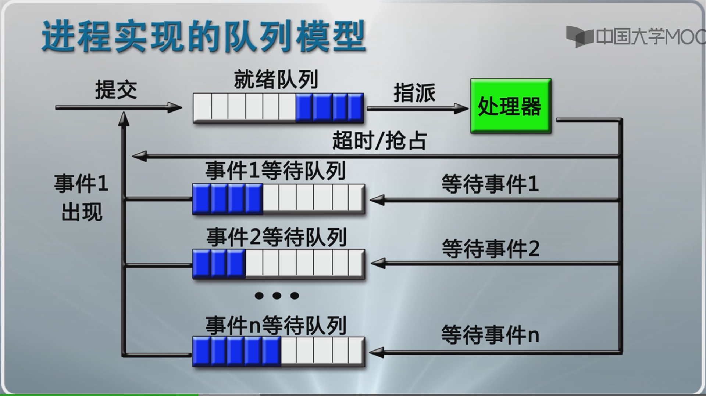

## 队列管理模块

操作系统实现进程管理的核心模块

## 进程的控制与管理

* 进程创建
* 进程撤销
* 进程阻塞
* 进程唤醒
* 进程挂起
* 进程激活

原语与进程控制原语：若干条指令所构成的完成某种特定功能的程序，具有**原子性**（可以进原语前关掉中断，出原语了再开中断实现）

# 进程切换与模式切换

## 进程切换

实质上就是被中断运行进程和待运行进程的上下文切换：

* 保存被中断进程上下文
* 转向进程调度
* 恢复待运行进程的上下文

## 模式切换

进程切换必须要在操作系统内核模式下完成，这就需要模式切换，模式切换又称处理器状态切换

模式切换基本工作任务:

* 中断装置完成正向模式切换：
  * 处理器模式变为内核模式
* 中断返回指令完成逆向模式切换：
  * 处理器模式转换为用户模式

进程切换的工作过程：

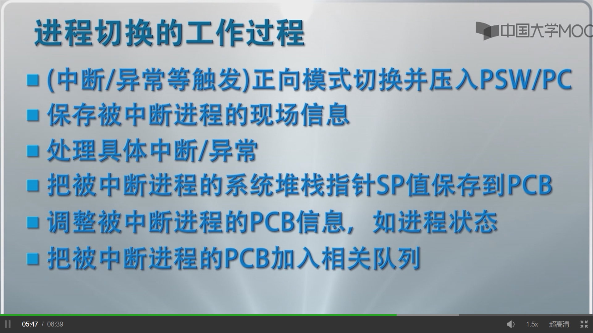

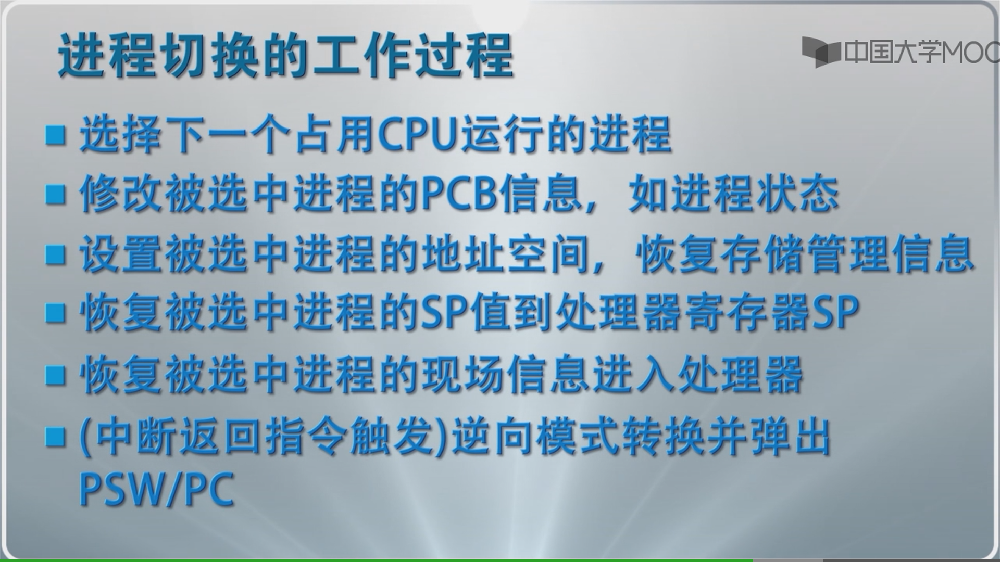

不引起进程切换的中断：

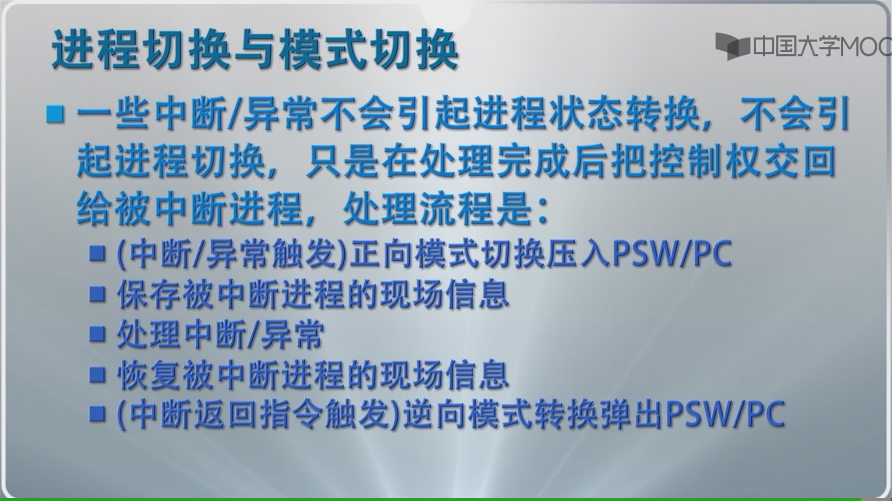