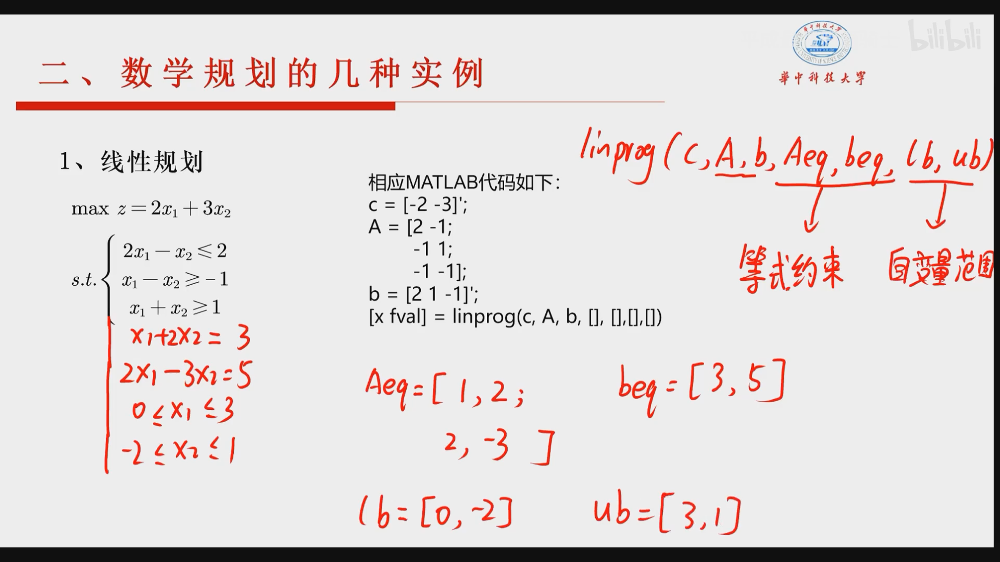
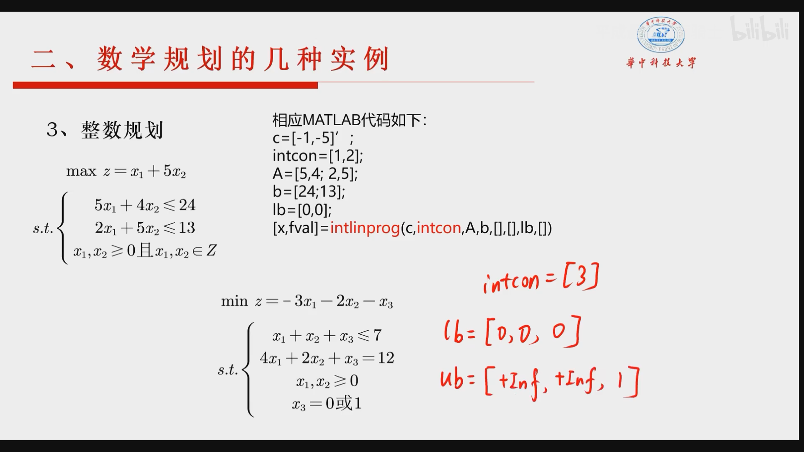
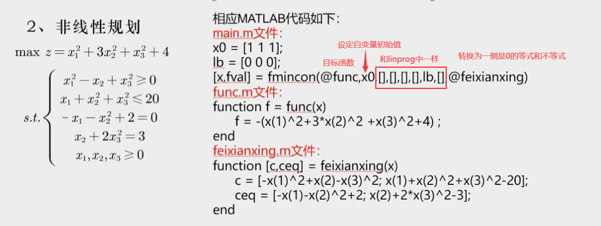
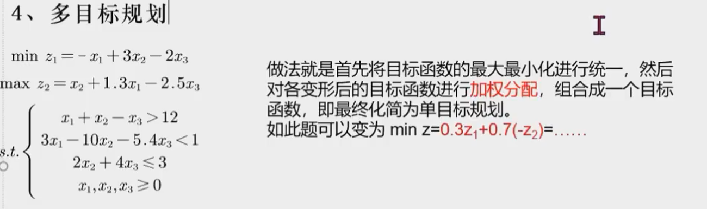

# 线性规划

* 用逗号或者空格分开矩阵里面的元素，矩阵后面加单引号是转置，“；”用于换行

* matlab里面只能求最小值，最大值问题转为最小值再求解

* 同样不能表示大于等于，要换成小于等于（系数加负号）

* eg：linprog函数使用：此处矩阵是否转置都不影响

  linprog(c,A,b,Aeq,beq,lb,ub)

  c: 目标函数系数矩阵 A：约束方程组系数矩阵 b：约束方程组常数矩阵 Aeq: 等式约束系数矩阵 beq: 等式约束常数矩阵 lb,ub: 自变量范围，lb代表最小值，ub代表最大值

  

# 整数规划

* 利用intlinprog处理整数规划问题，相比linprog多一个intcon参数表示哪几个自变量是int

* eg：自变量取0或1方法：先限制为int 再限制上下限为1 和 0

  

# 非线性规划

 

# 多目标规划

