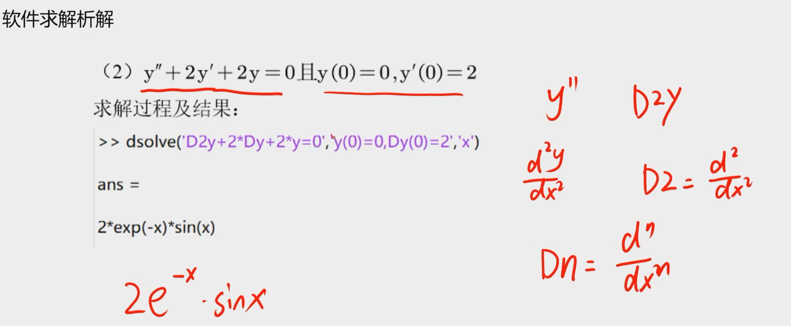

# 微分方程求解

## 

* 解析解：有确切的函数表达式
* 数值解：求出离散的结果，无确切表达式

## 求解析解

使用dsolve求解解析解

 

初始条件有多个用逗号隔开，n阶导数就是Dny

## 求数值解

* 刚性与非刚性方程：刚性方程中包含快速变化部分

options可以不写，**此处和dsolve不同，只有第一个函数要写单引号！！！**

* matlab中不可以在函数里面直接嵌套函数，要在另一个文件中写好了，把函数名加进去
* 误差的设置，retol是相对误差，abstol是绝对误差属性 

* 微分方程组的写法

* 高阶导数表示，给导数命名，然后求导

  

  

# 微分方程经典模型

## 人口预测模型

## 传染病动力学模型

