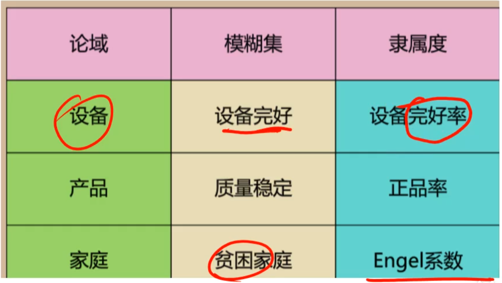

# 层次分析法（AHP）

* 利用**判断矩阵**来决定两两之间相互比较重要性的矩阵，然后根据判断矩阵得到权重

  

* 判断矩阵需要进行**一致性检验**，aij = aik * akj

* 可以用一致性指标来进行判断：

  

# Topsis 优劣解距离法

* 正向化处理就是把非极大型指标转换为极大型

* 正向化处理

* 标准化处理

Example：

# 模糊数学评价

* 如何获取隶属函数：模糊统计法，指派法，借助已有客观尺度

  模糊统计法：

  

  已有客观尺度：

  

  指派法：

  

eg：

# 灰色关联分析

# 主成分分析

降维减少变量，形成线性不相关变量，用线性组合构建可解释的新的主成分

