# 最短路径问题

## 最小生成树

* Prim 算法 （现有最短路径子图基础上找新边）
* kruskal 算法（找不生成贿赂的最小边）

## 最短路径

* Floyd 算法

* Dijkstra算法

  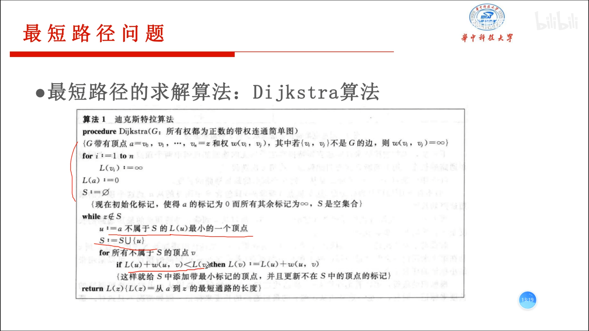

# 最大流问题

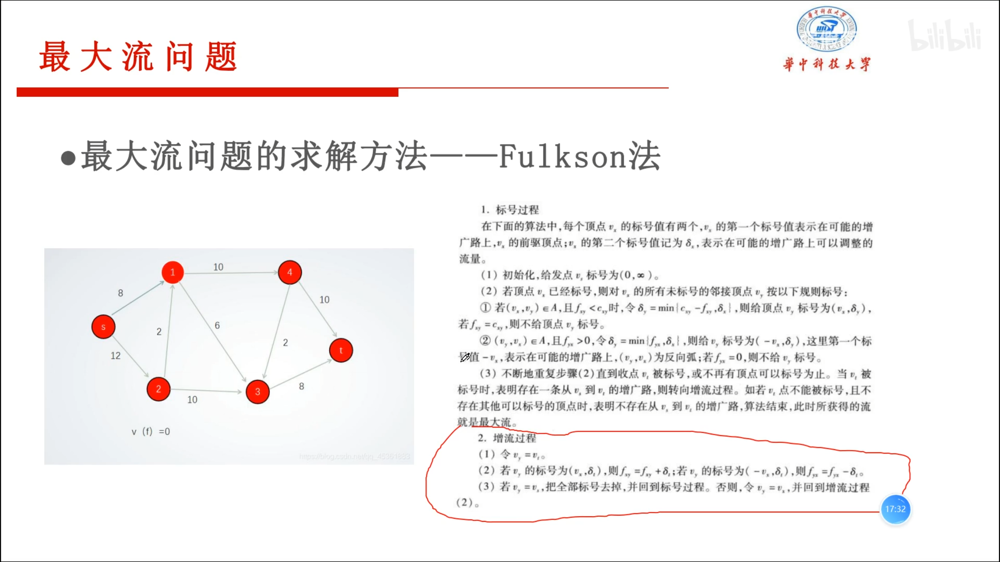

# TSP和VRP问题

# 代码部分

## 图的创建

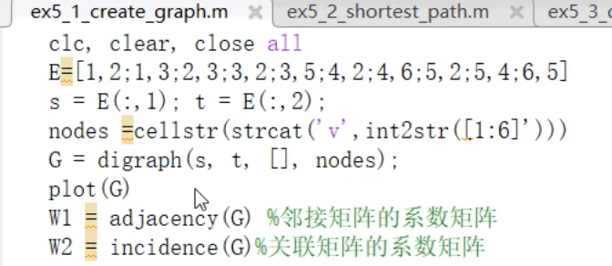

## 求最短路

第一二三列分别代表起点，终点，路径长度，method和positive是用dijkstra算法，默认Floyd

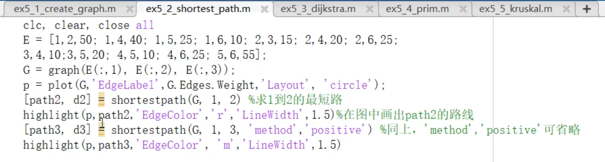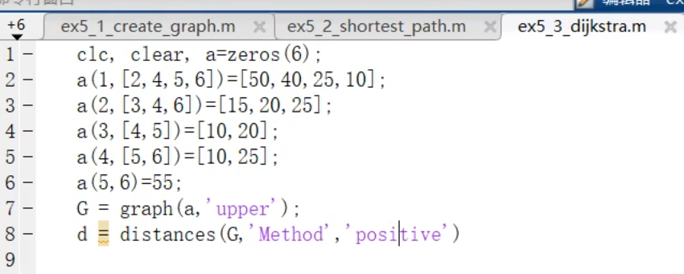

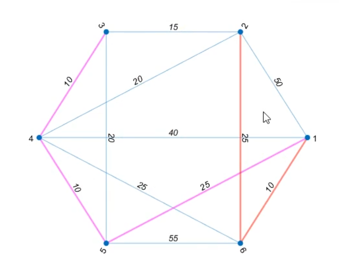

## Prim算法

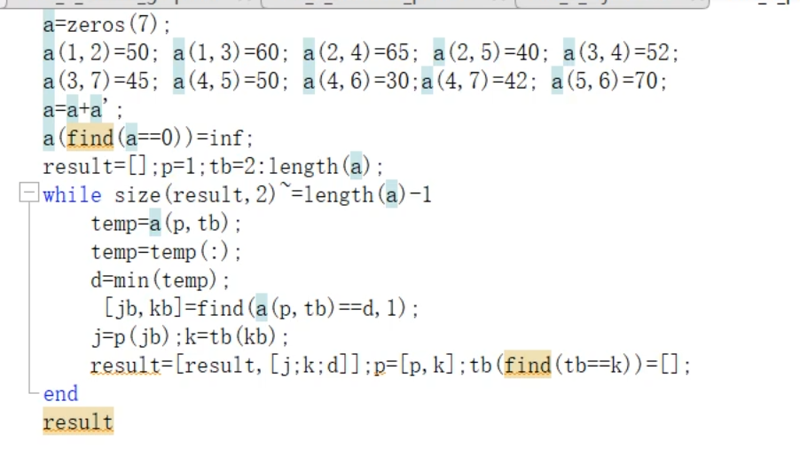

## kruskal算法

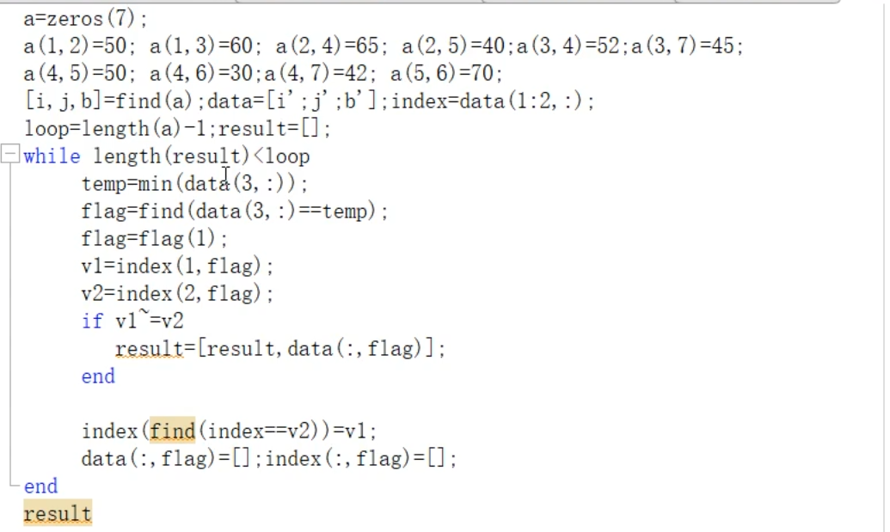

## 最小生成树

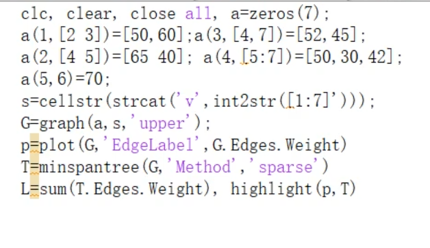

## 最大流

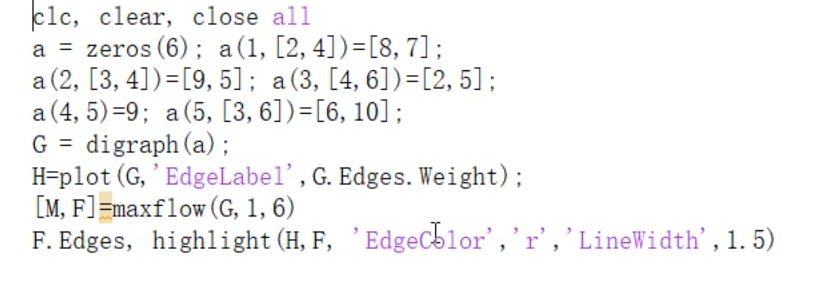

## 最小费用最大流

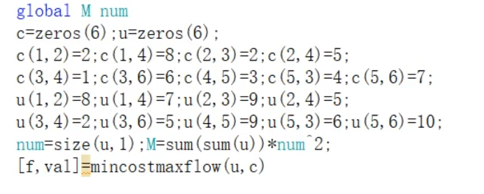

## TSP

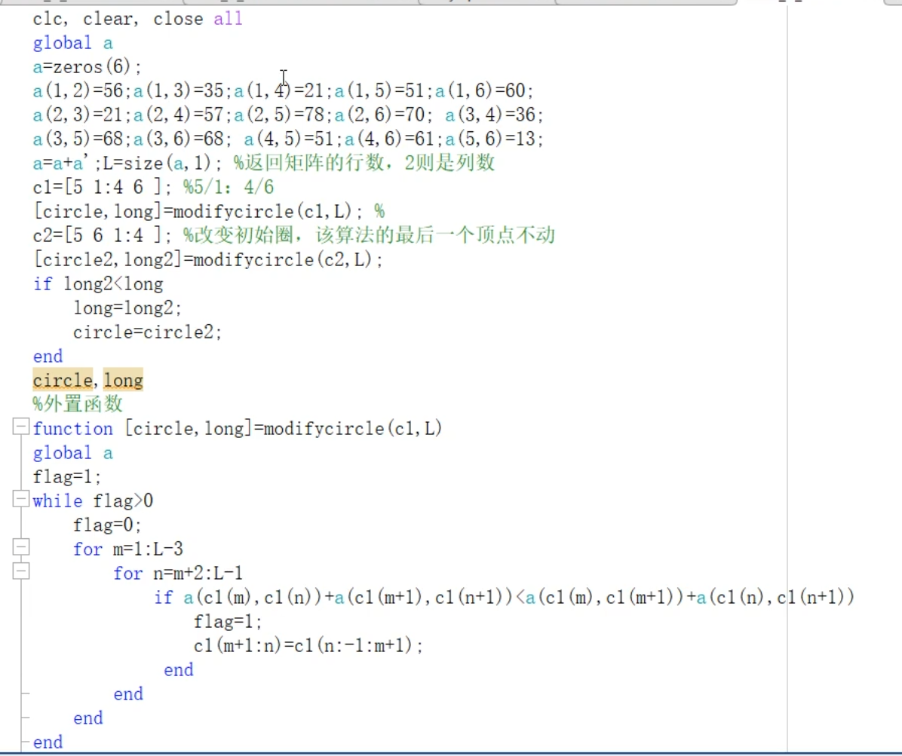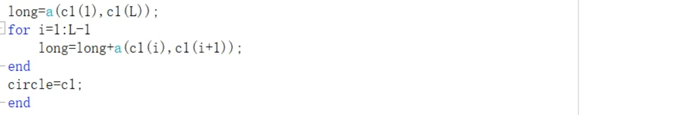