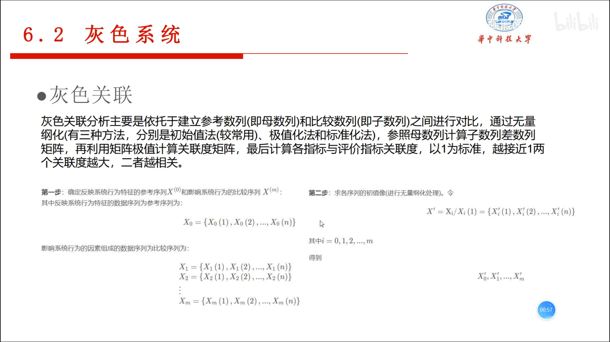

# 时间序列预测

## 移动平均法

## 指数平滑法

# 灰色系统  

## 灰色预测

* 在一定时间范围内有一部分已知信息但并不完全的情况下时间序列做预测

## 灰色关联

### 代码实现

# ARIMA模型

## 代码实现

* ACF和PACF图

* 判定是否是平稳序列

* ARIMA实现

  

## AR模型

## MA模型

## ARMA模型

## ARIMA模型

# 组合投资策略

