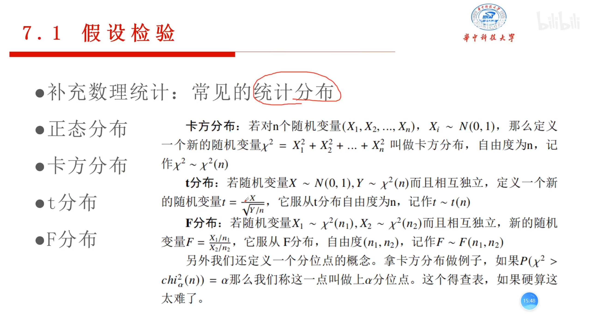
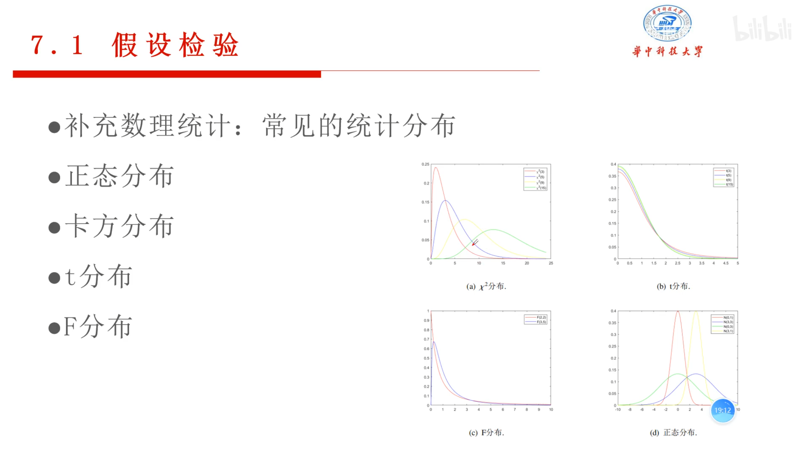
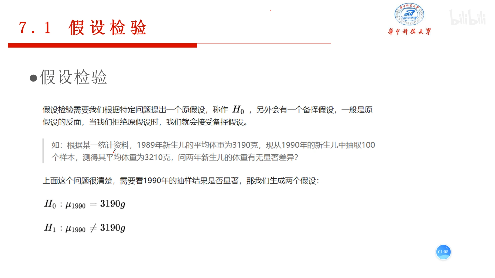
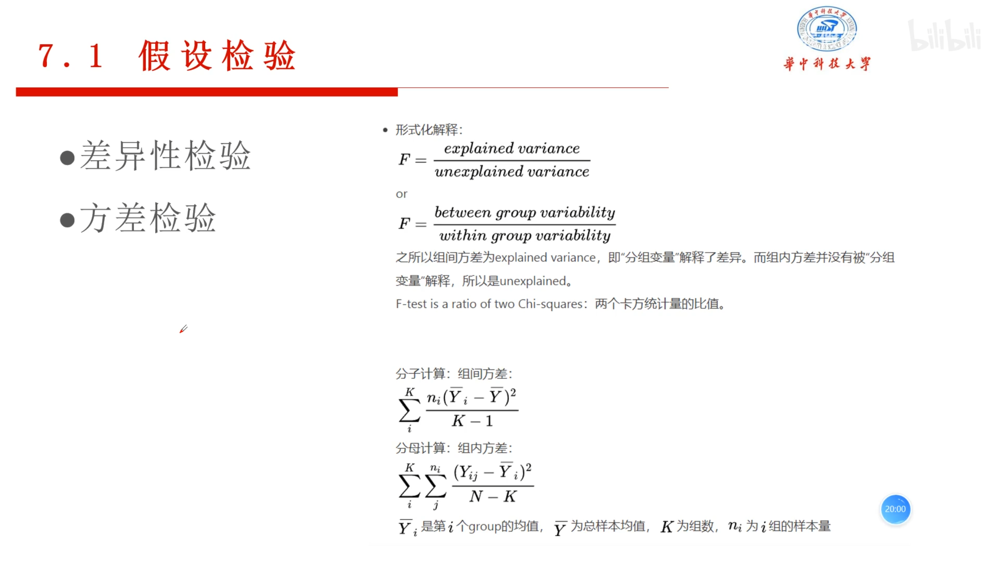
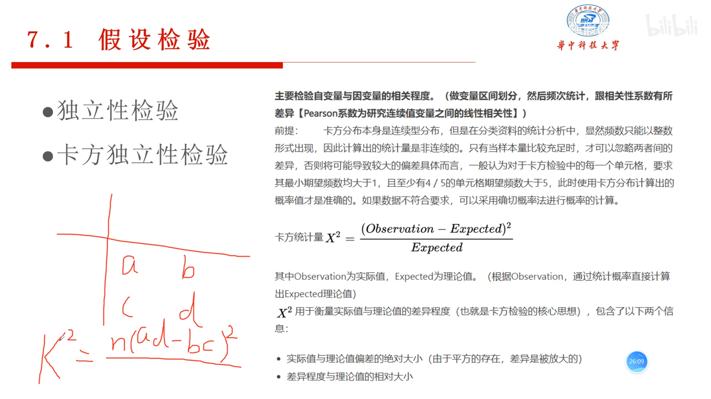
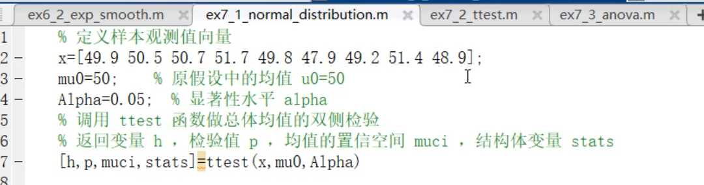
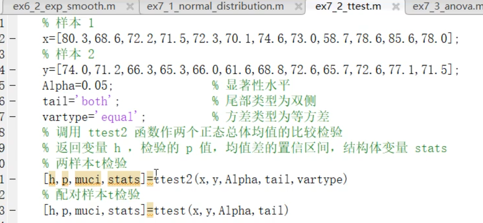
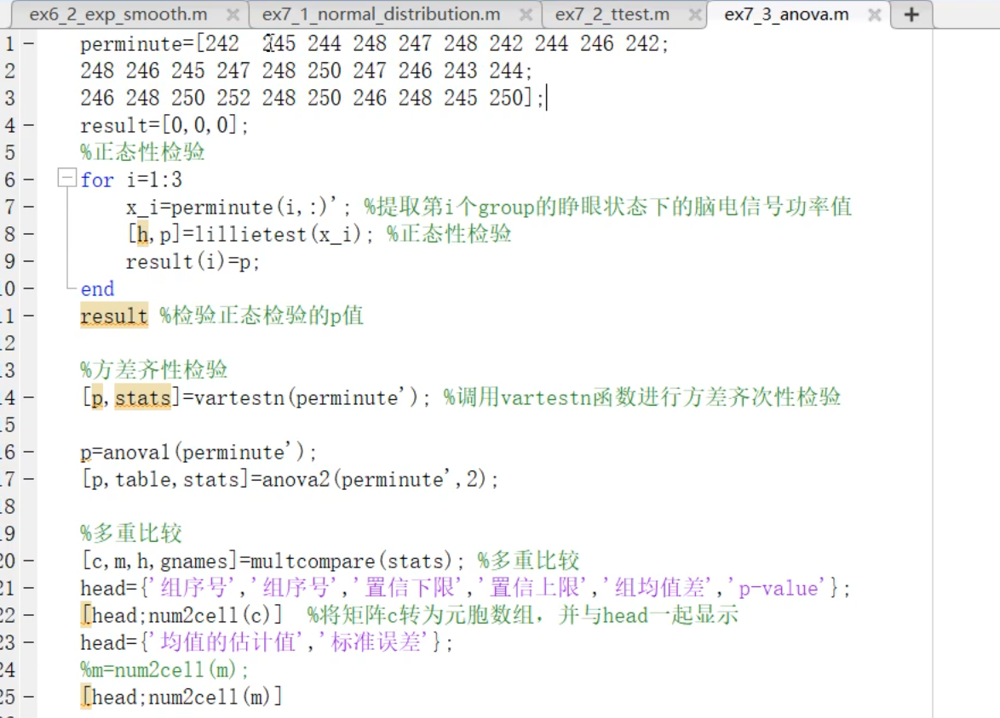
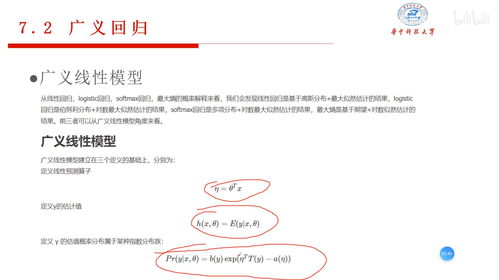

# 假设检验

## 相关性检验

### 差异性检验

* 单样本t检验，检验均值和某标准值的差别 

* 成对样本t检验，检验一组样品在某种实验条件前后样本均值是否有差别

* 独立样本t检验，检验两组独立样本的均值是否有差别，两组样本的数量可以不同，根据两组均值是否相同，分为方差相等和不等两种检验

  利用Levene 氏检验，判断两个方差是否相等，改检验假设方差相等，spss可以给出检验的p值，如果p小于0.05，拒绝假设，认为方差不等

### 方差检验

* f分布，可以用于多样本检验，差异性只能两两检验

### 独立性检验

* 卡方独立性检验

### 代码实现

* 正态分布

* 双样本和配对样本t检验

* anova方差检验

# 广义回归

* logistic回归

* 线性回归

  

* 结构方程模型