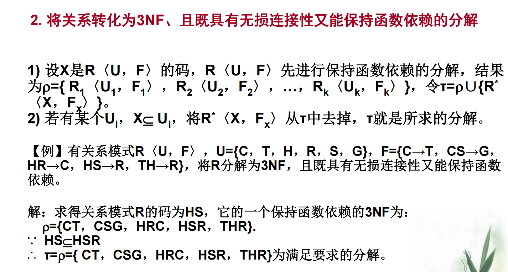

# 第一章 绪论

## 数据库系统概述

* 数据库是一堆数据的集合，可共享，持久化，有组织

* DBMS是位于用户和操作系统之间的**数据管理软件**

  用于：

  * 数据库定义和操作(DDL, DML)

  * 运行时正确性保证：事务系统、故障恢复

  * 并发控制：安全控制、完整性、锁机制
  * 通信问题：异构数据库互访，通信连接

* DBS构成：

  * 数据库：**提供数据的存储功能**
  * DBMS及其开发工具：**提供数据的组织、存取、管理和维护等基础功能**
  * 应用系统：**根据应用需求使用数据库**
  * 数据库管理员：**全面管理数据库系统**

* **数据的结构化**是数据库主要特征之一

* 数据最小存储单位：**数据项**

## 数据模型

* 描述计算机世界的称之为**数据模型**，描述信息世界或现实世界的称之为**概念模型**
* 计算机世界是对信息世界的形式化

* 数据模型的组成要素：
  * **数据结构**
  * **数据操作**
  * **完整性约束条件**
* 唯一标识实体的属性集称之为**码**

### 最常用的数据模型

* 非关系型模型

  * 层次模型

    优点：

    * 层次模型的**数据结构比较简单清晰**
    * **查询效率高**，性能优于关系模型，不低于网状模型
    * 层次数据模型提供了**良好的完整性支持**

    缺点：

    * **多对多联系表示不自然**
    * 对**插入和删除操作的限制多**，应用程序的编写比较复杂
    * **查询子女结点必须通过双亲结点**
    * **由于结构严密，层次命令趋于程序化**

    > 任何记录值只有按其路径查看时，才能显出它的全部意义

    > 如何在层次模型中表现出多对多关系？
    >
    > ------把多对多分解成一对多
    >
    > 分解方法：
    >
    > * 冗余结点：两个实体的多对多联系通过增设两个冗余结点将其转换成两个一对多联系
    > * 虚拟结点：将冗余结点转换为虚拟结点，虚拟结点是一个指引元，指向所替代的结点

  * 网状模型

    优点：

    * 能够更为**直接地描述现实世界**，如一个结点可以有多个双亲
    * 具有良好的性能，**存取效率较高**

    缺点：

    * **结构比较复杂**，而且随着应用环境的扩大，数据库的结构就变得越来越复杂，不利于最终用户掌握
    * DDL、DML**语言复杂**，用户不容易使用
    * 由于记录之间的联系是通过存取路径实现的，**应用程序在访问数据库时必须选择适当的存取路径**，即用户需要了解系统结构的细节，加重了编写应用程序的负担。

* 关系模型

  * 关系必须是规范化的，不允许表中还有表
  * 关系的完整性约束条件：
    * **实体完整性**
    * **参照完整性**
    * **用户定义的完整性**

  **优点**

  – **建立在严格的数学概念的基础上**

  – **概念单一**

  * 实体和各类联系都用关系来表示

  * 对数据的检索结果也是关系

  – **关系模型的存取路径对用户透明**

  * 具有更高的数据独立性，更好的安全保密性

  * 简化了程序员的工作和数据库开发建立的工作

  **缺点**

  – 存取路径对用户透明导致**查询效率往往不如非关系数据模型**

  – 为提高性能，必须对用户的查询请求进行**优化增加了开发DBMS的难度**

* 面向对象模型
* 对象关系模型

## 数据库系统结构

### 三级模式

#### 物理层

最低层次的抽象，描述数据实际上是如何存储的。（**内模式**）

* 一个数据库只有一个内模式

#### 逻辑层

比物理层稍高层次的抽象，描述数据库中存储什么数据以及这些数据间存在的关系。（**模式**）

* 一个数据库只有一种模式
* 外模式通常是模式的子集，一个外模式也可以为多个应用系统所使用
* 一个应用程序只能用一个外模式

#### 视图层

最高层次的抽象，但只描述**整个数据库的某个部分**。数据库系统的多数用户并不需要关心所有的信息，而只需要访问数据库的一部分。视图抽象层的定义正是为了使用户与系统的交互更简单。系统可以为同一数据库提供多个视图，而视图又保证了数据的安全性。（**外模式**）

### 二级映像

#### 外模式/模式映像

* 保证数据的逻辑独立性

#### 模式/内模式映像

* 保证数据的物理独立性

# 第二章 关系数据库

* 能够**唯一标识**元组**的最小化**的关系模式子集称为**候选码**
* 主码：若一个关系有**多个候选码**，则选定其中一个为主码
* 全码：关系模式的**所有属性组**是这个关系模式的候选码
* 主属性：候选码的诸属性称为主属性，不包含在任何侯选码中的属性称为非主属性或非码属性

基本关系的性质：

* 列同质：每列分量的域相同
* 不同列可出自同一个域
* 行列次序无所谓
* 候选码不能一样
* 分量必须是原子值，每个都是不可分的数据项

关系的完整性：

* 实体完整性

  主属性（主码中的属性）不能为空

* 参照完整性

* 用户定义完整性

### 关系运算

* **选择**操作从**行**角度进行，**投影**从**列**角度进行。

  > 投影可能取消原关系中某些元组，因为要保证行不重复

  

* **外连接=内连接+失配的元组**，用空值填补空缺
* 左右连接分别代表补上左侧/右侧表失配的元组

# 第三章 SQL

B+树

* B+树只有叶子节点存数据，其他节点只存索引，可以存放更多索引
* 叶子节点包含所有索引字段
* 叶子节点用指针相连，提高**区间访问**的性能
* InnoDB是把数据存放在B+树中的，B+树的键值就是主键
* 以主键以外的列值作为键值构建的B+树索引，称之为非聚集索引

* 嵌套查询的子查询不能用ORDER BY	

* 通配符：

  * `_` 代表任意一个字符
  * `%`代表任意长度的字符串
  * `ESCAPE` 是将百分号% 或下划线__转回其本意

  

# 第四章 数据库安全性

## 强制存取控制规则

1. 主体级别>=客体级别，主体可**读取**客体
2. 主体级别<=客体级别，主体可**写**客体

# 第五章 数据库完整性

> 数据的正确性、有效性、相容性？
>
> * 正确性：数据的合法性
> * 有效性：数据是否在有效范围之内
> * 相容性：指表示同一事实的同一数据应该相同，或满足某一约束关系的一组数据不应发生互斥问题

# 第六章 关系数据理论数据库设计

## 概念

* 关系模式：R(U, D, DOM, F)

  R： **关系名**

  U： 组成该关系的**属性名**集合

  D： 属性组U中属性所来自的**域**

  DOM： 属性向域的**映象**集合

  F： 属性间数据的**依赖**关系集合

* 数据依赖：类似数学中的函数y=f(x),自变量x确定后,相应的函数值y也就被唯一地确定

  数据依赖的类型：

  * 函数依赖FD
  * 多值依赖MVD
  * 其他（如连接依赖-5NF）

## 规范化

### 函数依赖

* 平凡函数依赖：X函数决定Y，但是Y是X的子集
* 非平凡函数依赖：Y函数依赖于X，且Y不是X的子集

* 完全函数依赖：X--->Y，且对于X的任何一个真子集都无法决定Y
* 部分函数依赖：若是Y对X非完全函数依赖，即为部分函数依赖

* 传递函数依赖：x-->y, y-->z, **且y不是X的子集，x不依赖于y**。则Z对X传递函数依赖

### 码

* 候选码：K为关系模式`R(U, F)`中的属性或者属性组，如果U**完全函数依赖**于K，则K为R的**候选码**
* 主属性：包含在**任何一个候选码**中的属性
* 非主属性：除了主属性之外的属性
* 全码：整个属性组是码
* 外部码：属性或属性组`X`非当前关系`R`的码，但是是另一个关系的码，则称`X`是`R`的外部码

### 范式

- 1NF是指数据库表的**每一列**都是**不可分割**的基本数据项，即属性值是不可再分的，不满足1NF的数据库模式不能称之为关系数据库

- 2NF要求每个**非主属性完全依赖于主键**，不能存在仅依赖主关键字一部分的属性

- 3NF要求每一个**非主属性既不部分依赖于码也不传递依赖于码**

- BCNF要求每一个决定因素都是候选键，**消除了主属性对候选码的部分和传递函数依赖**。

  > 决定因素：X--->Y，则Y函数依赖于X，X是决定因素。这里指**BCNF每个决定因素都包含码**

- BCNF一定是3NF，反之不成立

## 数据依赖的公理系统

* 逻辑蕴涵：根据已有的函数依赖集合`F`推导出新的函数依赖`X`，则称`X`是`F`的**逻辑蕴涵**

### Armstrong 公理系统

* 函数依赖闭包：在关系模式*R<U**，**F>*中为*F*所**逻辑蕴含的函数依赖的全体**叫作*F*的闭包，记为*F*+ 。

* 属性集闭包：某个**属性X**能作为哪些属性集的**决定因素**。所有这些依赖X的属性集合作为属性X的属性集闭包。

  

  求闭包的算法：

  

### 候选关键字的求解理论

* 最小依赖集：依赖集右侧仅有一个属性；不存在非完全函数依赖；不存在多余依赖（例如传递依赖的结果那个）

  > 如何求解最小依赖集？
  >
  > 

## 模式的分解

> * 无损连接性，保证不丢失信息
> * 保持函数依赖，能减轻或解决各种异常情况
> * 二者是模式分解相互独立的标准，不一定能都满足
>
> 判断是否是无损连接分解（ppt 6-2 42页）
>
> 
>
> 
>
> 判断分解是否保持函数依赖？
>
> 
>
> 

* 分解后的关系模式要与分解前**等价**，分解必须有无**损连接性和函数依赖保持性**
* 只是无损链接：能达到**4NF**
* 只是函数依赖/既函数依赖又无损连接：可以达到3NF，不一定能到BCNF

> 保持函数依赖的分解：
>
> 
>
> 保持函数依赖和无损连接性的分解
>
> 

# 第七章 数据库设计

## ER图向关系模型的转换

* 一个实体型转换为一个关系模式
* 一个1:1联系可以与任意一端对应的关系模式合并
* 一个1:n联系与n端对应的关系模式合并。
* **一个m:n联系转换为一个关系模式。不是m:n的都能合并在别的关系里面**
* 三个或三个以上实体间的一个多元联系转换为一个关系模式：
  * 存在”一“端：除了”一“端以外的其他实体的码的并集
  * 不存在”一“端：至少包含所有相关实体的码的并集
* 具有相同码的关系模式可合并。

# 第八章 关系数据库引擎基础

## 数据库存储

堆文件两种表示方式：

* 链表
* 页目录

页面内“数据”的组织方式： 

* 面向元组型 ：header记录元组数，每次添加元组放在已有元组后面

  存在问题：删除产生碎片，变长元组问题，元组查询开销

* 日志结构型

  **槽页**：header记录**已占用的槽位**和**上一次使用槽位的开始位置**

  元组在内部的唯一标识符：可以使用页面ID和slot id（或偏移量），也可包含文件位置信息。

  元组倒序存储。

  更好应对变长元组，避免碎片问题

> 为了储存超过一页的大数据，一些DBMS使用**溢出存储页**，有些DBMS允许将一个大值存放在**外部文件**中，作为一个**“BLOB”类型**。

元组设计：

* 物理上的非规范性：把相关的元组存放在一个或者相邻页上，能**有效减少IO次数**，但可能带来**额外数据维护开销**

### 存储模型

* 联机事务处理OLTP：传统具较强“事务特性”需求的应用，比如电商、贸易等
* 联机分析处理OLAP：数据量较大，主要是查询、复杂查询、统计，甚至数据挖掘
* 复合事务分析处理HTAP：兼具OLTP和OLAP特征

* NSM行存储：

  优点：适合OLTP对输出结果是全部属性的查询，对**快速的增、删、改操作非常友好**；

  缺点：不适合查询table的部分属性。

* DSM列存储：可以很好的适应大数据量、复杂查询语义、高负载查询，**适合OLAP**

  优点：

  * 由于只读取需要的数据，因此减少了I/O次数；

  * 更便捷的查询处理；

  * 有利于数据压缩的实现

  缺点：元组被“拆分” ，有些查询需要进行“缝合”，影响查询速度，也同时影响增删改效率

## 缓存

**页表：**是一个内存散列（hash）表，用于登记当前已经加载到缓冲池中的页面的信息

* 缓冲池的作用：
  1. 减少磁盘IO，提升页面读写效率
  2. 读操作时，如果所需页面已经加载到缓冲池，就不需要从磁盘读了。
  3. 写操作时，如果多次修改了同一页面，只需要写一次磁盘。
  4. 缓冲池管理器的目标：尽可能减少磁盘I/O带来的延时。

### 缓冲池结构

缓冲池优化：

* 多缓冲池
* 预取
* 扫描共享：将多个查询附加到一个游标上，减少重复访问的次数
* 缓冲池旁路：为了避免开销，顺序扫描操作符不会将获取的页存储在缓冲池中，而是使用正在运行的查询的本地内存。

## 散列表

散列表包含**散列函数**和**桶数组**两个关键元素，散列函数就是哈希函数，桶数组每个元素存储一个链表头。散列函数用于算记录要存到哪个桶中

散列冲突的解决方法：

* 线性探测法
* Robin Hood Hashing：记录每个(key,value)值距离hash(key)的相对位置，相对位置越大，就越“贫穷”，就可以从“富有”的那里“抢夺”slot以达到一种平衡
* Cuckoo Hashing

# 第九章 关系查询处理和查询优化

选择操作的实现：

* 简单的全表扫描：适合小表，不适合大表
* 索引（或散列）扫描方法：需要选择条件中的**属性上有索引**

连接操作的实现：

1. 嵌套循环方法

   简单通用，但是对于内层表多次循环扫描，性能差。

   适用于一个大集合一个小集合情况。**小集合作为外循环。小表驱动大表**

2. 排序-合并方法

   把两个表排序，然后遍历寻找相同属性的元组，两个表都只要扫描一遍就行。

3. 索引连接方法

   若参与连接的表在**连接属性上有索引**，就可以采用索引连接算法。因为利用索引可以**迅速定位元组**，可以加快连接过程中的元组查找速度，**提高连接效率**

4. Hash Join方法

   连接属性作为hash码，用同一个hash函数把R和S中的元组散列到同一个hash文件中

## 查询优化

### 代数优化

* 选择和投影的交换律：

  > 若是条件不属于A的可以先内嵌一个F涉及的属性组的投影，然后最外层再投影回来
  >
  > 

* 选择与笛卡尔积的交换律

* 投影与笛卡尔积的分配律？

查询优化的基本规则：

1. **选择运算尽可能先做**，减少中间关系
2. 投影和选择运算同时做，目的是**避免重复扫描**
3. 将投影运算与其前面或后面的双目运算结合，减少扫描关系的遍数
4. 某些选择运算＋在其前面的笛卡尔积 ==> 连接运算
5. 提取公共子表达式

### 物理优化

基于启发式规则的存取路径选择优化：

• **选择率低**，基于**索引的选择算法**优于全表扫描算法

• **选择率高**或要查找的**元组均匀地分布在查找的表中**，采用**全表扫描**较好。因为除了对表的扫描操作，还要加上对B+树索引的扫描操作，对每个检索码，从B+树根节点到叶子节点路径上的每个节点都要执行一次I/O操作

# 第十章 数据库恢复技术

## 基本概念

事务：用户定义的一个数据库操作序列，这些操作**要么全做，要么全不做**，是一个不可分割的工作单位

事务的ACID特性：

* 原子性
* 一致性
* 隔离性：并发执行事务之间不互相干扰
* 持续性

## 数据恢复的实现技术

### 数据转储

* 静态转储与动态转储

  

  

* 海量转储与增量转储

### 登记日志文件

* 联机日志文件：大小有限，**直接和DBMS日志缓冲区关联**，保存数据库当前一段时间内的事务执行的变化过程，主要用于**事务故障**和**系统故障**。
* 归档日志文件：保存历史上所有的不再用于联机处理的日志记录，由**联机日志文件归档而成**，主要用于**介质故障**的恢复。 

缓冲区处理策略：

* 影子拷贝和影子页面

  影子拷贝：创建一个新的数据库完整拷贝，更新事务在新拷贝进行，事务中止删新拷贝就行。commit则把新拷贝内容写入磁盘，数据库指针从旧拷贝转到新拷贝，删除旧拷贝

  影子页面：使用一个包含指向所有页面的指针的页表，页表的作用和数据库指针相同。影子拷贝只将页表和所有更新的页面拷贝到一个新位置，当提交事务时，原子性的更新指向页表的指针以指向新拷贝

  

* 日志文件的用途

* 登记日志文件的原则：
  * 先写日志后写数据库
  * 等级次序严格按照事务执行时间

* **幂等性在日志上的语义是：无论日志回放多少次，最终得到的结果保持一致**
* 物理日志能够做的幂等性，因为其本质是对状态机某一个字段在更新前后状态的记录**，**无论执行多少次，最终得到的状态总是相同的。
* 逻辑日志并不能够提供幂等性的语义，因为某一个更新操作本身不具备幂等性。
* 日志重放效率：逻辑<物理，因为逻辑日志有**额外的解释步骤**，**物理日志还能并发执行**

## 恢复策略

### 事务故障的恢复

### 系统故障的恢复

### 介质故障的恢复

1. 重装数据库，使数据库恢复到一致性状态
2. 重做已完成的事务

## 具有检查点的恢复技术

* 检查点技术保证检查点之前的所有commit操作的结果已写回数据库，在恢复时不需REDO

* 在检查点之前开始故障点之前结束的需要Redo
* 在故障点还未结束的事务需要Undo

# 第十一章 并发控制

## 并发控制概述

并发操作带来的数据不一致性：

* 丢失修改
* 不可重复读
* 读”脏“数据：T1修改数据，写入磁盘的，然后数据被T2事务读取，然后T1被撤销。T2读到的就是”脏“数据。

这些不一致性都是由于并发操作破坏了事务的隔离性

并发控制的主要技术：

* 封锁

  * 排他锁（X锁）：锁上后其他事务都不能读取和修改
  * 共享锁（S锁）：其他事务可以读，但是在释放锁之前不能修改

  > 锁机制可能存在的问题？
  >
  > * 活锁：某个事务一直处于等待锁的状态，不断被插队
  >
  >   避免措施：先来先服务策略
  >
  > * 死锁：分别占用着对方请求的锁的同时又请求对方的锁
  >
  >   解决方法：
  >
  >   1. 预防死锁
  >
  >      * 一次封锁法：一次性请求完所有要用的数据的锁
  >
  >        问题：降低并发度，难以事前确定封锁对象
  >
  >      * 顺序封锁法：预先对数据对象定一个封锁顺序
  >
  >        问题：数据库系统中封锁的数据对象极多，并且在不断地变化，很难事先确定每一个事务要封锁哪些对象
  >
  >   2. 诊断与解除死锁
  >
  >      死锁的诊断：
  >
  >      * 超时法：可能误判死锁，时限设置太长可能死锁不能及时发现
  >      * 等待图法：描述事务等待情况的有向图，产生环即有死锁
  >
  >      解除死锁：选择一个处理死锁代价最小的事务，将其撤消，释放该事务所有锁

  三级封锁协议：

  * 一级：事务T在修改数据R之前必须先对其加X锁，直到事务结束才释放，**只防止修改丢失**
  * 二级：一级+事务T在读取数据R前必须先加S锁，**读完后即可释放S锁**，可以防止丢失修改和读“脏”数据，**不能保证可重复读**
  * 三级：1级封锁协议 + 事务T在读取数据R之前必须先对其加S锁，直到**事务结束才释放**

* 时间戳

* 乐观控制法

## 并发调度的可串行性

* 一个给定的并发调度，当且仅当它是可串行化的，才认为是正确调度

* 冲突可串行化调度是可串行化调度的充分条件，不是必要条件

## 两段锁协议

所有事务必须分两个阶段对数据项加锁和解锁

* 在对任何数据进行读、写操作之前，事务首先要获得对该数据的封锁

* 在释放一个封锁之后，**事务不再申请和获得任何其他封锁**

第一阶段只能申请锁不能释放锁，第二阶段释放锁不能申请任何锁

* 事务遵守两段锁协议是可串行化调度的**充分条件**，而不是必要条件

选择封锁粒度原则

* 封锁的**粒度越大**，数据库所能够封锁的数据单元就越少，**并发度就越小**，系统**开销也越小**

* 封锁的**粒度越小**，**并发度较高**，但系统**开销也就越大**

多粒度封锁

显式封锁：某个事务直接加到数据对象上的封锁.

隐式封锁：由于上级结点加锁而使该数据对象加上的锁*

* **对某个数据对象加锁时系统检查的内容**

  

* 意向锁：如果对一个结点加意向锁，则说明该结点的下层结点正在被加锁，对任一结点加锁，必须先对它的上层结点加意向锁

  常用意向锁：

  * 意向共享锁IS锁：表明事务的意向是**读取**层次结构中的资源
  * 意向排他锁IX锁：表明事务的意向是**修改**层次结构中的资源
  * 共享意向排他锁SIX锁：**读取**层次结构中的全部底层资源**并修改部分（而不是全部）**底层资源

