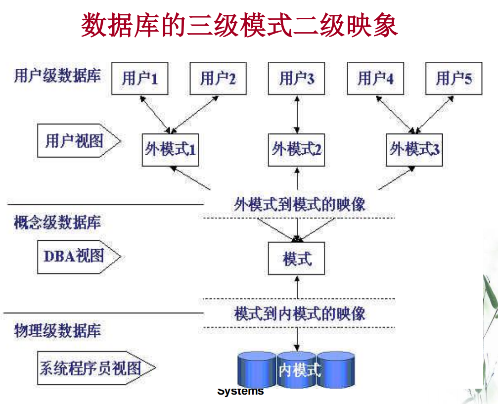
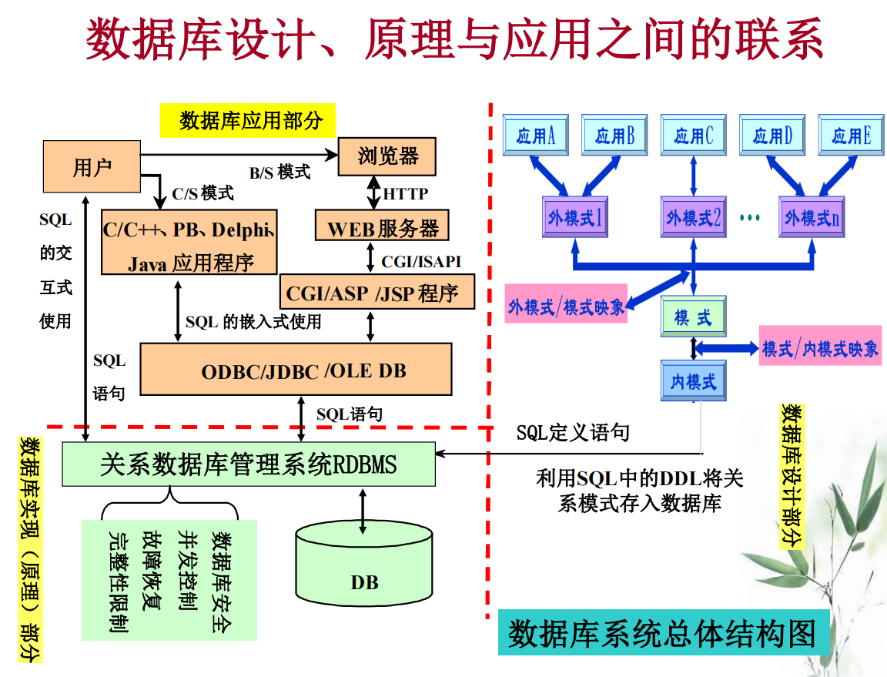

## 1.1 数据库系统概述

### 数据

**数据**是**信息**的载体，**信息**是**知识**的载体。**知识**可以从**数据**中发掘出来，即：知识发现

### 数据库

数据库是**长期储存**在计算机内，有组织，可共享的**大量**数据集合

### 数据库管理系统DBMS

位于用户和操作系统之间的一层数据管理软件，基础软件，是一个大型复杂的软件系统

### 数据库系统

## 1.2 数据模型

* 数据模型：描述计算机世界
* 概念模型：描述信息世界或者现实世界的

### 数据模型组成要素

* 数据结构：对系统静态特性的描述
* 数据操作：增删改查及操作规则，动态特性
* **完整性约束条件**

### 概念模型

现实世界到信息世界的中间层次

基本概念：

* entity：客观存在并可相互区别的事物
* 属性attribute
* 码key：唯一标识entity的属性集
* 域（Domain）：属性的取值范围
* 实体型：**用实体名及其属性名集合来抽象和刻画同类实体称为实体型**

* 实体集
* 联系：分为实体内部（各属性之间的）和实体之间（不同实体集）的联系

### 层次模型

满足条件：

1. 仅有一个根结点
2. 根节点外所有节点**有且仅有**一个双亲结点

优缺点：

* 优点：

  查询效率高，结构清晰，提供良好完整性支撑

* 缺点：

  1. 多对多联系表示不自然

  2. 插入和删除操作复杂

  3. 查询子女必须通过双亲结点
  4. 结构严密，层次命令趋于程序化

### 网状模型

满足条件：

* 允许一个以上的结点无双亲
* 一个结点可以有多个双亲

优缺点：

* 优点：存取效率高，更好地描述现实世界

* 缺点：
  1. 结构复杂
  2. DDL，DML语言复杂
  3. 用户需要了解系统结构的细节，加重编写应用程序的负担

### 关系模型

类比一个表格

优点：

* 概念单一
* 关系模型存取路径对用户透明，程序员只需要告诉DBMS做什么，不需要告诉他怎么做，同时提高了安全保密性

缺点：

* 查询效率低
* 为了提高性能，对查询请求进行优化，提升DBMS开发难度

## 1.3 数据库系统结构

### 三级模式结构

* 模式（逻辑模式）

  数据库系统结构的**中间层**，一个数据库只有一个模式，是数据库中全体数据的逻辑结构和特征的描述

* 外模式（用户模式）

  **数据库用户**使用的局部数据的逻辑结构和特征，数据库用户的数据视图，介于模式与应用之间

  外模式保证了数据库的安全性，每个用户只能看见和访问对应的外模式中的数据

* 内模式（存储模式）

  数据在数据库内部的表示方式，是数据物理结构和存储方式的描述，一个数据库只有一个内模式

三级模式的优点：

• 三级模式是对数据的三个抽象级别,它把数据的具体组织留给DBMS管理,使用户能逻辑地抽象地处理数据,而不必关心数据在计算机中的具体表示方式与存储方式.

### 两级映像

* 外模式/模式映像：同一个模式可以有任意多个外模式

  保证了**数据的逻辑独立性**：当模式改变的时候，数据库管理员修改相关外模式/模式映像，使得外模式保持不变，应用程序又是根据外模式编写的，所以应用程序不用改变，保证了数据和程序的逻辑独立性

* 模式/内模式映像：定义了数据全局逻辑结构与存储结构之间的对应关系，是**唯一的**

  保证**数据的物理独立性**：数据库存储结构改变，通过修改模式/内模式映像，模式可以保持不变，应用程序不受影响

> 数据和程序的独立性=物理独立性+逻辑独立性

数据独立性的作用？

* 数据的独立性使得数据的定义和描述可以从应用分离，数据存取由DBMS管理，用户不必考虑存取路径，简化应用编程，减少应用程序维护和修改

### 用户访问数据的过程

## 数据库系统总体结构图

