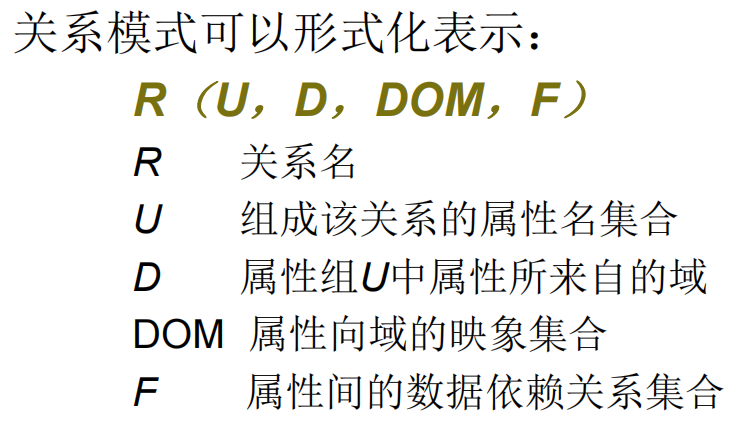
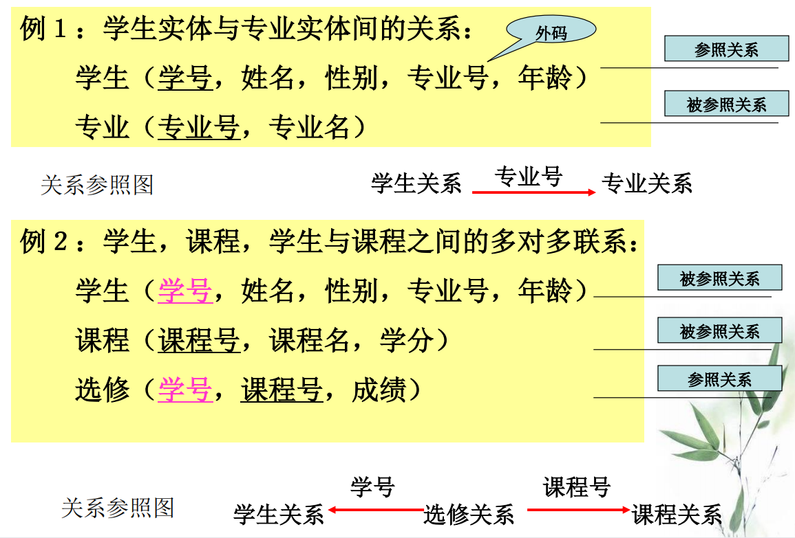
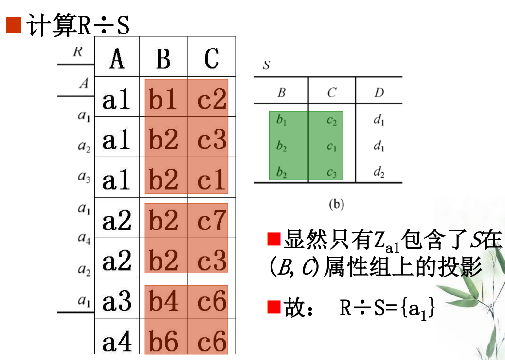
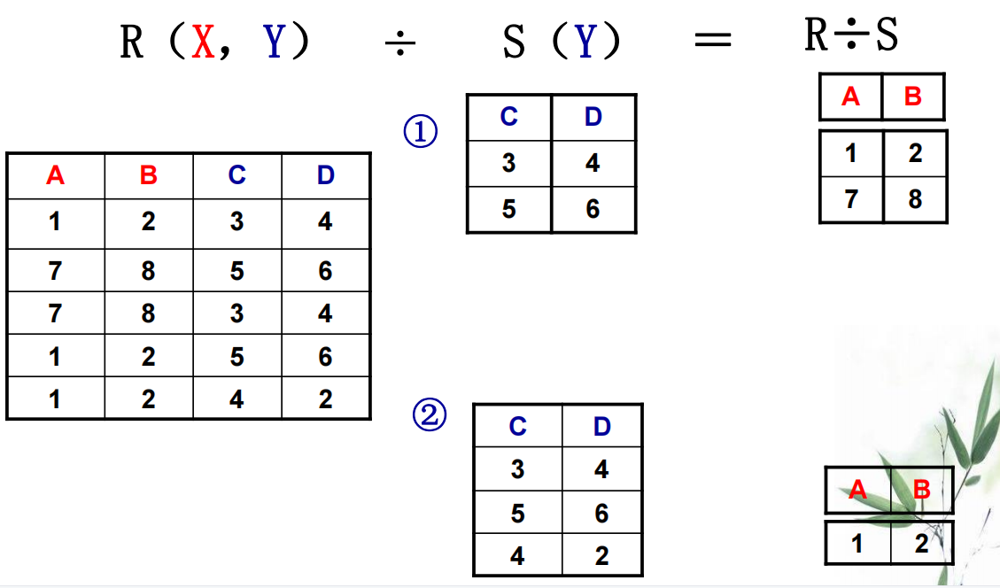

## 2.1 关系数据结构及其形式化定义

### 2.1.1关系

* 域：一组具有相同类型数据的集合

* 笛卡尔积：所有域的所有取值的一个组合

* 关系

  候选码：能唯一确定元组的最小化的关系模式子集，可能有多个

  主码：候选码里面选一个当主码

  主属性：候选码的诸属性

  全码：关系模式所有属性组作为候选码（所有属性加起来才能唯一确定一个元组）

### 2.1.2 关系模式

* 关系模式可以简写为R(U)

### 2.1.3 关系数据库

## 2.3 关系的完整性

* 实体完整性：

  * 主码不为空
  * 实体具有唯一标识，可区分
  * 对应现实世界实体集

* 参照完整性

  关系的引用：

  * 外码：

    设F是基本关系R的一个或一组属性，但不是关系R的主码。如果F与基本关系S的主码Ks相对应，则称F是基本关系R的外码。

    R和S不一定是不同关系，外码不一定要和主码名字相同，Ks和F定义在同一个域上

    **外码可以为空，或者所参照的关系的主码取一个**

  

* 用户定义的完整性

## 2.4 关系代数

* 传统的集合运算
  * 并
  * 交
  * 差：减去两者都有的元组
  * 笛卡尔积：元组的笛卡尔积
  
* 专门的关系运算
  * 选择
  
  * 投影：从R中选择出若干属性列组成新的关系，投影后可能取消某些元组，避免重复
  
  * 连接
  
    自然连接(内连接)：条件隐含，相同的属性组值相同（S.B = R.B）,**结果要去掉重复属性组B**
  
    等值连接:条件显式，S.A = R.B,不要求公共属性组
  
    外连接：内连接+失配的元组
  
  * 除
  
    