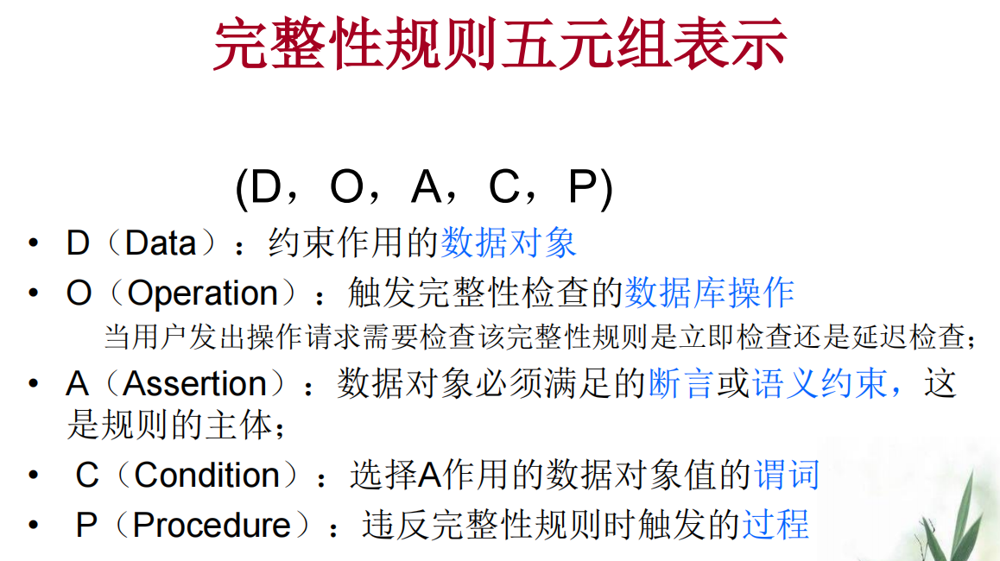
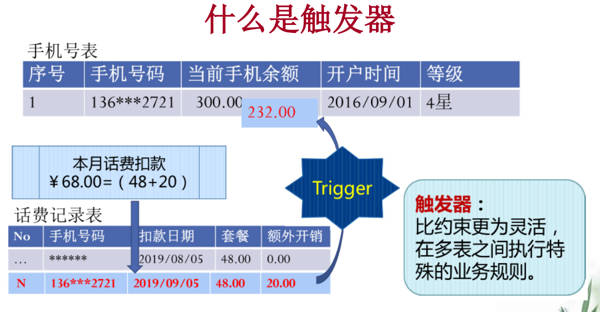
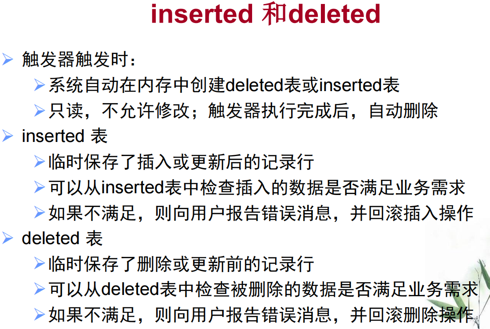
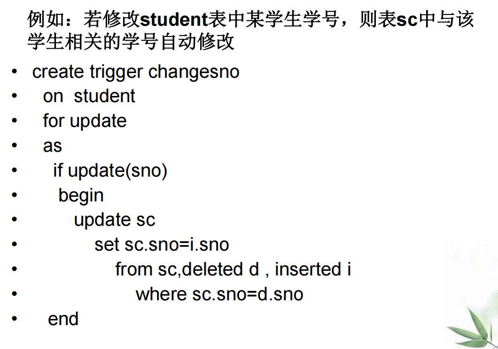

数据的完整性：防止数据库中存在不符合语义的数据，防范对象**不合语义，不正确的数据**

数据的安全性：保护数据库防止恶意的破坏和非法的存取，防范对象**非法用户和非法操作**

## 5.1 实体完整性

* 主码是否唯一，不唯一则拒绝插入或修改
* 主码各个属性值是否为空，为空则拒绝操作

## 5.2 参照完整性

参照完整性违约处理：

* 拒绝
* 级联
* 置空

外码是否能够取空值：依赖于应用环境的语义

## 5.3 用户定义的完整性

* 用户定义的完整性就是针对某一具体应用的数据必须满足的语义要求

* RDBMS提供，而不必由应用程序承担

## 5.4 完整性约束命名子句

## 5.6 断言

* 更一般的约束

create assertion <断言名> check <谓词>

## 5.7 触发器

* 在SQL SERVER中，可以用两种方法保证数据的**有效性和完整性**：**约束（check）和触发器（trigger）**。

* 约束直接设置于数据表内，只能实现一些比较简单的功能，而触发器是针对于数据库的特殊的存储过程，当数据表发生update,delete,insert操作时，会**自动激发相关语句的执行**，从而处理各种复杂的操作。

### 触发器类型

* after：

  这类触发器将在表中的数据变动（INSERT 、UPDATE、DELETE）**完成以后才被激发**，是为了对变动的数据进行检查，如果发现错误，将拒绝或回滚变动的数据。

* instead of：

  INSTEAD OF触发器是SQL SERVER2000中新增的功能，这种类型的触发器将**在数据变动之前被激活**，并取代数据的操作（ INSERT 、UPDATE、DELETE ），转而去执行触发器定义的操作。

**默认after**

