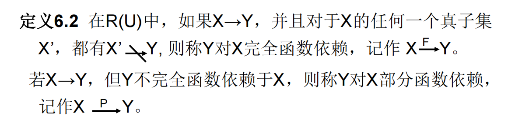

# 6.2 规范化

## 函数依赖

函数依赖定义：设R(U)是一个属性集U上的关系模式，X和Y是U的子集。若对于R(U)的任意一个可能的关系r，r中不可能存在两个元组在X上的属性值相等， 而在Y上的属性值不等，则称 “X函数确定Y” 或 “Y函数依赖于X”，记作X→Y。（**不能一对多**）

* 平凡函数依赖：

* 完全/部分函数依赖：

  

* 依赖传递：

  

## 码

## 范式

* 1NF：关系中每一分量不可再分。即不能以集合、序列等作为属性值
* 2NF：若R∈1NF，且每一个非主属性完全函数依赖于码，则R∈2NF
* 3NF：
* BCNF：
* 4NF：

# 6.3 数据依赖的公理系统

