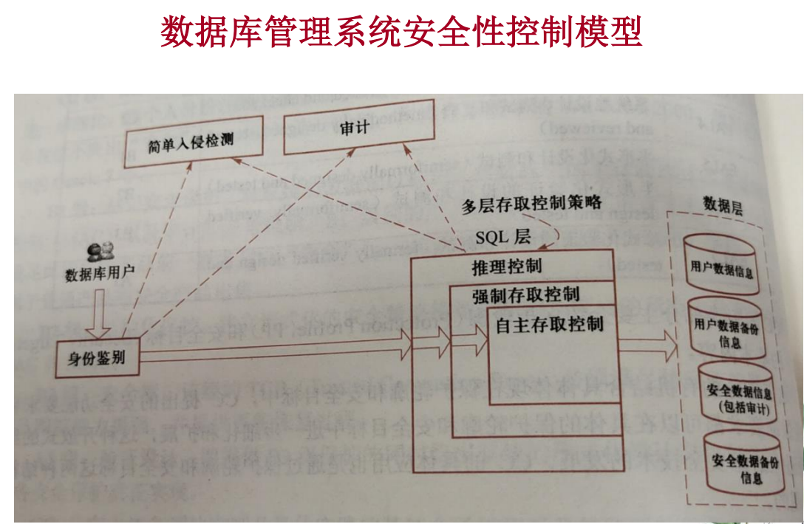
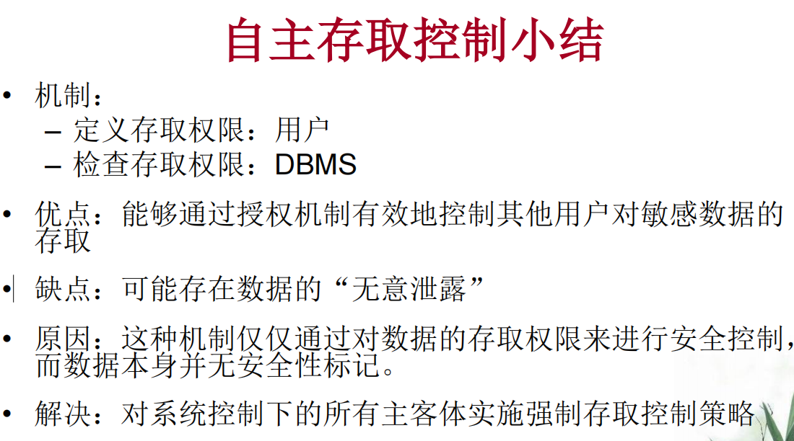
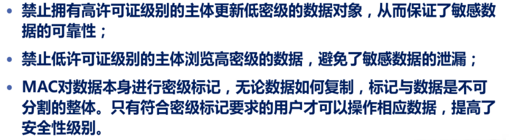

C1级别：具有主体、客体及主客体分离、身份鉴别、数据完整性、自主访问控制功能的系统；核心是**自主访问控制**。

C2级：满足C1级全部功能，且具有审计功能的系统；核心是**审计功能**。目前国内使用的系统大部分符合此标准

B1级：满足C2级全部功能，且具有标记及强制访问控制功能的系统；核心是**强制访问控制**。国际上有部分系统符合此标准，国内基本上没有满足此标准的系统；满足此标准的系统可称为可信系统或安全系统。

## 自主访问控制

* GRANT 赋予权限
* REVOKE 收回权限
* sp_addrole 创建角色，用于给同一级别的用户赋予权限

## 强制存取控制

规则：

* 仅当主体的许可证级别**>=**客体的密级时，该主体才能**读取**相应的客体

* 主体的许可证级别**<=**客体的密级，主体能**写**客体
* 用户可为写入的数据对象赋予高于自己的许可证级别的密级
* 一旦数据被写入，该用户自己也不能再读该数据对象

优点：

# 4.3 视图机制

* 视图机制把要保密的数据对无权存取这些数据的用户隐藏起来

* 视图机制更主要的功能在于提供数据独立性，其安全保护功能太不精细，往往远不能达到应用系统的要求

# 4.4 审计

自动将用户对数据库的所有操作记录起来，根据应用的安全等级自行选择是否需要打开审计功能

* 用户级审计
* 系统级审计

# 4.5 数据加密

* 基于文件的加密
* 字段加密
* 子密钥加密技术
* 秘密同态技术：允许用户不解密的情况下对加密数据进行操作。

其他安全保护：

* 推理控制

  统计数据库中隐蔽的信息通道

  能从合法的查询中推导出不合法的信息

* 数据库扫漏
* 数据库防火墙技术
