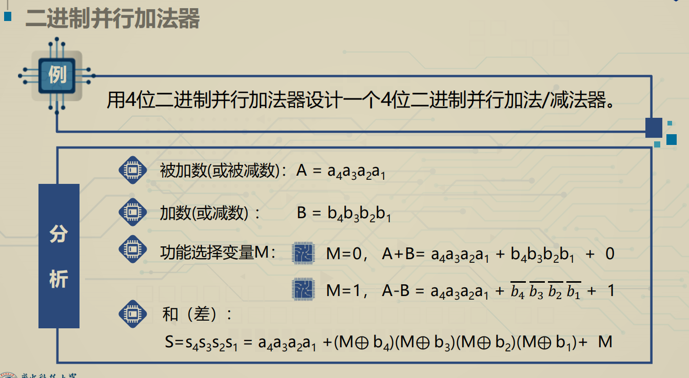

# 常用中规模组合逻辑电路

## 四位并行加法器 74283

* 若为3+8这种进位要在十位和各位都加0011，或者直接把进位输出理解成1

## 二进制译码器 74138

## 二-十进制译码器 7422

## 七段译码显示器 7448

* 74138实现全减器

## 四路数据选择器 74153

## 多路分配器

# 常用中规模时序逻辑电路

## 同步可逆计数器 74193

## 集成异步计数器 74290

R9和R0为置0和置9端，11生效，R9优先级高

## 4位双向移位寄存器 74194

S1S0为00时保持不变，10左移，01右移，11并行输入

# **常用中规模信号产生与变换电路**

## 5G555构成的多谐振荡器

