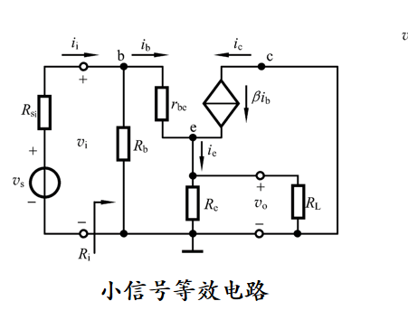

* 积分运算电路能令方波转换为三角波

* 

  遇到这种问题用叠加原理分别将两个输入置零求和

* 特殊二极管：

  光电二极管和变容二极管正常工作要加**反偏电压**

  齐纳二极管正常工作在反向击穿区

* 栅源电压为0还有电流就是耗尽型，阈值电压负，电压越小越有电流的就是P沟道，电压越大越有的是N沟道

* 共漏电压跟随，共栅电流跟随，共漏输出电阻最小，共栅输入电阻最小

* N沟道场效应管沟道中只有自由电子，P沟道场效应管沟道中只有空穴，因此场效应管也称为单极性器件。

* 共集极小信号虽然C接地，但是还是c和b在上面

  **发射极支路电阻折算到基极支路需要将电阻扩大到(1+β)倍；反之，基极支路电阻折算到发射极支路需要将电阻缩小到1/(1+β)。**

  

* 

* 

* 通常**共栅极和共基极**放大电路的**通频带要宽**于共源极和共射极放大电路。

* 无旁路电容的**直接耦合**放大电路区别于阻容耦合放大电路的特点是，它在**低频区的增益不会衰减**。

* 放大电路如果采用**阻容耦合**方式，**漂移量会被电容隔离**，不会被放大送到输出，但是**直接耦合**的放大电路无法隔离漂移量，这个漂移量会被放大后送到输出，从而输出出现漂移，称为**零点漂移**。

* 差分式放大电路的特点就是能够**放大差模**，抑制共模，因此**共模增益一般远远小于差模增益**。

* 在由多级放大电路构成的运算放大器中，影响零点漂移最重要的就是第一级，**采用差分式放大电路，可以在输入级有效地抑制零点漂移。**

* 当希望集成运放尽可能接近理想运放时，要求*Av*o、*r*id、*K*CMR越大越好。

* 当希望集成运放尽可能接近理想运放时，要求*r*o、*I*IB、*I*IO、*V*IO、D*I*IO/D*T*、D*V*IO/D*T*越小越好。

* **环路增益**为AF，是指闭合路径的增益；**闭环增益**为Af=A/(1+AF)，是指放大电路引入反馈后，输出信号与输入信号之比。

* 输出电阻=开路电压/短路电流

* 与纵轴相交为耗尽型，否则为增强型，Id假定正向是流入漏极，在横轴上方就是N沟道，下方P沟道，Id假定是实际电流方向，电流不为0时要求栅源电压大于阈值电压的是N沟道，否则为P沟道

* BJT基极电位处于发射级和集电极之间，PNP发射极电位最高，集电极最低，NPN集电极最高，发射级最低 

* 作业5.2.8记住不要逆向求电压，当前分路支流不是前面分路的总和！！！

* 5.4.4输出电阻那边不考虑第一级的输出电阻吗

* 8.3.5好好看

* 电路的上限频率取决于极间电容，下限频率取决于耦合电容和旁路电容，增益带宽积=上限频率*增益

## 背诵公式：

* CMOS和BJT的输入输出电阻，源电压和电压增益

* 全频率带宽
