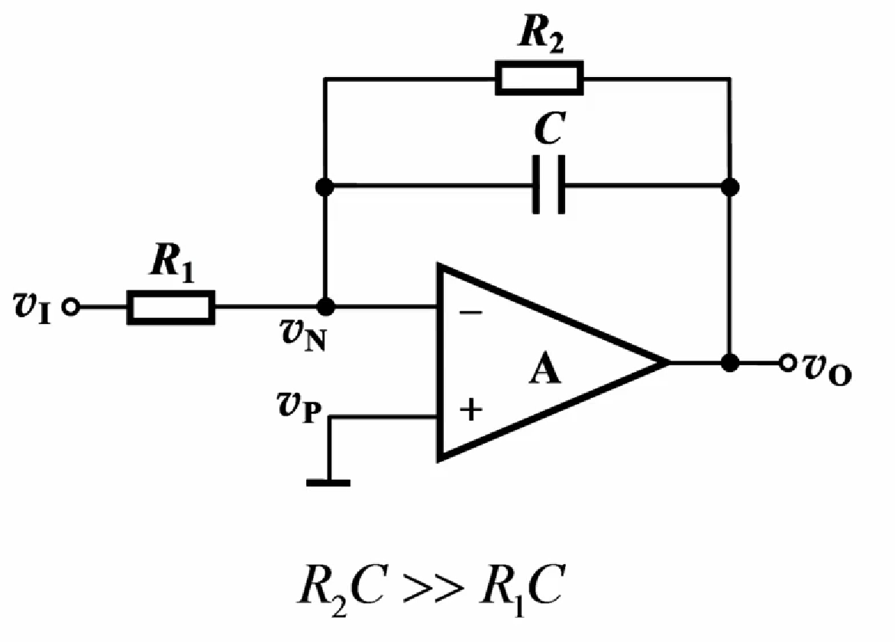
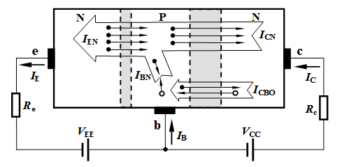
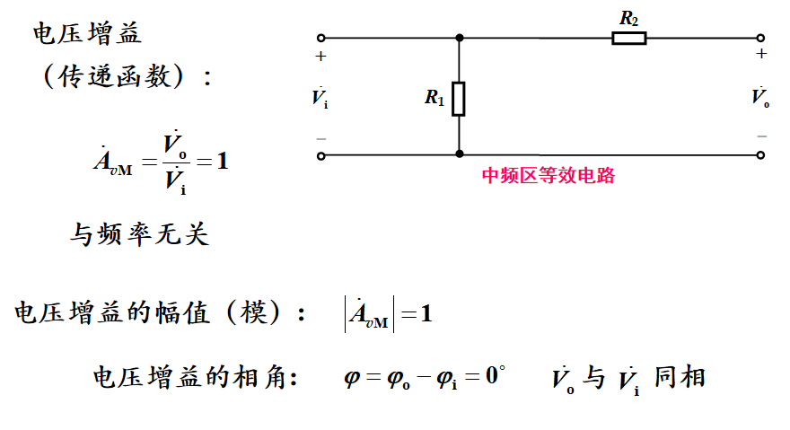
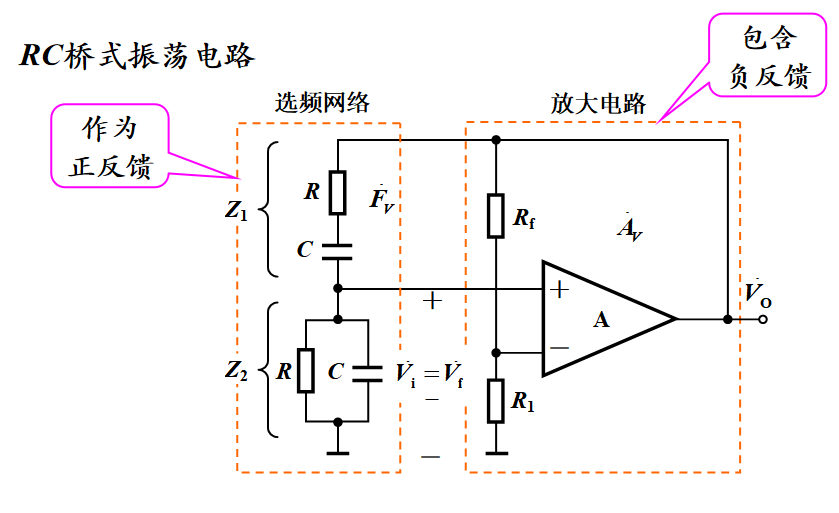

## 符号大小定义

## 第一章 放大电路模型

## 第二章 运算放大器

### 2.1  运算放大器及其信号放大

* **虚短和虚断**，只有工作在线性区虚短才成立！！！

  

* 直接在放大器两个输入端加入信号，容易直接使其进入饱和区，无法实现放大功能，引入负反馈电路后容易使运放工作在线性区

* 理想运放输入电阻无穷大，输出电阻约为0，开环电压增益无穷大，开环带宽无穷大，闭环运放增益：

  

### 2.2 运算放大器的基本性运用

1. 电压跟随器，一种特殊的同相放大器

   

   **电压跟随器的增益**体现在使信号源负载电阻变为无穷大，电压信号源内阻不再有电压损耗，输出电阻约为0，输出电压可以全部送给负载，消除了负载对电压信号源的影响，这种作用常称为**隔离或缓冲**

2. 反相放大器，输入电阻R1，输出电阻约为0

   

   

3. 求和电路

   

4. 求差电路

   

5. 积分电路

   

   并联一个大电阻，避免运放工作进入饱和状态。（因为运放输入端的偏置电流会对电容有直流充电，最终会导致运放进入饱和状态）

   

6. 微分电路

   

信号源对放大电路输入电阻的要求

* 电压信号源：尽可能大
* 电流信号源：越小越好

## 第三章 二极管

* N型半导体多数载流子是电子，由三价元素组成，成为**施主杂质**
* P型半导体多数载流子是空穴，由五价元素构成，称为**受主杂质**
* 扩散运动：由**载流子浓度差**引起的载流子运动
* 漂移运动：在**电场作用下**引起的载流子运动
* PN结形成：多数载流子扩散和少数载流子的漂移最后达到动态平衡
* 正向电压：P电位高于N，有利于多子扩散，削弱内电场
* 反向电压：有利于少子漂移，高电阻
* VT=26mA;

### I-V特性

## 第四章 MOSFET

* 静态工作点：
  $$
  V_{GSQ},V_{DSQ},I_{DQ}
  $$
  记得验证：
  $$
  V_{DSQ} > V_{GSQ} - V_{TN}
  $$

* 动态指标

### 4.1.1 mos管特性曲线和特性方程

#### 特性曲线

* 截止区

  

* 可变电阻区

  

* 恒流区

  

#### 转移特性

#### 跨导gm求解

### 4.1.2 其他mos管

#### N沟道耗尽型

#### P沟道

### 小结

### 4.2 MOSFET基本放大电路

### 4.3 小信号等效模型

* 共源极

* 共栅极

* 共漏极

  

### 4.4 共源极，共漏极，共栅极基本放大电路

* 共漏极,**电压跟随器**

  

* **共栅极有电流跟随作用**

## 第五章 BJT

* BJT箭头都是在基极和发射极之间，**从P指向N**

* **发射区掺杂浓度最高，集电区最低，基区居中**

* N区多自由电子，P区多空穴

* BJT实现传输条件：

  外部条件：**发射结正偏，集电结反偏**

  内部条件：发射区杂质浓度远大于基区，且基区很薄

* 
  $$
  α=I_{CN}/I_E≈I_C/I_E
  $$

  $$
  β=α/(1-α)
  $$

  $$
  β = (I_C-I_{CEO})/I_B≈I_C/I_B
  $$

  α一般在0.9~0.99；β一般远大于1

* 三种组态

  

### 输入输出I-V曲线

### 共射极电路

### BJT三种组态

## 第六章 放大电路频率响应

### RC电路的频率响应

* 中频响应

  

* 高频响应

  

* 低频响应

  

* 全频响应

  

  低频区输出超前输入，高频区输出滞后输入

### 共源放大电路的频率响应

* 级间电容构成低通电路，耦合电容和旁路电容构成高通电路

* **密勒电容：**

#### 增益带宽积

* MOS管确定，对相同的信号源，**增益带宽积基本为常数**

## 第七章 模拟集成电路

### 差分式放大电路

*  两输入端中的共模信号大小相等，相位相同；差模信号大小相等，相位相反。

* $$
  差模电压增益：A_{vd}=v_{od}/v_{id}
  $$

  $$
  共模电压增益：A_{cv}=v_{oc}/v_{ic}
  $$

  $$
  共模抑制比：|A_{vd}/A_{vc}|
  $$

* 如果有电容隔直，前级的漂移就不会传到后级被逐级放大，因此阻容耦合放大电路不存在零点漂移问题。

* 

### 集成运算放大器的主要参数

绝难误差电压公式：
$$
V_{O} = (1 + R_f/R_1)(V_{Io}+(1/2)*I_{io}(R_1//R_f+R_2)+I_{B}(R_1//R_f-R_2))
$$

全功率带宽：Vom峰值电压，SR转换速率
$$
BW_{P}=f_{max}=S_R/(2*pi*V_{om}) 
$$

### 运放在单电源下工作

* **输出静态电压置为电源电压的一半**
* 由于放大的是交流信号，所以只要能保证运放工作在线性区，就不需要严格遵守输入端电阻平衡条件。

## 第八章 反馈放大电路

* 理论上，地线和电源线不能作为反馈通路

### 串联反馈和并联反馈

* 对于电压信号源，串联反馈效果更好

* 信号为电流源，并联反馈效果好

* 并联反馈对理想电压源不起作用，串联反馈对理想电流源不起作用，但是当二者有内阻时候还是能起作用

* 串联反馈：输入信号和反馈信号在不同输入端

  并联反馈：输入信号和反馈信号在同一输入端

  并联反馈：

  

  串联反馈：

  

### 电压反馈和电流反馈

* 电压反馈：反馈网络输入端口和放大电路输出端口并联，具有**稳定输出电压作用**
* 电流反馈：反馈网络输入端口和放大电路输出端口串联，具有**稳定输出电流作用，减少负载变化对输出电流影响**
* 判断方法：**输出短路法：输出短路，输出电压置零，反馈量为0为电压反馈，不为0就是电流反馈**
* 判断方法二：**和Vo正极串联就是电压反馈，其他地方就是电流反馈**

### 正反馈和负反馈

* 判断方法：**瞬时极性法**

### 四种负反馈放大组态

### 反馈放大电路增益表达式

### 负反馈对电路的影响

* 负反馈可以提高增益稳定性

  

* 减小反馈环内非线性失真

* 抑制反馈环内噪声

* 对输入和输出电阻影响，参见上图

* 拓展带宽

### 深度负反馈下的近似计算

## 第十章  信号处理与信号产生电路

### RC正弦波振荡电路

* ### 振荡条件

  

  

  

  

### 电压比较器

* 单门限电压比较器：在同相端和反相端电压相同时发生电压跳变，根据输入电压在同相端还是反向端判断跳变方向，同相端则是大于门限电压为正，小于为负，反相端输入则反之

* 迟滞比较器：单门限电压比较器引入正反馈

  

### 非正弦信号产生电路

* 积分运算能把方波变三角波

* 方波产生电路：反向迟滞比较器

  

* 锯齿波产生：同向迟滞比较器+反向积分电路

