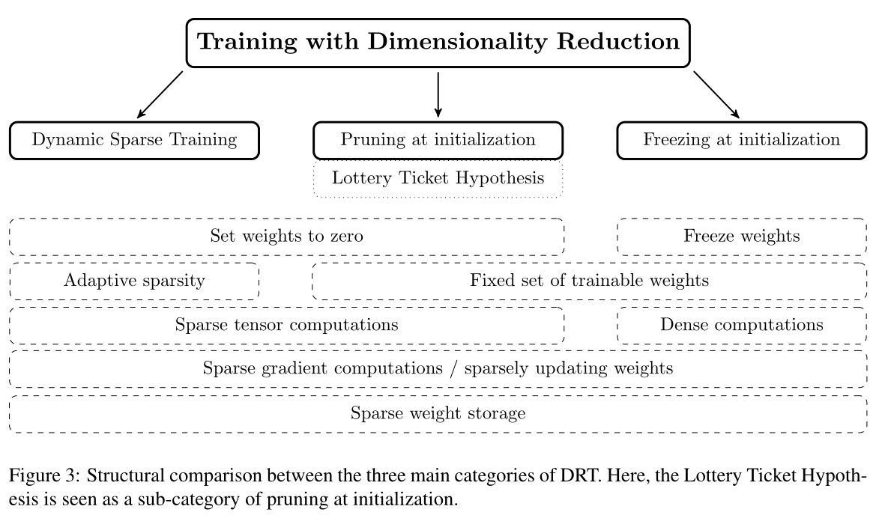
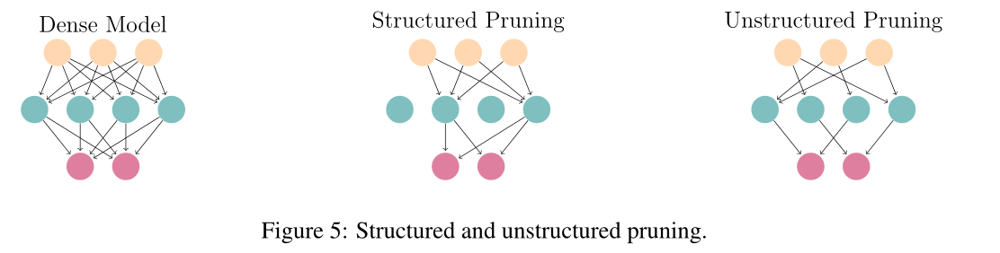
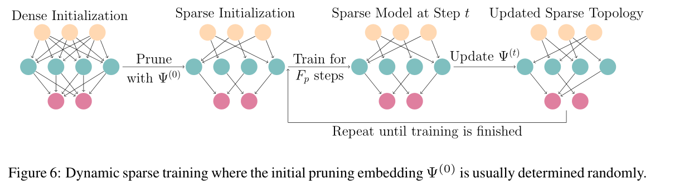
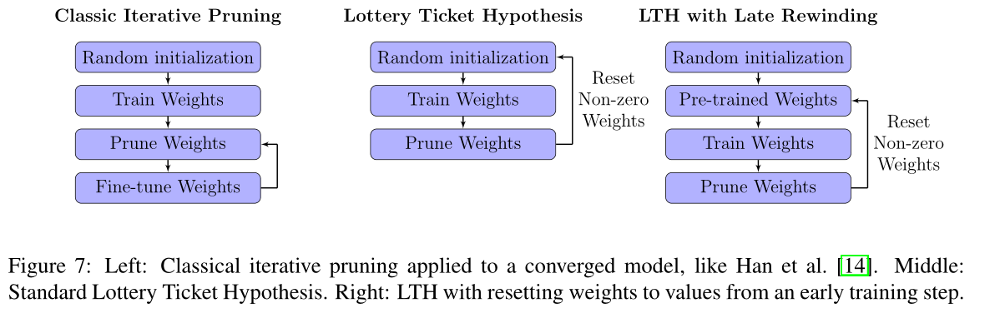
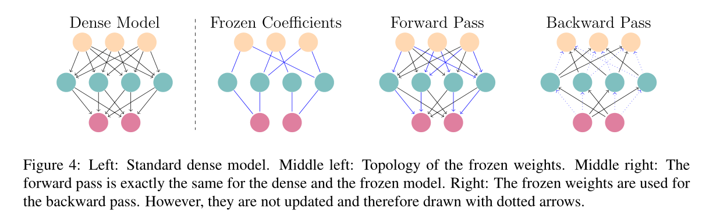

# 模型压缩

## 知识蒸馏

通用的知识蒸馏方法：

1. 先训练Teacher模型

   输出soft labels

   > 为什么使用soft targets？
   >
   > 因为除了正例，负标签页含有大量信息，用soft targets使得Teacher模型能给Student带来更多的信息量
   >
   > 

2. 在一个温度T下，蒸馏Teacher的知识到Student模型

   蒸馏过程目标函数是由相对于teacher的soft target的误差和student loss（对应hard target）加权获得

   > 温度作用：影响soft targets概率分布的平缓程度，从而影响Student训练过程中对负标签的关注度，可以根据Student的参数量来选择T，参数量小的模型不能capture all knowledge，可以适当忽略负标签蕴含的信息，用较低温度

## 降维训练

论文链接：https://arxiv.org/pdf/2205.08099.pdf

综述文章：[我总结了70篇论文的方法，帮你透彻理解神经网络的剪枝算法 - 腾讯云开发者社区-腾讯云 (tencent.com)](https://cloud.tencent.com/developer/article/1877711)

###  Pruning

通过让部分不太重要的小权重置为0，来降低网络复杂度，减少计算时间

* 结构化修剪：修剪网络中的通道，神经元，甚至网络的粗糙结构

  初始化采取随机或者精心设计的方式对结构化修剪结果影响不大。

* 非结构化修剪：将单个权重置为0，修剪性能更好，但需要支持稀疏张量运算的软硬件

  对于修剪方案的选择：

  * 对于分层阈值设定，可以每层设一个恒定比率的修剪参数，用启发式或者优化超参数的方法找到最合适的修剪rate

  * 随机初始化修剪方案，让每层的训练参数数量在训练中动态调整

  * 通过量级标准进行选择，选取最大量级的weights

  * 基于梯度的标准选择。依赖于开始时刻损失函数的一阶泰勒展开来度量权值对损失函数的影响。
  
    
  
  对于更新修剪方案的频率 $F_p$的选择：
  
  * 要远大于一次训练，这样才能保证：
    1. 训练的稳定性
    2. 新加入的权重有足够多的训练轮次达到足够大的数值避免被剪枝/冻结
  
  全局剪枝和局部剪枝：
  
  全局剪枝一次性在整个网络上应用修剪，可能导致层崩溃，局部减脂对每一层使用相同的rate进行修剪。图左为局部修剪，右为全局修剪。
  
  
  
* 剪枝方法：

  * 训练，修剪，微调：

    1. 训练网络
    2. 通过将参数置0进行修剪
    3. 用最低的学习率训练网络几个额外十七，让他有机会从修剪引起的性能损失中恢复

    2，3可以迭代，每次都会增加修剪率

  * 初始化的时候修剪（pruning at initialization）

    lottery ticket：随机初始化的密集神经网络包含一个子网工作，它被初始化，这样当单独训练时它可以在训练最多相同迭代次数后与原始网络的测试精度相匹配

  * rewinding：在修剪网络后完全重新训练网络。与微调不同，这里的re-train遵循和train相同的学习率计划，这种再训练和微调相比展现出更好的性能和更高的成本

  

  * sparse training 稀疏训练

    1. 随机掩码初始化网络，修剪一定比率的网络
    2. 一个轮次内训练这个修剪过的网络
    3. 修剪一定数量的最低权重
    4. 重新增长相同数量的随机权重

    

  * 掩码学习：

    1. 通过单独的网络或层进行掩码学习

       训练单独代理以尽可能多修剪一层的过滤器，最大限度提高准确性，插入基于注意力的层，使用强化学习等

    2. 通过辅助参数进行掩码学习

       将剪枝视为一个优化问题，最小化网络的L0范数及其监督损失

  * 基于惩罚的方法

    对权重本身实施惩罚，例如指定对弱连接的惩罚，增加要保留的参数和修剪参数之间的距离，减少删除影响

    对整个训练过程中不断增长的惩罚的权重子集可以逐步修剪它们实现无缝删除

> Lottery ticket hypothesis
>
> 极度系数的子网络可以有和全网络相近甚至更好的表现
>
> 

### Freezing

修剪和将未经训练的权重冻结在0是等效的。

* 结构化冻结：通常冻结整个layer
* 非结构化冻结：冻结单个权重，减少分布式训练的梯度计算，内存需求和通信成本

**在训练参数较少的时候，freezing表现的比较好，训练参数多了还得pruning**

可以通过对冻结参数进行权重衰减来结合二者优点。通过冻结初始权重保证信息流可靠和训练结束的稀疏网络，但是同时更新二者。

* 在训练过程中允许改变冻结掩码效果会更好

论文小结：

* 通过提前训练网络寻找lottery ticket，和在训练中逐步调整稀疏结构都比在训练开始的时候找一个特定的稀疏子网络表现更好
* 有伪随机数生成器的情况下freeze相比于prune只要额外32bit的存储开销，若是没有则开销大大提升

* 利用彩票假说寻找lottery ticket需要至少两倍的训练轮次来完成训练，所以LTs需要大量剪枝转换的预训练

## 神经网络架构搜索 NAS

自动化设计神经网络的方法，在网络架构搜寻前，需要对卷积层、卷积单位和卷积核的大小等参数进行预先设定，随后使用预设定的参数在一个巨大的网络空间上搜寻。资源消耗较大，有一定局限性。

## 参数量化

将网络中的高精度参数替换成低精度参数，从而降低存储成，加快计算，降低设备能耗

量化方式：

* 对weight精度要求不高的直接降低位数，减少存储数据量
* 权重聚类：对神经网络中所有的weight按值的大小进行分堆，聚类，然后对每个类取一个值（可以是平均值）来替换里面所有的weight
* 哈夫曼编码：常出现的用较少bit表示，不常出现的用较多bit表述，平均储存的数据量大大减少
* binary connect设置权重，权重均为1或者-1

## 动态网络

论文连接：[Dynamic Neural Networks: A Survey (arxiv.org)](https://arxiv.org/pdf/2102.04906v2.pdf)

核心思想：**自适应推理**

### 样本自适应动态网络

**可以把对样本的适应联系上对机器本身算力的适应，从而在不同终端进行不同程度的网络压缩**

* 动态结构

  * 动态深度：早退机制和跳层机制

  * 动态宽度

    1. **多专家混合系统**（MoE）（可用于CNN，LSTM和Transformer）

       通过并行结构建立多个”专家“（可以是完整模型或者网络模块），对专家的输出结果进行动态加权（软加权）得到最终结果。

       可以通过控制门来选择性激活专家子网络，实现模型效率提升

       

    2. **CNN中的动态通道剪枝**

       根据样本自适应的激活不同的卷积通道，从而在保持模型容量的情况下实现计算效率的提升

       1. 可以根据门控来决定每一层的通道执行，eg：runtime neural pruning（RNP）
       2. 沿着通道维度的多级架构，参考沿着深度的多级架构早退机制。后期stage依赖于early predictions，eg：CGNet

       3. 基于特征激活值的动态修剪

  * 动态路由

    建立更加通用的超网络，在超网络内部（部分）结点，采用一定的路由机制来对到达该节点的网络的样本特征进行动态路由

* 动态参数

  保持网络结构在推理过程中不变，根据输入样本自适应地调节模型的（部分）参数，从而提升模型的表达能力

  **这个方面看似并不是压缩模型，故没有细看直接略过**

  1. 参数动态调节
  2. 参数预测
  3. 基于注意力的动态特征

文章后续关于空间自适应动态网络和时间自适应动态网络主要用于对输入图像数据空间位置不同和时序数据时间位置不同进行自适应计算，和模型压缩同样关系不大，略。

## Architecture Design

以Depth Separable Convolution为例，将classic CNN分解为Depthwise Convolution和Pointwise Convolution，使得CNN参数量大大减小。

> 上述方法为什么有效呢？
>
> 这里有个解释（Low rank approximation）。如果神经网络某一层输入为N，输出为M，那么对应的weight就有 ![[公式]](https://www.zhihu.com/equation?tex=N%2AM) 个。这时，如果我们在N和M中间加一层，对应输出为K，那么参数量就是 ![[公式]](https://www.zhihu.com/equation?tex=M%2AK%2BK%2AN) 。当K比较小时，参数量相比于 ![[公式]](https://www.zhihu.com/equation?tex=N%2AM) 会大大减少。
>
> 

Depth Separable Convolution相当于将CNN中间多加了一层，这样就可以减少整体网络的参数量。
