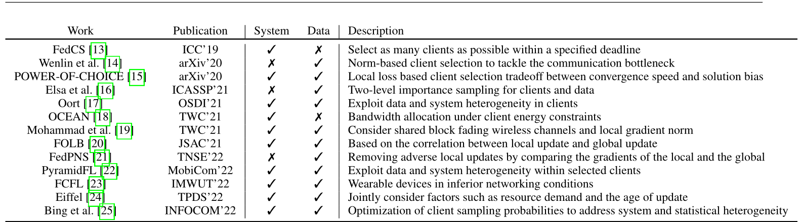

# FedC2S

Class-aware client selection for effective aggregation in federated learning 

[论文链接](https://reader.elsevier.com/reader/sd/pii/S2667295222000204?token=B63C47738F0125AD48665B5EFA5FAD352CDFE79DA9E7DA4DE09640946E0D148330069C8336E9B2B7D54B0B00D029DCD5&originRegion=eu-west-1&originCreation=20230112065211)

* 论文提出的客户端选取策略用于处理Non-IID数据，但是提出的客户分组方法仍具有借鉴意义

## Abstract

* 传统**随机选择客户端**的方法对IID数据上的表现可以，但是**在非IID数据上会产生精度下降问题**
* 本文建议**根据客户端拥有的数据类别进行分组**，每轮通信中只选择一组
* 在数据**分布高度不平衡，模型复杂**的情况下，该方案在模型精度和收敛速度方面具有优势

## Introduction

* 在数据分布极度不平衡的情况下，每个客户端只包含一个特定类别的数据，基于平均的聚合导致精度显著下降

## Background and related work

Parameter training in neural network

* 如果用所有samples进行梯度下降，称之为batch gradient descent（BGD）
* 只用一个sample则为Stochastic gradient descent（SGD）
* BGD最终结果更好但是计算量大，SGD收敛更快但是可能陷入局部最优
* Mini-batch gradient descent(MBGD)则是一个tradeoff，using a subset of samples in each iteration, whose number 
  is called batch size.
* 我们可以设置不同的批大小，使得所需迭代次数最小化，训练效果接近SGD。一般来说，批大小越大，每次迭代的梯度方向越准确，训练冲击越小。

Federated learning

* **本文讨论的是server和clients有相同模型下的更高效聚合策略**

**Client Selection**

* 一种基于契约理论的激励机制**鼓励拥有高质量数据的客户端加入**联邦学习过程
* 一种名为FedCS的新协议试图通过在一轮中**选择资源约束更少的clients**来聚合更多的updates

* 一种名为power-of-choice的方法每轮随机选择一部分客户端，在这些客户端上用当前全局模型测试本地数据的loss，**选择loss最大的client进行循环训练**

### **Class-aware client selection for aggregation**

* 不同类型的数据不同客户端会派生出具有不同特征的局部模型，加权平均后参数所表示的特征将被削弱
* 因此提出根据数据类别进行客户端分组，参数只在同一个分组内聚合，在不同分组间传递

* 为了进行分类，客户端一开始就得向服务端汇报他们拥有的数据类型，如果数据动态变化，客户端需要在每一次通信开始时向服务器报告自己的标签集和每个类的数据量，因此该方案只适用于**数据类信息可以共享的情况**

Client grouping

* 将不同数据label的客户划分到不同组，这样可能会有很多组，可以通过合并一些集合来加快训练过程，代价是牺牲一点全局模型精确度

Class-aware client selection

* 选取客户端集合原则：
  1. 每个分组的选择可能性要尽可能相同
  2. 为了global model的准确性，所有选定的客户端的数据应该代表连续几轮通信中的总体数据分布（？）
* 根据公式计算每个communication round下不同set的Value，选择Value最少的set，因为Value最少说明他在前面几轮参与的训练比别人少，被选择的次数也比别人少

# Power-of-Choice

Towards Understanding Biased Client Selection in Federated Learning

[论文链接](https://proceedings.mlr.press/v151/jee-cho22a/jee-cho22a.pdf)

## Introduction

* 在实践中就一小部分clients参与每轮的训练可能家具数据异质性的不利影响

一些相关工作：

1. 采用数据的重要性采样来加速集中式SGD收敛
2. 选择损失最大的或者梯度范数最高的样本进行下一次SGD迭代
3. 偏选低损失样本来提高对异常值的鲁棒性
4. 聚类客户端抽样方案，减少FL中客户端聚合权重的方差

* 本文从理论上证明偏向具有较高局部损失的客户选择可以提高收敛速度

## Power-of-Choice Strategy

1. Sample the Candidate Client Set
2. Estimate Local Losses
3. Select Highest Loss Clients

* 对于第一步中的set大小的选择是收敛速度和结果偏差的一个tradeoff，如果大小等于所有客户端就变成了random client sampling，candidate set的大小越大，selection skew越大，在更高误差下限的风险下给出更快的误差收敛

# Client Selection in Federated Learning: Principles, Challenges, and Opportunities

一篇关于client selection的综述文章

[文章链接]([[2211.01549\] Client Selection in Federated Learning: Principles, Challenges, and Opportunities (arxiv.org)](https://arxiv.org/abs/2211.01549))

* SYSTEM HETEROGENEITY

  设备在computation, communication, energy上的不同

* Prioritizing FL clients

  * Statistical Utility

    代表client的local update对global model的重要性，分为基于数据样本的和基于模型的

    * 基于样本的主要利用local data来进行评估，可以利用**样本数量，梯度的L2范数，本地损失**等指标来进行评估

    * 基于模型的可以利用**client和server模型参数的平均差值，同号权重百分比，local update前后模型改变量，权重远离0最多的client **等指标进行评估

  * System Utility

    * 设置一个communication round的deadline，模型本地训练，传输，压缩等时间之和大于ddl的都不选
    * 设置一个**soft deadline**，对掉队client进行惩罚

  每个客户端的总体效用是系统效用和统计效用的乘积，该乘法形式可以通过乘以相应的效用函数来扩展到包括其他效用方面，如**公平性和稳健性**

* **在开发(选择优先级的客户端)和探索(选择更多样化的客户端)之间存在权衡。**

### Research Opportunities

* 最佳的客户选择数量，可以研究在FL训练过程中自动调整这个数字
* 理论性能保证
* 基准测试和评估度量
* 大型开放实验台