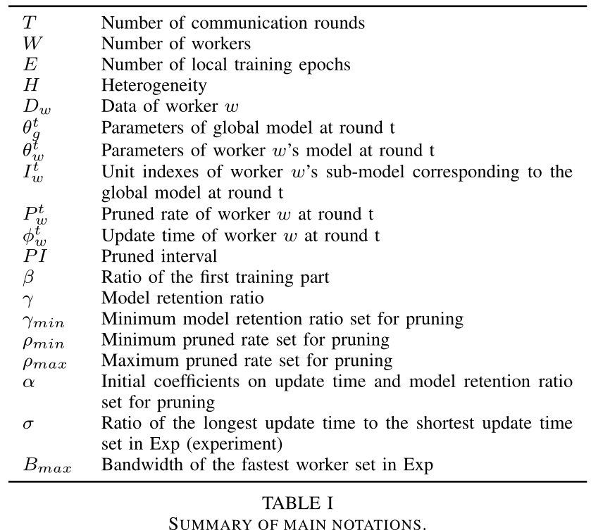
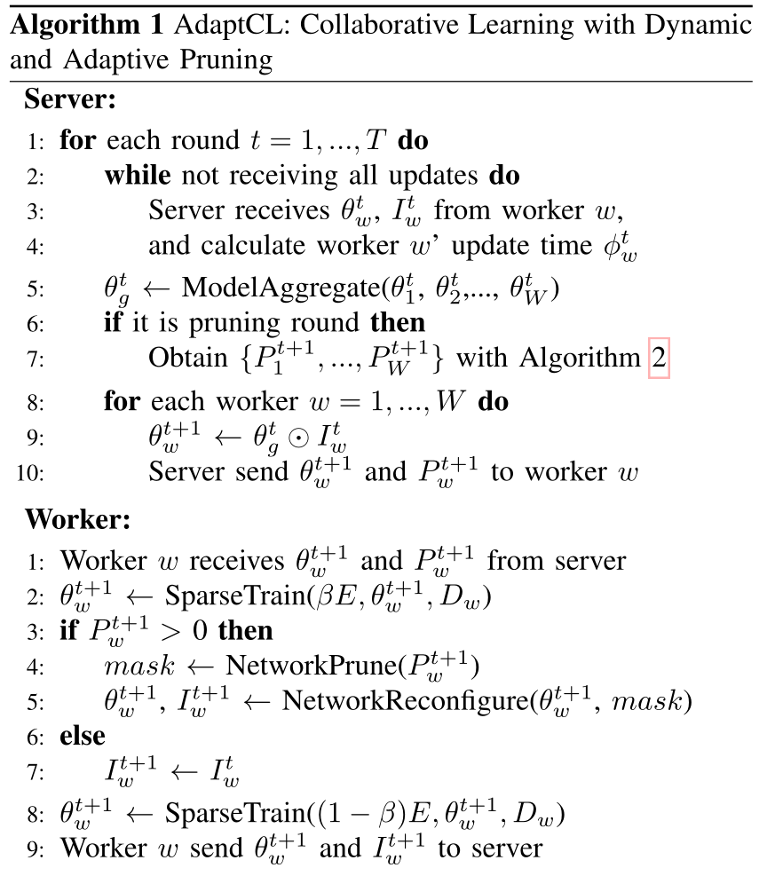
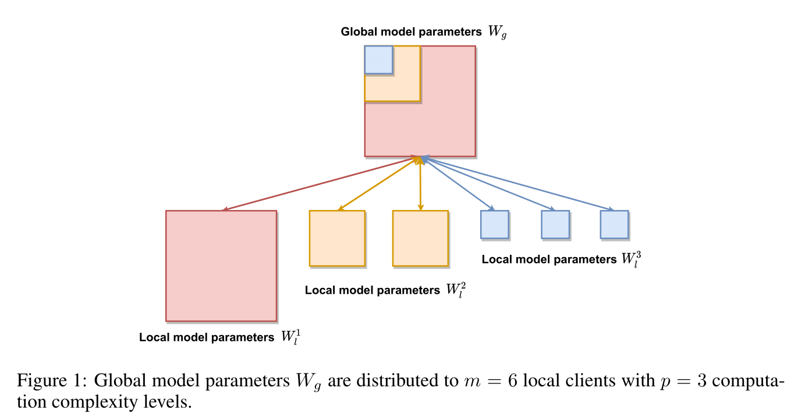

# AdaptCL

------Efficient Collaborative Learning with Dynamic and Adaptive Pruning

## Abstract

* 本文提出一种可以**根据能力自适应进行修剪**的模型，保证每个子模型**无需工人能力的先验知识**即可从全局模型中获取子模型
* 由于模型是根据worker本身计算能力来修剪的，所以**每个worker的更新时间就相近**，从而大大提升训练速度
* AdaptCL提供了一种处理准确性和时间开销之间的权衡机制

## Introduction

协作学习每轮分三步：

1. 服务器发送全局model给workers
2. workers在适合自己算力的裁剪后的子模型上训练，把训练后的updated model送回server
3. server负责聚合从worker中获取的子模型，形成新的global model用于下一轮修剪分发

> asynchronous parallel 异步并行的 **staleness issue**？
>
> 异步并行让server一接收到updated sub model就更新，不同子模型更新时间大不相同可能导致global model无法收敛

> 不能直接用剪枝算法的原因：
>
> 以往剪枝算法基于预训练模型，为了加速inference，我们需要加速训练，且基于的是正在被训练的模型

* 本文的AdaptCL通过为每个data holder根据算力和沟通能力进行不同的修剪，生成稀疏子模型来保证不同的worker也能有一个大致相近的update time，从而使用同步方法得到超过上述异步方法的效率，还避免了staleness issue

* server以每个worker的update time作为其能力的表征，再利用模型留存比例和对应训练时间进行个性化建模，重新设置个性化的修建比率（修剪以shortest update time作为目标）

> Non-IID数据：非独立同分布数据（Non-independent and identically distributed）

## Related Work

1. Nerwork Pruning

   怎么剪：减去重要程度低的units，比如零激活百分比xxxxxx

   剪多少：每一层都有不同的剪枝比率，文中通过获取filters 的global rank来学习不同层的剪枝阈值（？要剪再了解）

2. Efficient Collaborative Learning

   inefficient的两个原因：

   * Local cause：模型太大，本地训练不来，太耗时

     解决方法：利用梯度量化和稀疏化加速model transmission。或者调整参数聚合频率。

   * Global cause ：workers之间的异构导致的draggers问题

     解决方法：通过给不同worker分配不同sub models实现update time尽可能的相近

3. AdaptCL

   Overview

   * 训练开始，给每个worker分配相同模型，因为还不知道它们的capacity，随后的round根据算法生成可调整pruned rate，这个过程随训练动态进行直至update time趋向一致
   * server端在接收到所有子模型更新后才进行联合学习
   * worker端收到参数后先**训练一部分epochs**，如果无需修剪则训练完剩下部分，否则在训练剩下部分之前要进行unit的修剪，更新子模型和相对于全局模型的global index，然后发送给server

   

   Model Training and Aggregating

   * 利用系数训练的方法，并把与单元相关参数视为一组，训练时候降低一整组的参数值，从而降低修剪单元带来的影响

   * 两种模型聚合方法：忽略不同worker的数据集差异性前提下

     a unit may only exist in $w'$ ($w'$<$W$) sub-models

     1. By-Unit 聚合系数设为$\frac{1}{w'}$ 
     2. By-Worker 聚合系数设为$\frac{1}{W}$

     根据别的论文指出lottery ticket可能表现更好，因为它的make operation通过冻结参数为0使其更快达到优化终点，而By-worker也是把没有包含unit的sub-model中该参数设为0，所以决定采取by-worker用于模型聚合

   Pruned Rate Learning

   * 利用子模型之前的留存比率和更新时间作为数据集，构建留存比率到训练时间的唯一函数
   * 加入最大和最小修剪比例，最小留存比率防止过大的修剪和连续的微小修剪

   NetWork Pruning

   * 在分布式剪枝中**identical和constant**是关键（pruning order is identical across all workers or constant over time）

     因为相同的模型结构在worker的task相似的时候能够有更好的表现，而在协作学习的时候肯定有很多worker的task是相似的

   * 依赖于数据的重要性评价会导致子模型不一致，所以引入了模型独立的全局评价方法Batch normalization，提出了CIG-BNscalor的修剪方法

   * 采取迭代修剪，在每个修剪间隔后进行修剪，并从训练开始就修剪，使得训练过程尽可能节省时间同时腾出更多轮次来恢复模型性能

## Conclusions

提出AdaptCL model，能够根据data holder的capability基于全局模型动态生成可调整的稀疏子模型，并通过不同的模型修剪让workers的update time尽可能相近，避免dragger和staleness issues。

# HETEROFL

computation and communication efficient federated learning for heterogeneous clients

## Abstract

提出HeteroFL模型，**解决不同local models之间的异构性，在local models有着不同的计算复杂度的情况下仍能构建出单一的全局推理模型**。最终证明根据clients的能力自适应分发subnetworks能提高计算效率又能提高通信效率

## Introduction

* 传统federated learning潜在假设local models和global model有着相同的结构，因此我们不得不将global model的复杂度限制到最低的client的程度来训练其数据。
* 我们的方法即使在模型异质性动态变化的时候也能展现出稳定高效的学习结果
* 提出了多种策略提升FL training，在平衡非独立同分布数据统计异质性下仍具有鲁棒性，此外提出的方法还能减少抵达最优结果的communication rounds

## Related Work

当前FL存在的几个主要问题：**communication efficiency， system heterogeneity， statistical heterogeneity，and privacy**

* 为了减少通信开销，有些研究提出了data compression技术，例如量化和草图，或者分割学习
* 为了解决系统异构性，提出了异步通信和客户端主动采样技术
* 为了解决统计异质性，一个研究趋势是调整global model去适应非独立同分布数据的个性化局部模型，主要利用FL和辅助学习，元学习，多任务学习，迁移学习，知识蒸馏，彩票假说等方法结合来实现。

这些方法或多或少带来了不必要的额外通信和计算开销，且模型的梯度变化理论上可以反推出隐私信息。

本文中的方法能够很好解决系统异构性和通信效率问题，**允许local clients只对低计算复杂度的模型进行优化然后只通信少量的模型参数**，为了解决统计异质性，提出了**Masking Trick**用于平衡Non-IID 数据在分类问题中的划分。还提出了Batch Normalization的一种修正，因为运行估算的隐私问题影响高级深度学习模型的使用。

## Heterogeneous Federated Learning

### Heterogeneous Models

* 通过改变隐藏通道的width来减少local models的参数，并保证local model和global model仍保持同样的model class
* 实际聚合操作就是把含有该部分参数的所有client的参数都加起来求平均。
* 在这种分配下，较小的local model反而可以从global aggregation中收获更多，该方法比为每个client分配一样的subnetworks效果更好

### Static Batch Normalization

* 不使用BN的原因：BN需要在每个隐藏层运行估计表示，uploading这些数据给server会导致更高的通信开销和隐私问题。

> 为什么Batch Normalization 需要running estimates of representations at every hidden layer ？

* sBN则只是单纯标准化batch data，且具有更好的表现

### Scaler

* 利用dropout $q$来解决不同计算复杂度的模型对同一参数优化会偏离到不同的尺度

算法大致流程：

1. 在每个communication round根据activate clients数随机选择$M_t$个clients
2. 对每个client**并行处理**，根据他们的计算能力和通信能力划分成对应的computation complexity level

3. 根据该level的收缩比率获取子模型，然后update，得到子模型的全新参数
4. 迭代每个computation complexity level获得global model的全局参数在每个level的平均值
5. 将获取到的每个level的参数整合起来组合成global model的参数
6. 视情况看本地的计算和通信能力和学习率是否需要修改
7. 重复上述过程，迭代下一个communication round

### Experimental Results

略

## Conclusions and Future Work

* 该工作展现了利用远比global model小的local model进行协同训练产生单一全局推理模型的可能性
* 该模型展现了在数据统计异质性和本地设备能力动态变化情况下的鲁棒性

# Split-Mix

EFFICIENT SPLIT-MIX FEDERATED LEARNING FOR ON-DEMAND AND IN-SITU CUSTOMIZATION

## Introduction

* resource dynamics：每个应用程序在不同时候分配到的设备上资源变化很大
* robustness dynamics: 不同外界环境需要不同等级的安全/健壮性要求，当外界环境突变的时候可能需要一个更加健壮的model来取代当前用于benign condition的model

* HeteroFL在较大的模型的专属参数部分得到的训练很少
* 为解决上述问题，提出了split-mix的方法使得**结果模型的大小和鲁棒性可以在运行的时候有效定制**

## Problem Setting

* Heterogeneous computational budgets during training

* Heterogeneous data distributions

  

## Method

* **Split-Mix**：将完整的知识分成细小碎片然后进行灵活组合实现定制化

**More accessible data by splitting wide networks：**

* 通过split wide networks能够让这些大的network进入那些budget-insufficient的client利用他们的数据训练
* 由于所有base model独立评估，我们可以并行训练这些base model提高效率
* client‘s budget会限制并行训练的base models数量，我们可以在每轮选取不同集合的model 进来

**Boost accuracy by mixture of subnet experts：**

* 将base models集成起来直至size达到和通道数量相同

算法：

* Federated Split-Mix Learning

  每个round初始化参数和聚合权重，对每个client根据自身情况从base model中进行抽样组合成符合其大小需要的model

  把这个model的参数送给client进行训练，返回server根据聚合权重更新该部分参数

* SampleBaseModels

  根据需要的model大小，从传入的base model之外的models中均匀不重复抽样出足够的参数来加入到参数集合使之满足组合model需要的大小

* 利用动态对抗样本作为增强来提高模型鲁棒性，在accuracy和robustness之间进行trade-off
* sharing all parameters except the batch-normalization (BN) layers can maximize robustness and accuracy by
  expertised BNs, respectively把BN layer分为两个部分，one for standard performance and the other for robustness

* Customizable layer-wise mixing:对每个BN层输出进行加权平均来避免中间输出加倍的问题

# PervasiveFL

Pervasive Federated Learning for Heterogeneous IoT Systems

* 引入modellet作为FL的万能门户，和local model进行相互学习
* 
