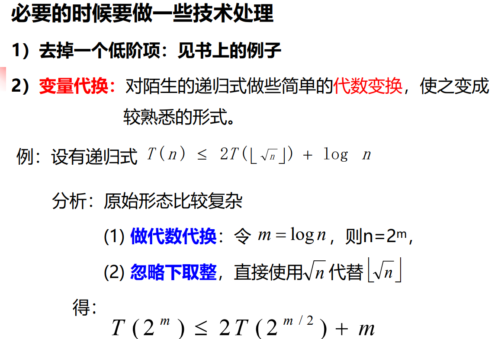
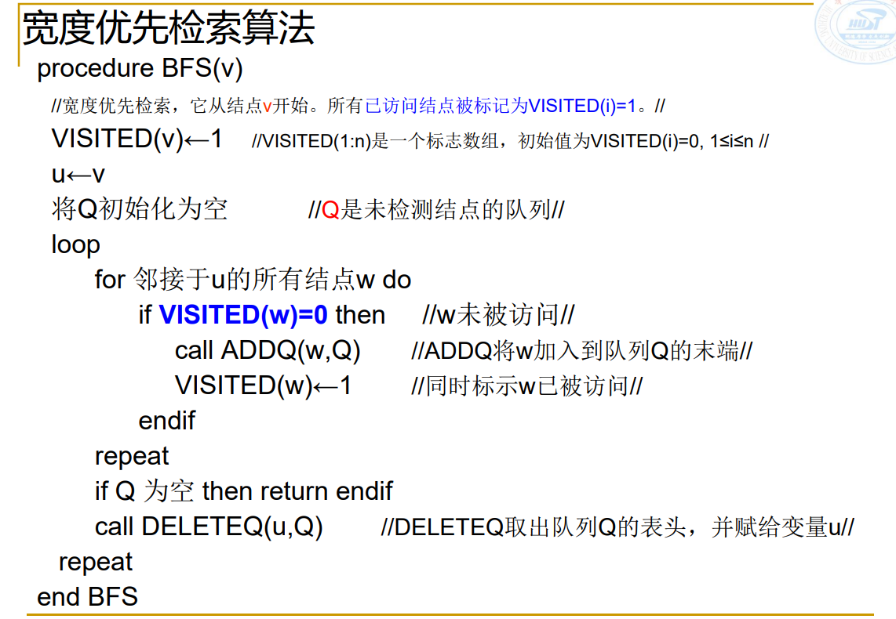

# 理论部分

1. 算法的基本概念和性质

   算法是一组有穷的规则，它规定了解决某一特定类型问题的一系列运算，描述了一个特定的计算过程来实现输入到输出的转换

2. 循环不变式

   

   

   循环不变式证明算法正确性

   

3. 渐近表示：O、Ω、Θ记号的定义和相关性质及其证明

   

   

   

   **注意：**

   

4. 分治法的基本思想

   * 分解：把问题递归分解成两个子问题
   * 解决：若还是无法直接得出，就继续递归分解问题，直至分解到可以秒解的**基本情况**
   * 合并：把子问题的解合并起来

5. 以比较为基础的检索和分类算法的时间下界及其证明，熟练掌握其中几个典型算法。

   

6. 为什么我们通常更关心算法的最坏情况执行时间？

   一个算法的最坏情况执行时间给出了任何输入的运行时间的一个**上界**。知道了这个界，就能确保算法绝不需要更长的时间，我们就**不需要再对算法做更坏的打算**

7. 用代换法、递归树法解递推式的基本思想

   * 用代换法解递归式基本思想：先猜测解的形式，然后用数学归纳法求出解中的常数，并证明解是正确的

   

   * 递归树：反应递归的执行过程。每个节点表示一个单一子问题的代价，子问题对应某次递归调用。根节点代表顶层调用 的代价，子节点分别代表各层递归调用的代价。

     等比数列代换手法：

     

8. 主方法及其使用。

   

9. 了解期望时间和最坏情况时间是线性时间的选择算法的基本思想

   > 快速排序思想：利用分区操作每次使得一个数字处于正确的位置，并且划分两个数组，递归这两个数组，最终使得最小的子数组也有序，则整个数组都有序了。

   期望时间为线性时间的选择算法基本思想：

   以随机快排为基础，每次partition分区都能划分出比主元大和小的两个子数组，即可以根据主元前面的数组的个数确定主元是第几小的数，通过不断分区，使得主元正好是第 i 小的数。

   

   最差情况为线性时间的选择算法基本思想：

   

10.  最优化问题是一类什么问题？

    这一类问题的可行解可能有很多个。每个解都有 一个值，我们希望寻找具有最优值的解（最小值或最大值）

11. 什么是最优子结构性、无后效性？用剪切-粘贴法证明一个问题满足最优子结构性

    * 最优子结构：问题的最优解由相关子问题的最优解组合而成，而这些子问题可以独立求解

    * 无后效性：如果在某个阶段上过程的状态已知，则从此阶段以后过程的发展变化仅与此阶段的状态有关，而与过程在此阶段以前的阶段所经历过的状态无关。**即后面发生的变化对前面阶段的状态不产生影响**。

    * 剪切-粘贴法：

      

12. 什么是状态转移方程？

    状态转移方程：自顶向下第 7 行或者自底向上第 6 行

    切割钢条问题dp方法对比：

    

13. 子问题图的画法。

    * 一个子问题的求解时间与子问题图中对应顶点的“出度”成正比
    * 一般情况下，动态规划算法的运行时间与顶点和边的数量至少呈线性关系

    

14. 简述对动态规划所能带来计算性能改进的理解

    动态规划在求解的过程中记录了重复子问题的解，通过引用以前的计算结果，避免重复计算，提高了效率

15. 贪心算法的基本思想和一般步骤。什么是贪心选择性和贪心选择？

    基本思想：找出每个子问题的最优解，最后将所有的局部最优解拼凑起来形成一个整体上的最优解。

    贪心求解的一般步骤： 

    1）确定问题的最优子结构； 

    2）将最优化问题转化为这样的形式：每次对其作出选择后，只剩下一个子问题需要求解； 

    3）证明作出贪心选择后，剩余的子问题满足：其最优子解与前面的贪心选择组合即可得到原问题的最优解(具有最优子结构)

    * 贪心选择性：可以通过做出局部最优（贪心）选择来构造全局最优解的性质。
    * 贪心选择：只需做出当前看起来最优的选择，而不用考虑子问题的解。

16.  比较动态规划和贪心方法的异同。

    异：动态规划在进行第一次选择的时候要依赖子问题得到的解，所以一般是自底向上的；而贪心算法在进行第一次选择之前不求解任何子问题，通常是自顶向下的。贪心算法进行选择时可能依赖之前做出的选择，但是不依赖任何将来的选择或者是子问题的解。

    同：均要求问题有**最优子结构性**，利用局部最优解推导全局最优解

17. 什么是松弛操作？

    

18. 最短路和松弛操作的相关性质：三角不等式性质、上界性质、路径松弛性质及其它。

    * 三角不等式性质：

    * 上界性质：

      

    * 路径松弛性质：

      

19. BFS，DFS，D_Search有何异同？

20. 什么是回溯法、分支-限界法？限界函数的作用是什么？

    * 回溯法：使用限界函数的**深度优先状态**结点生成方法称为**回溯法**（backtracking）

    * 分支-限界方法：使用限界函数的**E结点一直保持到死为止**的状态结点生成方法称为**分支-限界方法** （branch-and-bound）

    >状态生成树的相关概念
    >
    >E节点：当前正在生成其儿子节点的活结点
    >
    >活结点：自己已经生成,但其儿子结点还没有全部生成并且 有待生成的结点。（静态）
    >
    >q 死结点：不需要再进一步扩展或者其儿子结点已全部生成的 结点

21. 有关状态空间、解空间、状态空间树及检索和周游的基本概念

    * 状态空间：根结点到其他结点的所有路径

    * 解空间：满足显式约束条件的所有可行解

    * 状态空间树：解空间的树结构

    * 检索：一次搜索，遍历出一个树

    * 周游：多次搜索直至遍历整个图

22. 简述 LC-检索的基本思想。

​		LC-检索：选择成本估计函数值最小的活结点作为下一个E-结点 的状态空间树检索方法。

​		利用成本估计函数来剪枝，活结点列表以优先队列的形式存放，利用成本估计函数去寻找最小代价答案。

23. 什么是结点成本函数和结点成本估计函数？结点成本估计函数𝐶̂(X)中 h 函数和𝑔̂函数会分别对算法带来什么影响？

    * 结点成本函数：

      

    * 结点成本估计函数：

      

      **g函数可能会纵深检查，h函数可以减少纵深检查可能**

24.  Bellman-Ford 算法是如何检查图中可能存在的负权重回路的？

    对每条边进行|V-1|次松弛处理，如果还会存在边还能更小的情况（还能进行松弛操作），说明存在负权重环路。

25. 举例说明在带有负权重边的图上 Dijkstra 算法工作异常。

    

26. 了解 Johnson 算法对图权值改造的基本思想

    

27. 什么是流网络、最大流？

    * 流网络：
    * 最大流：流值最大的一个流

28. Ford-Fulkerson 方法：残存网络、增广路径、最大流最小切割定理。

    

    

    

    

    

29.  Edmonds-Karp 算法的思路和相关证明。

    * Edmonds-Karp算法仍然是基于Ford-Fulkerson方法，不 同的是**使用广度优先搜索寻找源结点到汇点的最短路径作为增广路径（单位距离）**，从而得到不依赖于最大流值的运行时间上界

# 算法部分

## 算法设计策略

1）增量式算法设计策略 

2）分治策略 

3）贪心策略 

4）动态规划 

5）宽度优先搜索 

6）深度优先搜索

## 排序

## 分治

## 动态规划

### 钢条切割

p代表某一长度钢条的售价，r代表某一长度的最优代价

有切割代价c版：

### 矩阵链乘法

m代表了最优代价，s代表分割点

### LCS问题

* 子序列定义：

  

* LCS算法：

  c代表最优代价，b指示了最优序列中的元素位置

  

* 算法的改进

  

### 最优二叉搜索树

* 定义：左子树小于根，右子树大于根，左右子树也是最优二叉搜索树

  e代表最优代价，w代表i到j所有节点概率，root表示i到j的数的根节点

  

### 0-1背包问题

### Bellman-ford 算法

### Floyd-Warshall 算法

## 贪心

### 活动选择问题

* 自顶向下

  因为n个活动已经按结束时间单调递增排好了，所以找到开始时间在事件k之后的第一个事件就是Sk中结束事件最早的事件

* 迭代形式

  

### 分数背包问题

### Huffman 编码问题

### 最优归并模式问题、

### 最小生成树问题、

### Dijkstra 算法

## 最小生成树

## 最短路

### 单源最短路径问题

#### Bellman-ford 算法

#### Dijkstra 算法

### 每对结点间最短路径问题

#### Floyd-Warshall 算法

#### Johnson 算法

## 深度优先

### 深度优先搜索

### 深度优先生成树

### D_Search**深度检索**

用栈来保存未被检测的结点

### 回溯法

### n-皇后问题

## 广度优先

### 广度优先搜索

### 宽度优先周游

### 宽度优先生成树

### LC-检索

### 带有限期的作业排序问题

* 成本估计函数上界：还没有被计入的作业的罚款合计
* 成本估计函数：已经被考虑过的但是没有被计入J中的作业的罚款合计，可以作为C(x)下界
* 成本函数：x是答案节点的情况下，C(x)是根为X的子树中结点的最小罚款

## 网络流

### Ford-Fulkerson算法

### Edmonds-Karp 算法

