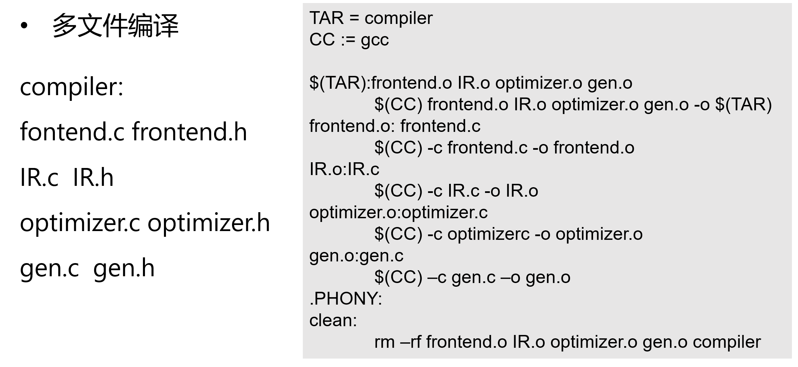
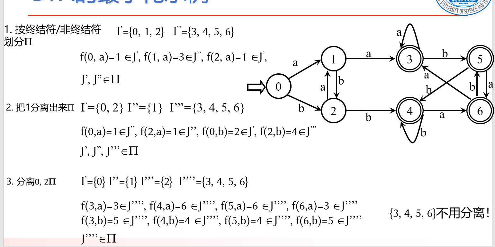
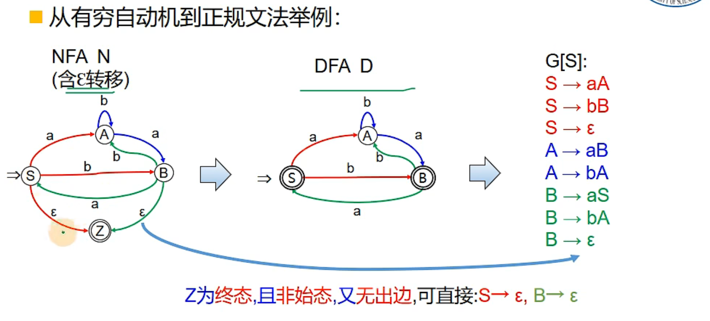
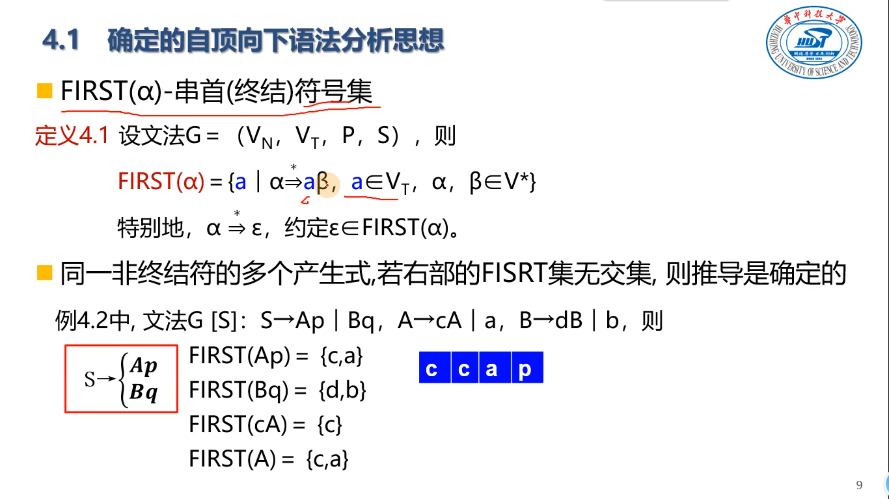
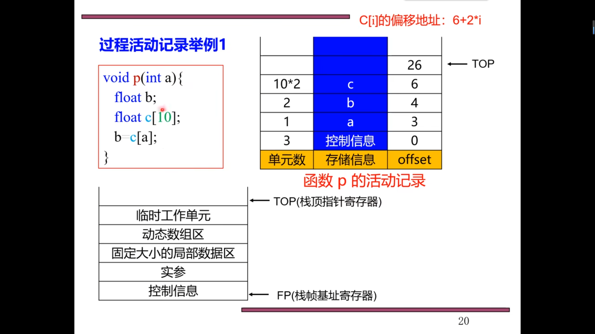
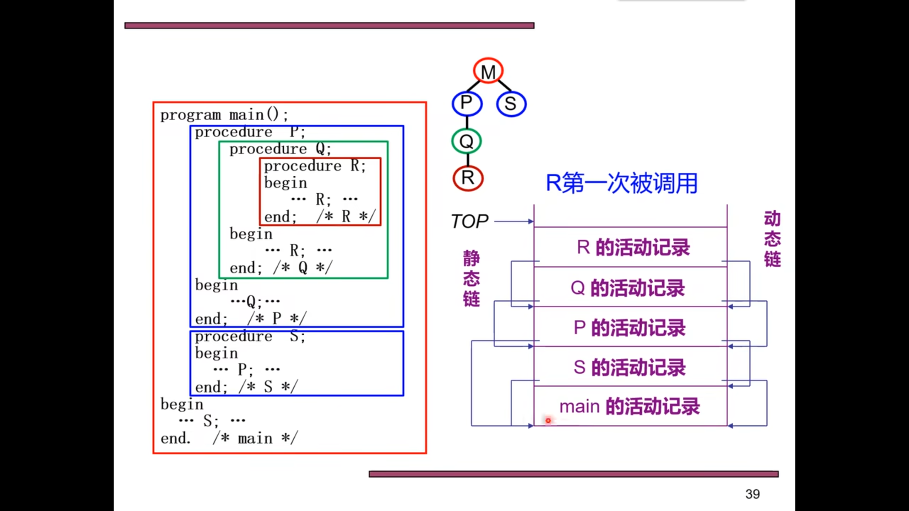
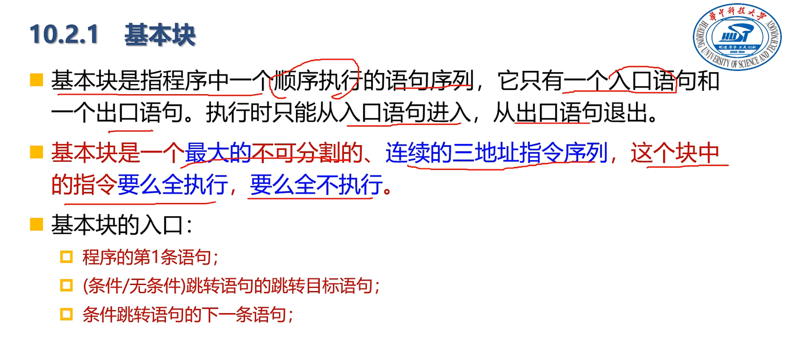
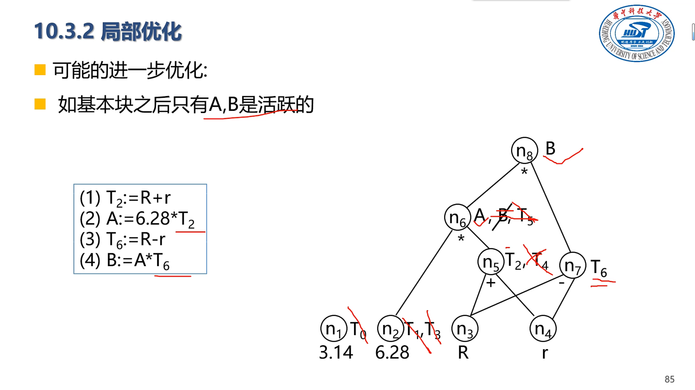

# 引论（10%）

* 编译过程和编译程序的结构 

  

  

* 各阶段的任务

  * 词法分析：分析出一个个token

  * 语法分析：形成**抽象语法树AST**，把单词序列分解成各类语法短语，如“程序”、“语句”、“表达式”等

  * 语义分析：上下文相关分析，类型匹配，类型转换，引用消解。审查源程序有无语义错误，为代码生成阶段生成类型信息。

  * 中间（IR）代码生成：把源程序变成一种内部表示形式

  * 代码优化：对中间代码进行变换改造，使生成的目标代码更高效

  * 目标代码生成：将中间代码变换成特定机器上的绝对指令代码或可重定位的指令代码。

    

  

* 阶段的组合：前后端划分的意义

  前端的存在方便了新的编程语言出现后的改动，只用改前端

  后端的存在方便了新的目标语言的出现，适应新的目标平台只用改后端

* 编译和解释的区别？(AOT/JIT)

  

## 编译工具链

### Makefile 基础

# 文法与语言（10%）

>* 识别文法表达的语言 
>
>* 用正则文法描述语言
>
>* 最左/最右推导与语法推导树
>
>* 短语，直接短语与句柄
>
>* 文法的二义性

* 句子是特别的句型，没有非终结符的句型就是句子

  

* 正闭包从一次开始，星闭包从0次空开始。 

* **两个文法等价，当他们的语言（L(G1) = L(G2)）相同**

## 文法的类型

* 0型：所有规则**左部至少含有一个非终结符**
* 1型：上下文有关文法，**左侧至少含有一个非终结符，左侧符号串长度不大于右侧，除非右侧为空**

* 2型：上下文无关文法，**任意产生式左部均为一个非终结符**

* 3型：正规文法，有限自动机。

  

* **最右推导也叫规范推导**，**逆过程就是规范规约**

* 全部叶子节点组成的符号串是文法的句型，所有符号都变成终结符就是句子

* 文法的二义性：对于同一个句子存在不同的语法树

* **文法的二义性不等同于语言的二义性**

  

## 句型的分析

### 自顶向下分析

- 最左推导，穷举规则

### 自下而上分析

* 按句柄归约-规范归约（移进-归约）
  * 简单优先分析法
  * LR分析法

* 短语
* 直接短语
* 句柄

# 词法分析（15%）

> 正则表达式转NFA  
>
> 正规文法转NFA
>
> NFA转DFA
>
> DFA的化简

* 关键字、界符和运算符都是**一符一种**，字面量和标识符则不是

* :star:考试的时候Identifier到底写指针还是本身的值？
* 识别单词到终止状态时手上多一个符号的时候要加星号，要把多余符号还回去作为下一个识别程序的识别

## 单词的形式化描述工具

* **正规文法、正则式、有穷自动机**三种用于描述词法的工具

* 正规文法就是四元组

* 正规式（正则表达式），满足交换律、结合律、分配律

  

### 正规文法和正则式转换

## 有穷自动机

* 所有能用正则表达式的语言，都能用有穷自动机表示

* 自动机所接受的，当且仅当符号串的集合可推到终结态。 所有这些字符串的集合即为DFA识别的语言

* NFA不仅存在多个转移后状态，初态也不唯一，且ε也能导致状态转移，同一个字母可能出现在同一个状态射出的多条弧上

* NFA接受某符号串，当其能转移到至少一个终结态上。所有这样的集合称之为NFA识别的语言。
* **NFA与DFA描述能力相同**
* **任何一个状态集的空闭包至少包含他自己**

### 子集构造法（NFA->DFA）

* **一定要记得求每一步的空闭包！！**

### DFA化简

* **分割法**

### 正则表达式和有穷自动机的转换

* NFA到正规式

  

  

  

### 正规文法和有穷自动机的转换

#### 正规文法->NFA

#### DFA->正则文法 

> 注意这里不能直接0B变成00，因为不符合正规文法的规范！！！

# 语法分析:LL(1) （15%）

> FIRST集FOLLOW集和SELECT的计算  
>
> LL(1)方法的判定
>
> 左递归的消除
>
> 预测表驱动的LL(1)语法分析方法

* 输入：词法分析的单词符号
* 输出：语法树

## 自顶向下语法分析

:star::star:**如果对非终结符A，有一条空规则，则A的FOLLOW集合和A的非空右部(指的是A除了空规则之外的其他产生式右部)的FIRST集合两两相交为空，可以使用确定的最左推导。**

**句末符一定是起始符号S的FOLLOW集合的一部分，因为它标志着句子的结束，帮助我们确定何时到达了输入字符串的结尾。**

## LL（1）文法的判别

:star:注意此处规则三：基于直觉，A如果是末尾或者后面能推出空，则应该能和B共享后面的Follow（B）这部分集合。

同理求FIRST的时候，如果前缀全能推出ε的话，就要继续找下一个非终结符的FIRST

## 非LL(1)文法到LL(1)文法的等价变换

* **转换的时候考虑是否能消除不可达非终结符**

 

## LL(1)分析的实现-递归下降分析法

## LL(1)分析的实现-表驱动分析法

# 语法分析:LR分析（15%）

> LR(1)项目集族和DFA的构造  
>
> LR(1)分析表
>
> LR(1)语法分析算法
>
> LL(1)/LR(0)/SLR(1)/LR(1)/LALR(1)文法之间的关系
>
> * 如果文法G是LR(0)文法，则G一定是SLR(1) 。
>
> * 后四个主要区别在于描述**归约状态**上：
>
>   * LR(0)：**任何情况下都能归约**，那一整行都是可归约
>   * SLR(1)：符合产生式左部的**FOLLOW集**才能归约
>   * LR(1)：满足**向前搜索符**才能归约，向前搜索符是**左部FOLLOW的子集**
>   * LALR(1)：LR(1)基础上合并同心集，状态减少了，但是某些时候晚几步才能发现语法错误
>
>   
>
>   
>
> * LL(1) 一定能用LR(1)分析

## LR(0) 分析

* LR（0）分析是不会有**移进-归约冲突**或**归约-归约冲突**

## SLR(1)分析（略）

* SLR（1）是存在冲突，但是**移进符号集和归约项目的左部的follow集两两相交必须为空**

## :star:LR(1)分析

* LR(1)分析法在构造项目时，将特定位置后继符信息一并纳入考虑

### LR(1)文法

## LALR(1)分析

* 合并同心集会产生归约-归约冲突，不会产生移进-归约冲突

# L- 翻译模式与中间代码生成（15%）

> S翻译模式与L翻译模式的识别
>
> 综合属性与继承属性
>
> 语法分析树和抽象语法树的构造
>
> 语法制导的L-翻译模式实现中间代码生成
>
> * 用到两遍扫描，第一遍扫描生成语法树，第二遍扫描深度优先遍历，从左到右，从上到下，遍历的同时生成三地址码
>
> * 注：一个只有赋值/if/while语句以及由以上语句构成的复合语句，算术和逻辑表达式，只有int类型的小型语言系统。给定翻译模式，能根据文法和翻译模式生成程序片断的中间代码

## 属性文法

* **继承属性写在语法树符号的左侧，综合属性写在右侧**

## 翻译模式

 

### 基于L-翻译模式的计算

* **继承属性的计算总是在该符号之前**

s是综合属性，i是继承属性。规则是什么？

* 自底向上的语义计算，**语义栈只能存放综合属性的值**，所以继承属性的求值结果必须以某个综合属性值的形式存放在语义栈中。
* 简而言之，就是把不是复用规则的符号继承属性的计算改成复用规则，然后前面加非终结符，**复用这个非终结符的综合属性**。**新加入非终结符的综合属性在归约的时候获取，继承属性在规约之前即符号之前获取。**

## 静态语义分析和中间代码生成

### 符号表

### 静态语义分析

### 中间代码生成

* 提取AST公共部分得到DAG

* 四元：操作符 操作数1 操作数2 结果

* 优化后的有向无环图和三地址代码

* 特定函数保证有分治的时候能够正确获取y

# 运行时存储组织（5%）

> 运行时存储空间布局 
>
> 栈帧(活动记录)的布局
>
> * 从高地址到低地址：返回值，实参，返回地址，控制链（ebp)，局部变量
>
> 函数调用与参数传递，传值与传址的区别

## 存储空间布局

## 活动记录

* 上面展示的都是R自己的display

* **静态链**指向**定义**该过程的活动记录，**动态链**指向**调用**该过程的AR

## 过程调用

# 代码优化（15%）

>基本块的划分和控制流图
>
>必经集点集，回边，自然循环的识别
>
>数据流分析：定值到达分析，活跃变量分析，UD链与DU链
>
>循环优化：**循环不变计算的识别，循环不变计算外提，归纳变量计算的强度削弱，基本归纳变量的删除**
>
>其它优化：**公共子表达式删除，常量合并与传播，复写传播，死代码删除**

## 优化的技术介绍

* 常量提前计算出来：常量折叠（合并）、常量传播（把变量名全换成具体的常量）。

  **常量传播可能导致更多常量折叠**

* 

* 

  > SSA：一个变量只能被赋值一次

  

* 

## 基本块、流图和循环

### 基本块

### 流图

### 常用的优化方法

* 删除公共子表达式

  

  

  此处t3能取代a[t2]是因为无论如何变化，B2始终是到达B4前最近的对a[t2]的赋值，此后a[t2]没有改变过。而a[t1]虽然没有显式改变过，但是不能用v替换，因为不能保证B1中的v得到的就是a[t1]的最新值，可能t4或者t2与t1相等，导致a[t2]在B1之后B4之前发生了改变。

* 删除无用代码（例如复制传播导致的）

  

  

  

  

* 常量合并（推导出某个表达式是常量，用常量替代表达式）

* 代码移动（循环不变计算移出循环）

* 强度削弱：加法或移位代替乘法，乘法代替除法，平方换乘法

* 基本归纳变量与归纳变量

  

  识别归纳变量，然后进行强度削弱：

  

* 删除归纳变量

  

#### 循环

  

* 必经结点

  

  **回边：被支配结点指向支配结点的边**，每个回边对应一个循环

  

  

## 代码的优化技术

* 窥孔优化：删除冗余的存取操作，常量合并、传播等

* 局部优化：**基本块范围内**的优化

  

  在构造DAG的时候用上常量折叠，删除旧变量赋值等操作，然后把优化后的DAG转换为四元式

  

* **循环优化**

  代码外提、归纳变量强度削弱、**归纳变量替换基本归纳变量**等

* 全局优化

## 数据流分析

* 合流计算要么是并要么是交，根据具体内容判断

### 到达-定值分析

* 算到不变为止

### 活跃变量数据流分析

* 这里的in和out代表的是活跃变量，和上面的定义不一样。

* 可用表达式的分析：与其他分析不同的是，**这里合流求交集**

