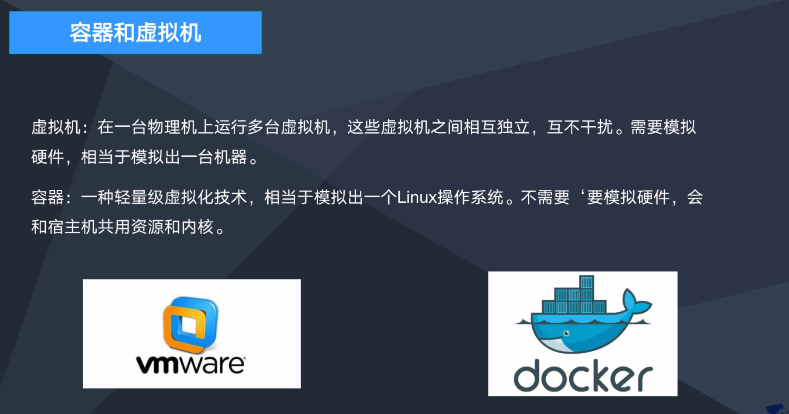
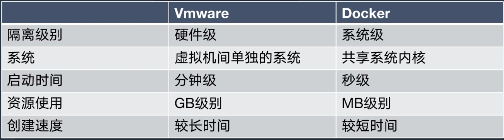
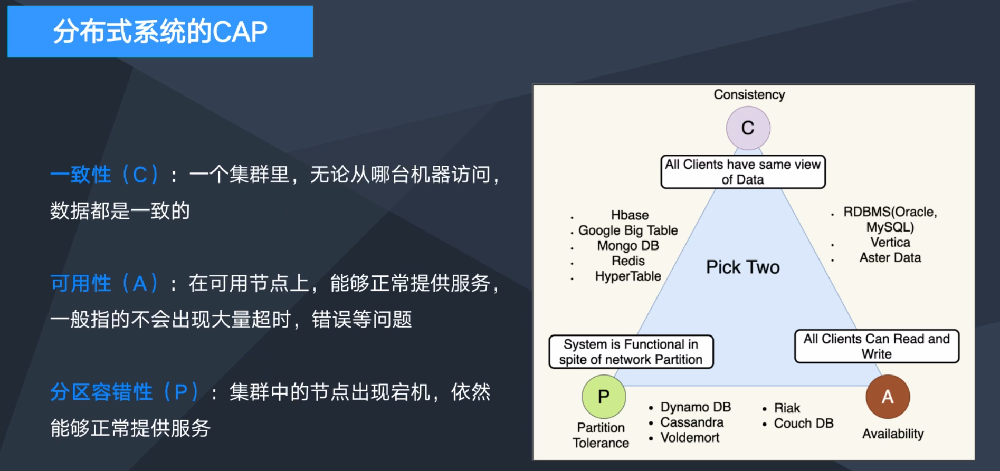
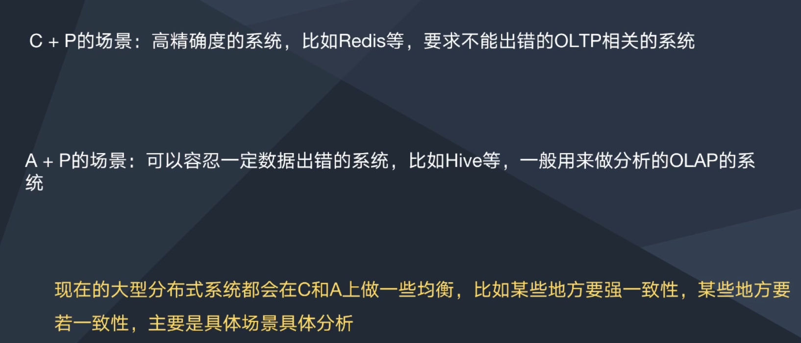
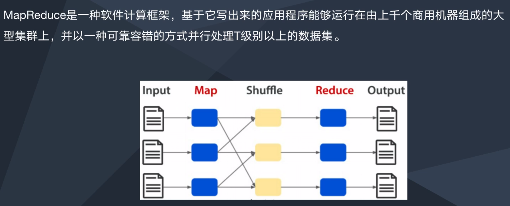
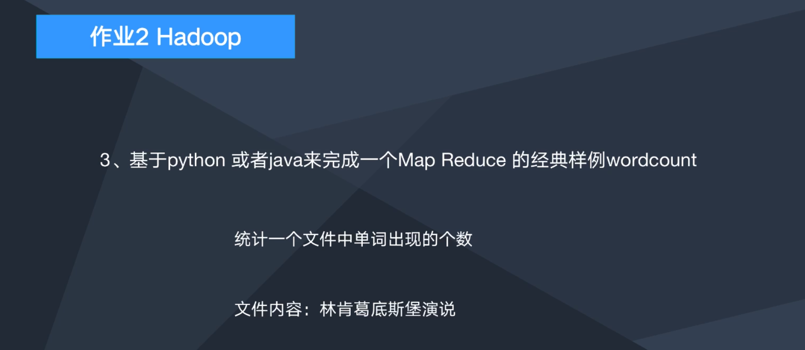
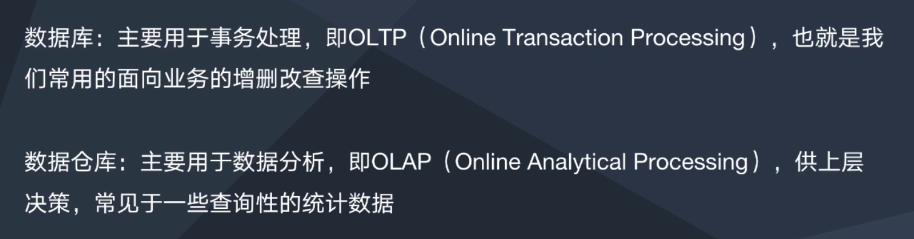
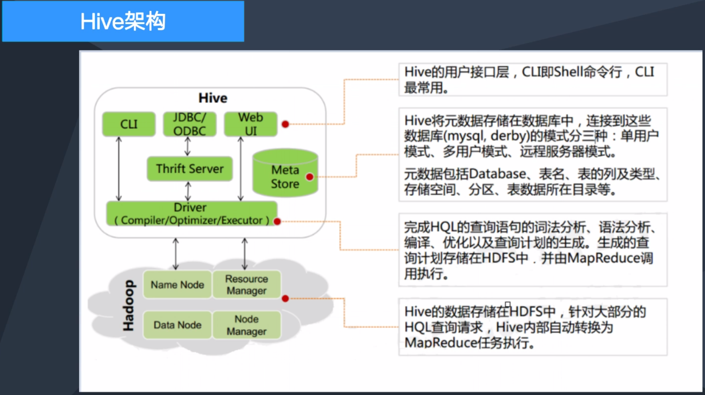

# Docker的应用

* Docker：开源的应用**容器**引擎。基于Go开发，遵从Apache2.0协议开源
* 作用：保证每一个服务相互独立，不出现环境干扰

容器和虚拟机的区别：

# Hadoop及其组件

## HDFS

* HDFS采用**块存储**，把文件分为128MB的块发到各个Datanode上存储
* HDFS只支持**追加写**，不支持修改写，针对高吞吐量开发，牺牲数据访问速度

## MapReduce

Spark：更快的计算方式

和MapReduce的区别：

* 内存计算：提供Cache机制支持数据共享和**迭代计算**，减少IO开销
* DAG机制：减少多次计算的中间结果写入到HDFS的开销

# 数据仓库Hive

# 游戏大数据场景下的Hadoop

