# ETL

* extract：无论离线还是在线，都是利用Flume集群从日志服务器提取信息

  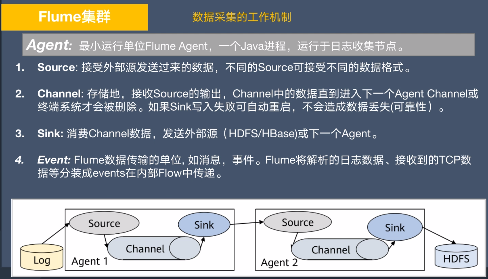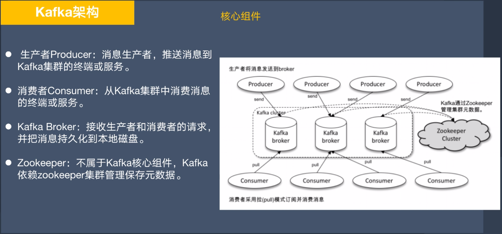

  Flume和Kafka集成：flume从kafka获取数据

  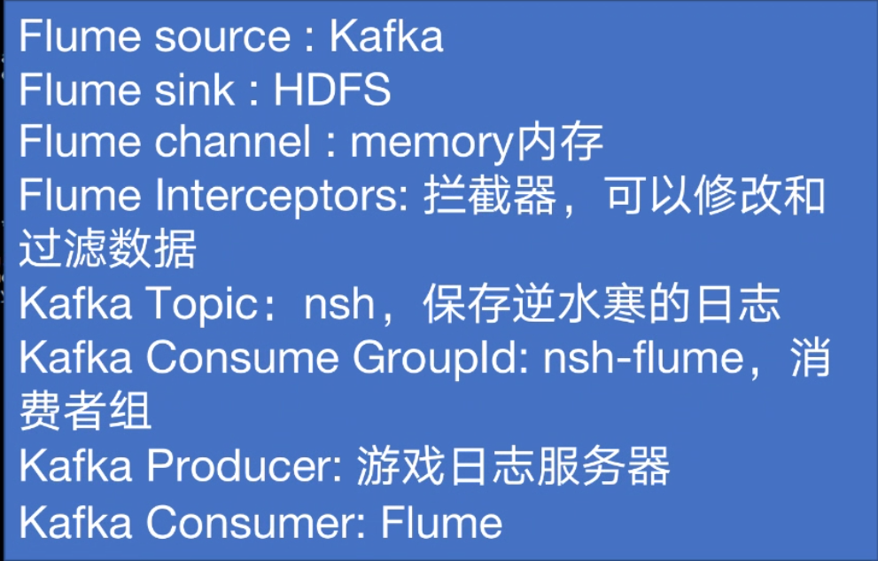

  Flume的sink：数据可以写入HDFS，日志文件，本地文件系统，Hbase

* transform：

* load

# 离线计算

# Spark

支持离线批处理和实时流计算

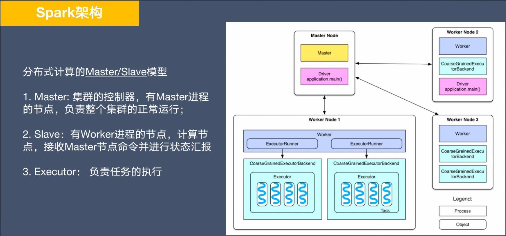

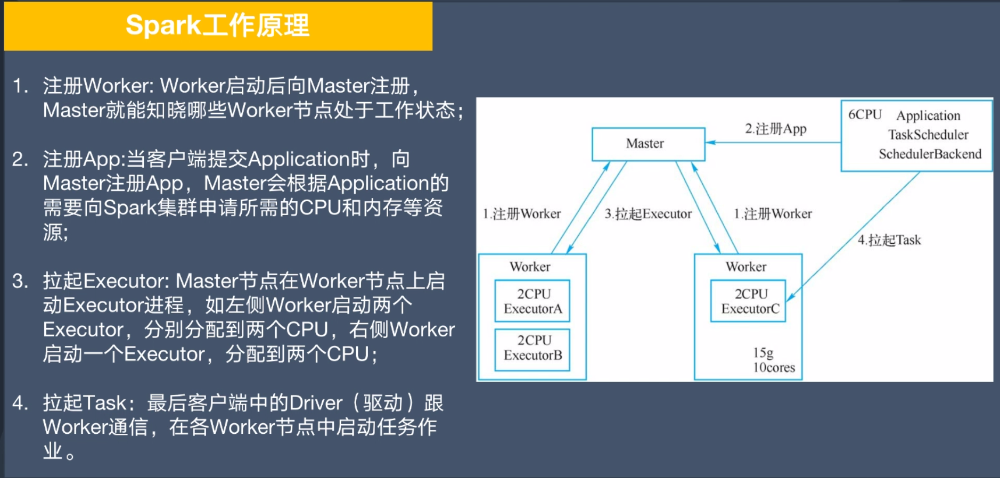

Spark RDD 转换算子

* filter(func) 操作会筛选出满足func的元素，返回一个新的数据集

* map(func): 把每个元素传递到func，结果返回作为一个新的数据集

* flatMap()与map()相似，但是每个输入元素可以映射到0或者多个输出

  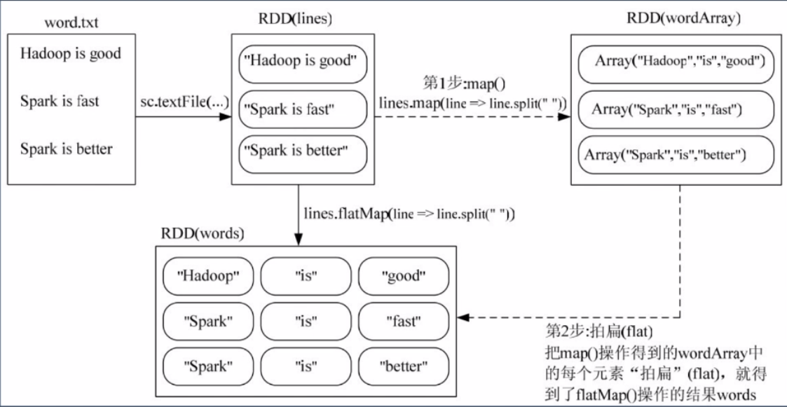

* groupByKey（）用于（K，V）键值对数据集，返回（K，Iterable）形式数据集，即**把key相同的value group在一起**

* reduceByKey（func）用于（K，V）键值对，返回新的(K,V) 数据集，每个值是把每个key传到func进行聚合后的结果

  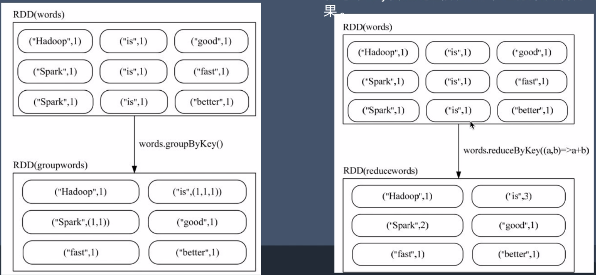

Spark RDD行动算子

* **真正触发计算的地方**，因为Spark是惰性计算，只有执行到行动操作才会执行真正计算（只有转换算子之后记录转换轨迹，不会真正计算），从文件加载数据，完成转换操作

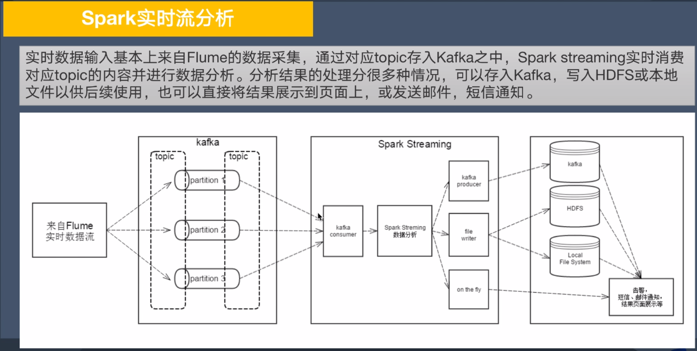

* Saprk Streaming 工作原理：

  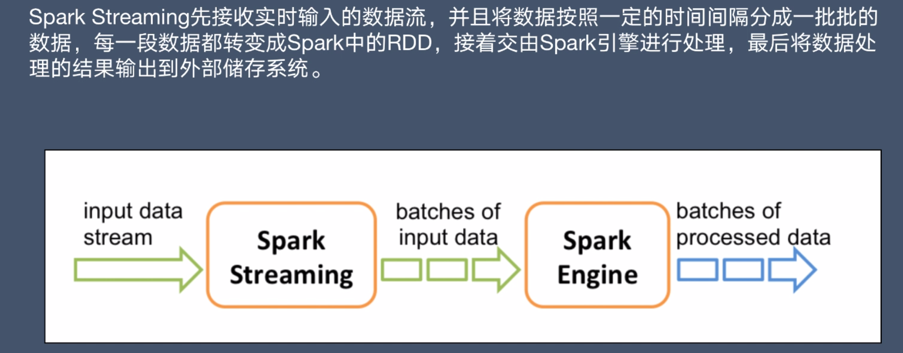

# Flink

开源，分布式，高性能，高可用大数据处理引擎，可对有限数据流和无线数据流进行有状态计算

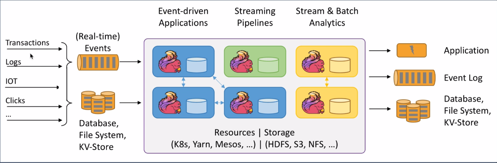

Flink算子

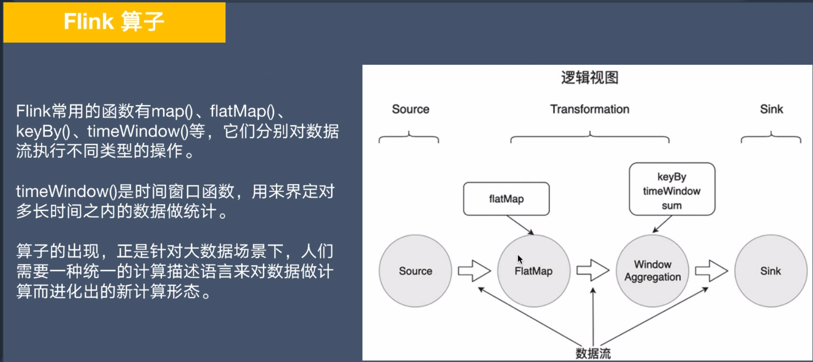

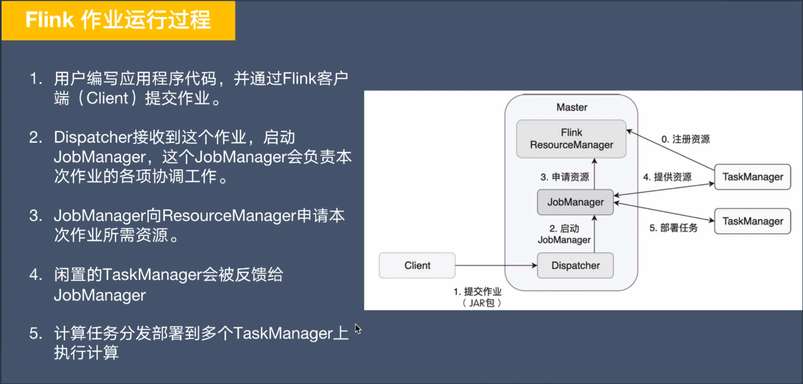

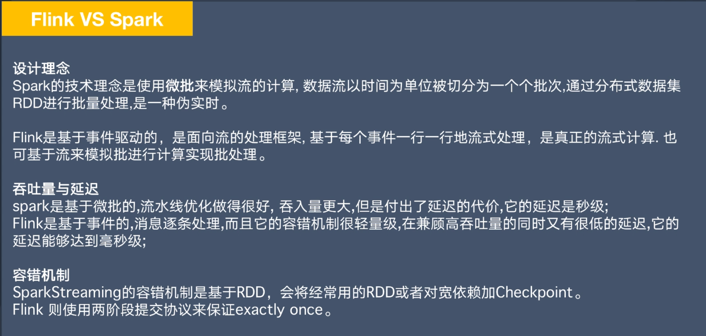

# 调度器

crontab：

1. 任务依赖基于时间实现，易造成前面任务失败或者未结束后面任务开始
2. 难以并发
3. 无法设置优先级
4. 任务管理维护不方便，无法执行效果分析

Airflow工作流引擎：

1. 开源，分布式任务调度狂卷
2. 分布式任务调度
3. 可构建任务依赖
4. 任务具备原子性
5. 具备任务监视功能