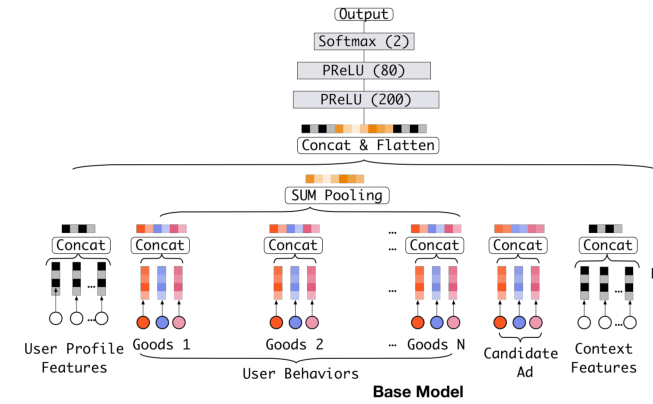
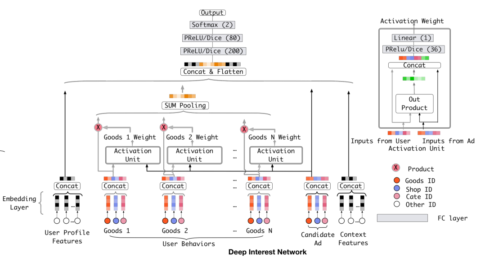

## Deep Interest Network for Click-Through Rate Prediction

​	选择理由：初次接触推荐系统第一反应就是广告个性化推荐，而阿里电商平台的Deep Interest Network正好符合了我对推荐系统最初的想象，且该文章的模型在老师第一堂课中有所提及，属于推荐系统方面的经典之一，也符合了作业的要求。

​	文章开头提出了点击率预测在工业中的重要应用，提出当下用于点击率预测的模型大部分都遵循**Embedding&MLP**范式，利用embedding将高维的用户特征进行压缩，变成一个固定长度的表示向量，然后利用全连接的MLP来学习特征之间的非线性关系。进而实现广告推荐。对我一个头一次接触推荐系统的人来说，哪怕这个Base Model对我来说都是一种复杂且精妙的实现，于是我在文章的第四部分介绍Deep Interest Network之前先努力了解了Base Model的运行机制：

* Embedding Layer：将**输入降维**，根据输入是one-hot还是multi-hot，embedding vector具有不同的数目
* Pooling layer and Concat layer：全连接网络只能处理固定长度输入，embedding vector由于用户不同行为的不同编码，所以拥有不同长度的向量，需要利用池化来获取**固定长度的vector**
* MLP：自动进行特征的组合学习，提取特征之间的信息
* Loss：利用negative log-likelihood function作为目标函数表示样本被点击的概率

​	Base Model中的embedding vector对同一个用户不随着candidate ads而发生改变，导致representation vector的维度限制了用户多样兴趣的表现，而直接通过提升维度来解决这个问题会导致模型在数据量不够情况下的过拟合，且大大增添计算和存储的负担，这是工业在线系统不能够忍受的。

​	为了解决这个问题，Deep Interest Network因此被创造。不同于Base Model一成不变的representation vector，它根据candidate ad的种类和用户历史行为的关系，主动地提高对相关用户历史行为的关注。在模型中，这一关注通过local activation unit体现在模型结构中，activation unit是一个前馈网络，输入的是**用户和广告二者的embedding vectors**，由此学习出对应商品的权重，再和原本的用户行为相乘，实现和candidate ad相关的用户行为获取更高的权重。

​	除了提出这种带有注意力机制的神经网络，该文章还提出了两种新的技术来帮助训练工业深度网络：

* 一个小批感知正则化器，节省了大量参数的深度网络的大量正则化计算，能够帮助避免过拟合

  在参数极大条件下，使用普通的正则化方式例如L2，它需要在每个小批次计算**所有参数**的的L2-norm，这带来的计算量是不可承受的。本文提出的正则化器则只在每个小批次计算**稀疏特征参数**中的L2范数

* 一个数据自适应的激活函数，能够考虑到输入的分布来推广PReLU，可视为PReLU的一般化，根据数据分布自适应调整整流点，将整流点的值设为输入的均值。

后面的部分是论文的实验部分，由于我的水平不够，故匆匆略过。。只能看出模型表现效果优良。

